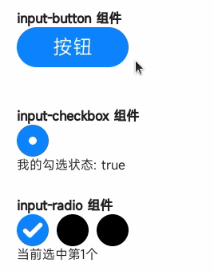

<!-- 源地址: https://iot.mi.com/vela/quickapp/zh/components/form/input.html -->

# # input

## # 概述

提供可交互的界面，接收用户的输入。

## # 子组件

不支持

## # 属性

支持[通用属性](</vela/quickapp/zh/components/general/properties.html>)

名称 | 类型 | 默认值 | 必填 | 描述  
---|---|---|---|---  
type | button | checkbox | radio | | button | 否 | 支持动态修改  
checked | `<boolean>` | false | 否 | 当前组件的 checked 状态，type 为 checkbox 时生效，可触发 checked 伪类（checked 伪类样式还未支持）  
name | `<string>` | - | 否 | input 组件名称  
value | `<string>` | - | 否 | input 组件的值  
  
## # 样式

支持[通用样式](</vela/quickapp/zh/components/general/style.html>)

名称 | 类型 | 默认值 | 必填 | 描述  
---|---|---|---|---  
color | `<color>` | rgba(0, 0, 0, 0.87) | 否 | 文本颜色  
font-size | `<length>` | 37.5px | 否 | 文本尺寸  
width | `<length>` | `<percentage>` | - | 否 | type 为 button 时，默认值为 128px  
height | `<length>` | `<percentage>` | - | 否 | type 为 button 时，默认值为 70px  
  
## # 事件

支持[通用事件](</vela/quickapp/zh/components/general/events.html>)

名称 | 参数 | 描述  
---|---|---  
change | 不同 type 参数不同，具体见下方 change 事件参数 | input 组件的值、状态发生改变时触发，type 为 button 时无 change 事件  
  
### # change 事件参数

参数 | checkbox | radio | 备注  
---|---|---|---  
name | √ | √ | -  
value | √ | √ | -  
checked | √ | - | -  
  
## # 方法

名称 | 参数 | 描述  
---|---|---  
focus | {focus:true|false}，focus 不传默认为 true | 使组件获得或者失去焦点，可触发 focus 伪类（focus 伪类样式还未支持）  
  
## # 示例代码

``` <template> <div class="page"> <div class="section"> <text class="title">input-button 组件</text> <input class="button" type="button" value="按钮" @click="onButtonClick" /> <text>{{ buttonText }}</text> </div> <div class="section"> <text class="title">input-checkbox 组件</text> <input class="checkbox" type="checkbox" checked="{{ checkboxChecked }}" @change="onCheckboxChange" /> <text>我的勾选状态: {{ checkboxChecked }}</text> </div> <div class="section"> <text class="title">input-radio 组件</text> <div> <input class="radio" type="radio" name="radio" value="1" checked="{{radioValue === '1'}}" @change="onRadioChange" /> <input class="radio" type="radio" name="radio" value="2" checked="{{radioValue === '2'}}" @change="onRadioChange" /> <input class="radio" type="radio" name="radio" value="3" checked="{{radioValue === '3'}}" @change="onRadioChange" /> </div> <text>当前选中第{{ radioValue }}个</text> </div> </div> </template> <script> export default { private: { buttonText: '', checkboxChecked: true, radioValue: '1' }, onTextChange(e) { this.textValue = e.value }, onButtonClick() { this.buttonText = '按钮被点击了' }, onCheckboxChange(e) { this.checkboxChecked = e.checked }, onRadioChange(e) { this.radioValue = e.value } } </script> <style> .page { flex-direction: column; padding: 30px; background-color: #ffffff; } .section { flex-direction: column; margin-bottom: 30px; } .title { font-weight: bold; } .button { width: 140px; height: 50px; font-size: 25px; color: white; } .checkbox, .radio { width: 40px; height: 40px; margin-right: 10px; } </style> ```



← [ barcode ](</vela/quickapp/zh/components/basic/barcode.html>) [ picker ](</vela/quickapp/zh/components/form/picker.html>) → 

快速导航

概述

子组件

属性

样式

事件

change 事件参数

方法

示例代码
