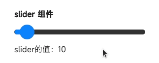

<!-- 源地址: https://iot.mi.com/vela/quickapp/zh/components/form/slider.html -->

# # slider

## # 概述

滑动选择器

## # 子组件

不支持

## # 属性

支持[通用属性](</vela/quickapp/zh/components/general/properties.html>)

名称 | 类型 | 默认值 | 必填 | 描述  
---|---|---|---|---  
min | `<number>` | ０ | 否 | -  
max | `<number>` | 100 | 否 | -  
step | `<number>` | 1 | 否 | -  
value | `<number>` | 0 | 否 | -  
  
## # 样式

支持[通用样式](</vela/quickapp/zh/components/general/style.html>)

名称 | 类型 | 默认值 | 必填 | 描述  
---|---|---|---|---  
color | `<color>` | #f0f0f0 或者 rgb(240, 240, 240) | 否 | 背景条颜色  
selected-color | `<color>` | #009688 或者 rgb(0, 150, 136) | 否 | 已选择颜色  
block-color | `<color>` | - | 否 | 滑块的颜色  
padding-[left|right] | `<length>` | 32px | 否 | 左右边距  
  
## # 事件

支持[通用事件](</vela/quickapp/zh/components/general/events.html>)

名称 | 参数 | 描述  
---|---|---  
change | {progress:progressValue, isFromUser:isFromUserValue} | 完成一次拖动后触发的事件   
isFromUser说明：  
该事件是否由于用户拖动触发  
  
## # 示例代码

``` <template> <div class="page"> <text class="title">slider 组件</text> <slider class="slider" min="0" max="100" step="10" value="{{ initialSliderValue }}" onchange="onSliderChange"></slider> <text>slider的值：{{ sliderValue }}</text> </div> </template> <script> export default { private: { initialSliderValue: 10, sliderValue: null }, onSliderChange (e) { this.sliderValue = e.progress } } </script> <style> .page { flex-direction: column; padding: 30px; background-color: #ffffff; } .title { font-weight: bold; } .slider { margin-top: 20px; margin-bottom: 20px; padding-left: 0; padding-right: 0; } </style> ```



← [ switch ](</vela/quickapp/zh/components/form/switch.html>)

快速导航

概述

子组件

属性

样式

事件

示例代码
