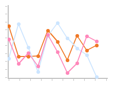
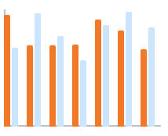

<!-- 源地址: https://iot.mi.com/vela/quickapp/en/components/basic/chart.html -->

# chart

## Overview

A chart component used to display line charts and bar charts.

## Subcomponents

Not supported

## Attributes

Supports [Common Attributes](</vela/quickapp/en/components/general/properties.html>)

Name | Type | Default Value | Required | Description  
---|:---:|---|:---:|---  
type | `<string>` | line | No | Sets the chart type (dynamic modification not supported). Options: bar (bar chart) \ line (line chart)  
options | ChartOptions |:---:| Yes | Chart parameter settings. Parameters must be set for bar charts and line charts. You can set the minimum and maximum values, the number of ticks, visibility, line width, and smoothness for the x-axis and y-axis. (Dynamic modification not supported)  
datasets | Array<ChartDataset> |:---:| Yes | Data collection. Must be set for bar charts and line charts. Multiple datasets and their background colors can be set.  
  
### ChartOptions Description

Name | Type | Default Value | Required | Description  
---|:---:|---|:---:|---  
xAxis | ChartAxis | line | Yes | x-axis parameter settings. You can set the minimum and maximum values, the number of ticks, and visibility for the x-axis.  
yAxis | ChartAxis |:---:| Yes | y-axis parameter settings. You can set the minimum and maximum values, the number of ticks, and visibility for the y-axis.  
series | ChartSeries |:---:| No | Data sequence parameter settings. You can set: 1) line styles, such as line width and smoothness; 2) the style and size of the white dot at the end of the line (only supported for line charts).  
  
### ChartDataset Description

Name | Type | Default Value | Required | Description  
---|:---:|---|:---:|---  
strokeColor | `<color>` | #ff6384 | No | Line color. (Only supported for line charts)  
fillColor | `<color>` | #ff6384 | No | Fill color. For line charts, it represents the gradient fill color.  
data | Array<`<number>` |:---:| Yes | Sets the points for drawing lines or bars.  
gradient | `<boolean>` | false | No | Sets whether to display a gradient fill color. (Only supported for line charts)  
  
### ChartAxis Description

Name | Type | Default Value | Required | Description  
---|:---:|---|:---:|---  
min | `<number>` | 0 | No | Minimum value of the axis. (Negative numbers not supported. Only supported for line charts)  
max | `<number>` | dataset data count-1 | No | Maximum value of the axis. (Negative numbers not supported. Only supported for line charts)  
axisTick | `<number>` | 10 | No | Number of ticks displayed on the axis. (Only supports values from 1 to 20, and the actual display depends on the calculated value (width of the chart in pixels / (max-min)). Due to integer operations in lightweight smart wearables, errors may occur when the division is not exact, resulting in a blank space at the end of the x-axis. For bar charts, the number of bars displayed per group matches the number of ticks, and the bars are displayed at the tick positions.)  
display | `<boolean>` | false | No | Whether to display the axis.  
color | `<color>` | #c0c0c0 | No | Axis color.  
  
### ChartSeries Description

Name | Type | Default Value | Required | Description  
---|:---:|---|:---:|---  
lineStyle | ChartLineStyle |:---:| No | Line style settings, such as line width and smoothness.  
loop | ChartLoop |:---:| No | Sets whether to restart drawing when the screen is full.  
  
### ChartLineStyle Description

Name | Type | Default Value | Required | Description  
---|:---:|---|:---:|---  
width | `<length>` | 2px | No | Line width setting.  
  
### ChartLoop Description

Name | Type | Default Value | Required | Description  
---|:---:|---|:---:|---  
margin | `<length>` | 1px | No | Number of points to erase (horizontal distance between the most recently drawn point and the oldest point). Note: On lightweight devices, when margin is used simultaneously with topPoint/bottomPoint/headPoint, there is a chance that a point may fall exactly within the erased area, making it invisible. Therefore, simultaneous use is not recommended.  
  
## Styles

Supports [Common Styles](</vela/quickapp/en/components/general/style.html>)

## Events

Supports [Common Events](</vela/quickapp/en/components/general/events.html>)

## Sample Code

### Line Chart
```html
< template > < chart type = " line " options = " {{lineOpts}} " datasets = " {{lineData}} " > </ chart > </ template > < script > export default { data : { lineData : [ { strokeColor : '#f07826' , data : [ 763 , 550 , 551 , 554 , 731 , 654 , 525 , 696 , 595 , 628 ] , } , { strokeColor : '#cce5ff' , fillColor : '#cce5ff' , data : [ 535 , 776 , 615 , 444 , 694 , 785 , 677 , 609 , 562 , 410 ] , } , { strokeColor : '#ff88bb' , data : [ 673 , 500 , 574 , 483 , 702 , 583 , 437 , 506 , 693 , 657 ] } , ] , lineOpts : { xAxis : { min : 0 , max : 10 , display : true , axisTick : 10 } , yAxis : { min : 400 , max : 900 , display : true , } } } } </ script >
```



### Bar Chart
```html
< template > < chart type = " bar " options = " {{barOpts}} " datasets = " {{barData}} " > </ chart > </ template > < script > export default { data : { barData : [ { fillColor : '#f07826' , data : [ 763 , 550 , 551 , 554 , 731 , 654 , 525 ] } , { fillColor : '#cce5ff' , data : [ 535 , 776 , 615 , 444 , 694 , 785 , 677 ] } ] , barOpts : { xAxis : { min : 0 , max : 7 , display : false , axisTick : 7 } , yAxis : { min : 0 , max : 800 , display : false , } } } } </ script >
```


