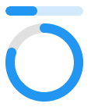

<!-- 源地址: https://iot.mi.com/vela/quickapp/en/components/basic/progress.html -->

# progress

## Overview

Progress bar

## Child Components

Not supported

## Attributes

Supports [general attributes](</vela/quickapp/en/components/general/properties.html>)

Name | Type | Default Value | Required | Description  
---|:---:|---|:---:|---  
percent | `<number>` | 0 | No | -  
type | horizontal | arc | horizontal | No | Progress bar type. Dynamic modification is not supported.  
  
## Styles

Supports [general styles](</vela/quickapp/en/components/general/style.html>)

Note: The base color of the horizontal progress bar is #f0f0f0. The height attribute is invalid.

Name | Type | Default Value | Required | Description  
---|:---:|---|:---:|---  
color | `<color>` | #33b4ff or rgb(51, 180, 255) | No | Progress bar color  
stroke-width | `<length>` | 32px | No | Progress bar width  
layer-color | `<color>` | #f0f0f0 or rgb(240, 240, 240) | No | Progress bar background color  
  
Effective when type=arc:

Name | Type | Default Value | Required | Description  
---|:---:|---|:---:|---  
start-angle | `<deg>` | 240 | No | Starting angle of the arc progress bar, with the 0 point of the clock as the baseline. The range is 0 to 360 (clockwise)  
total-angle | `<deg>` | 240 | No | Total length of the arc progress bar, ranging from -360 to 360. A negative number indicates a counterclockwise direction from the start point to the end point.  
center-x | `<length>` | Half of the component width | No | Center position of the arc progress bar (the origin is the top-left vertex of the component). This style must be used together with center-y and radius.  
center-y | `<length>` | Half of the component height | No | Center position of the arc progress bar (the origin is the top-left vertex of the component). This style must be used together with center-x and radius.  
radius | `<length>` | Half of the smaller value of the component width and height | No | Radius of the arc progress bar. This style must be used together with center-x and center-y.  
  
## Events

Supports [general events](</vela/quickapp/en/components/general/events.html>)

## Example Code
```html
< template > < div style = " flex-direction : column " > < progress class = " p1 " percent = " 40 " > </ progress > < progress class = " p2 " percent = " 80 " type = " arc " > </ progress > </ div > </ template > < style > .p1 { margin-bottom : 10px ; stroke-width : 12px ; } .p2 { margin-bottom : 10px ; stroke-width : 12px ; start-angle : 0 ; total-angle : 360deg ; } </ style >
```


