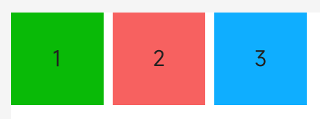

<!-- 源地址: https://iot.mi.com/vela/quickapp/en/components/container/div.html -->

# div

## Overview

Basic container used as the root node of the page structure or to group content.

## Child Components

Supported

## Attributes

Supports [general attributes](</vela/quickapp/en/components/general/properties.html>)

## Style

Supports [general style](</vela/quickapp/en/components/general/style.html>)

## Events

Supports [general events](</vela/quickapp/en/components/general/events.html>)

## Example Code
```html
< template > < div class = " page " > < div style = " flex-direction : row ; " > < text class = " item color-1 " > 1 </ text > < text class = " item color-2 " > 2 </ text > < text class = " item color-3 " > 3 </ text > </ div > </ div > </ template > < style > .page { margin : 20px ; flex-direction : column ; background-color : white ; } .item { height : 100px ; width : 100px ; text-align : center ; margin-right : 10px ; } .color-1 { background-color : #09ba07 ; } .color-2 { background-color : #f76160 ; } .color-3 { background-color : #0faeff ; } </ style >
```


