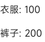

<!-- 源地址: https://iot.mi.com/vela/quickapp/en/components/container/list-item.html -->

# list-item

## Overview

The subcomponent of [`<list>`](</vela/quickapp/en/components/container/list.html>), used to display specific items in a list. It fills the width of the list component by default.

## Subcomponents

Supported

## Attributes

[Common attributes](</vela/quickapp/en/components/general/properties.html>) are supported.

Name | Type | Default Value | Required | Description  
---|:---:|---|:---:|---  
type | `<string>` |:---:| Yes | The type of list-item, defined as a custom string, such as 'loadMore'. **List-items with the same type must have identical DOM structures**. Therefore, use `if` and `for` with caution inside list-items, as they may cause DOM structure inconsistencies for list-items of the same type, leading to errors.  
  
## Styles

[Common styles](</vela/quickapp/en/components/general/style.html>) are supported.

To achieve component reuse and optimize performance, explicitly specify the width and height.

## Events

[Common events](</vela/quickapp/en/components/general/events.html>) are supported.

## Example Code
```html
< template > < div class = " page " > < list class = " list " > < list-item for = " {{productList}} " class = " item " type = " list-item " > < text > {{$item.name}}: {{$item.price}} </ text > </ list-item > </ list > </ div > </ template > < script > export default { data : { productList : [ { name : 'Clothes' , price : '100' } , { name : 'Pants' , price : '200' } ] , } } </ script > < style > .page { padding : 30px ; background-color : white ; } .list { width : 100% ; height : 100% ; } .item { height : 40px ; } </ style >
```

### Display Effect


