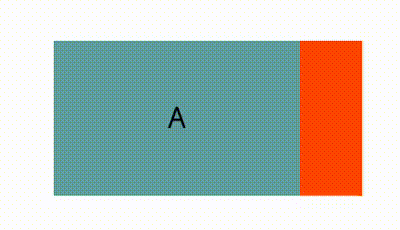
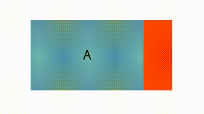

<!-- 源地址: https://iot.mi.com/vela/quickapp/en/components/container/scroll.html -->

# scroll2+

## Overview

Scroll view container. A vertical or horizontal scroll container. Vertical scrolling requires a fixed height, and horizontal scrolling requires a fixed width.

## Child Components

Supported. Nested child scroll components are also supported.

## Attributes

Supports [Common Attributes](</vela/quickapp/en/components/general/properties.html>)

Name | Type | Default | Required | Description  
---|:---:|---|:---:|---  
scroll-x | `<boolean>` | false | No | Whether to allow horizontal scrolling  
scroll-y | `<boolean>` | false | No | Whether to allow vertical scrolling  
scroll-top | `<number>` | `<string>` |  | No | Sets the vertical scroll bar position, the distance from the top of the content to the top of the scroll. If there is a scroll snap effect, it will scroll first and then snap.  
scroll-bottom | `<number>` | `<string>` |  | No | Sets the vertical scroll bar position, the distance from the bottom of the content to the bottom of the scroll. If there is a scroll snap effect, it will scroll first and then snap. If both scroll-top and scroll-bottom are set, scroll-top takes precedence.  
scroll-left | `<number>` | `<string>` |  | No | Sets the horizontal scroll bar position, the distance from the left side of the content to the left side of the scroll. If there is a scroll snap effect, it will scroll first and then snap.  
scroll-right | `<number>` | `<string>` |  | No | Sets the horizontal scroll bar position, the distance from the right side of the content to the right side of the scroll. If there is a scroll snap effect, it will scroll first and then snap. If both scroll-left and scroll-right are set, scroll-left takes precedence.  
bounces | `<boolean>` | false | No | Whether to enable boundary rebound  
  
## Styles

Supports [Common Styles](</vela/quickapp/en/components/general/style.html>)

Name | Type | Default | Description  
---|:---:|---|---  
scroll-snap-type[3+](</vela/quickapp/zh/guide/version/APILevel3>) |:---:| none | Used in conjunction with scroll-snap-align, applied to the scroll component, indicating the scroll snap type. The first parameter is x or y, indicating horizontal or vertical scrolling; the second parameter is mandatory, proximity, or cross. mandatory: snaps to the nearest anchor; proximity: snaps only when the distance to the snap anchor is less than 30% of the container height; cross: snaps only when the child component's boundary that can be snapped appears in the scroll viewport. Default is proximity   
Minimum aiot-toolkit version: 1.1.4  
scroll-snap-align[3+](</vela/quickapp/zh/guide/version/APILevel3>) | none | start | center | end | edge | none | Used in conjunction with scroll-snap-type, applied to the scroll child component, indicating the alignment form between the child component and the scroll. none: no alignment, default value; start: aligns the component with the start edge of the scroll; center: aligns the component with the center of the scroll; end: aligns the component with the end edge of the scroll; edge: in the scrolling direction, aligns the component with the start or end edge of the scroll   
Minimum aiot-toolkit version: 1.1.4  
scroll-snap-stop[3+](</vela/quickapp/zh/guide/version/APILevel3>) | normal | always | normal | When set to always, cannot skip elements during snapping   
Minimum aiot-toolkit version: 1.1.4  
  
### Example Code

  * scroll-snap-type & scroll-snap-align
```html
< template > < div class = " page " > < div class = " scroll-container " > < scroll class = " box " scroll-x = " true " style = " scroll-snap-type : x proximity ; " > < text class = " scroll-item color-1 " > A </ text > < text class = " scroll-item color-2 " > B </ text > < text class = " scroll-item color-1 " style = " scroll-snap-align : start ; " > C </ text > < text class = " scroll-item color-2 " > D </ text > < text class = " scroll-item color-1 " style = " scroll-snap-align : center ; " > E </ text > < text class = " scroll-item color-2 " > F </ text > < text class = " scroll-item color-1 " style = " scroll-snap-align : end ; " > G </ text > < text class = " scroll-item color-2 " > H </ text > </ scroll > </ div > </ div > </ template > < script > export default { } </ script > < style > .page { padding : 60px ; flex-direction : column ; } .scroll-container { width : 100% ; } .box { margin-bottom : 30px ; height : 100px ; width : 200px ; } .scroll-item { width : 80% ; height : 100px ; text-align : center ; } .color-1 { background-color : cadetblue ; } .color-2 { background-color : orangered ; } </ style >
```



  * scroll-snap-stop
```html
< template > < div class = " page " > < div class = " scroll-container " > < scroll class = " box " scroll-x = " true " style = " scroll-snap-type : x cross ; scroll-snap-stop : always ; " > < text class = " scroll-item color-1 " > A </ text > < text class = " scroll-item color-2 " style = " scroll-snap-align : center ; " > B </ text > < text class = " scroll-item color-1 " style = " scroll-snap-align : center ; " > C </ text > < text class = " scroll-item color-2 " style = " scroll-snap-align : center ; " > D </ text > < text class = " scroll-item color-1 " style = " scroll-snap-align : center ; " > E </ text > < text class = " scroll-item color-2 " style = " scroll-snap-align : center ; " > F </ text > < text class = " scroll-item color-1 " > G </ text > </ scroll > </ div > </ div > </ template > < script > export default { } </ script > < style > .page { padding : 60px ; flex-direction : column ; } .scroll-container { width : 100% ; } .box { margin-bottom : 30px ; height : 100px ; width : 200px ; } .scroll-item { width : 80% ; height : 100px ; text-align : center ; } .color-1 { background-color : cadetblue ; } .color-2 { background-color : orangered ; } </ style >
```



## Events

Name | Parameters | Description  
---|:---:|---  
scrolltop |:---:| Triggered when scrolling to the top  
scrollbottom |:---:| Triggered when scrolling to the bottom  
scroll | { scrollX, scrollY } | Triggered when scrolling, scrollX represents the horizontal distance scrolled; scrollY represents the vertical distance scrolled  
  
## Methods

Name | Parameters | Return Value | Description  
---|:---:|---|---  
getScrollRect | None | `<object>` | Gets the dimensions of the scrollable content  
scrollTo | Object | None | Scrolls the scroll component window to a specific coordinate position  
scrollBy | Object | None | Scrolls the scroll component window by a certain distance  
  
### scrollTo Method Object Parameters

Name | Type | Default | Required | Description  
---|:---:|---|:---:|---  
left | number |:---:| No | The horizontal coordinate value of the scroll component. If not provided, no horizontal scrolling occurs. Negative values are treated as 0. Values beyond the scroll range are treated as the scroll boundary.  
top | number |:---:| No | The vertical coordinate value of the scroll component. If not provided, no vertical scrolling occurs. Negative values are treated as 0. Values beyond the scroll range are treated as the scroll boundary.  
behavior | smooth / instant / auto | auto | No | The scrolling behavior. smooth-smooth scrolling, instant-instant scrolling, auto-same as instant  
  
### scrollBy Method Object Parameters

Name | Type | Default | Required | Description  
---|:---:|---|:---:|---  
left | number |:---:| No | The horizontal offset of the scroll component. Can be negative. Values beyond the scroll range are treated as the scroll boundary.  
top | number |:---:| No | The vertical offset of the scroll component. Can be negative. Values beyond the scroll range are treated as the scroll boundary.  
behavior | smooth / instant / auto | auto | No | The scrolling behavior. smooth-smooth scrolling, instant-instant scrolling, auto-same as instant  
  
### Return Value (Asynchronous)

Property | Type | Description  
---|:---:|---  
width | `<number>` | The width of the scrollable content, including border and padding  
height | `<number>` | The height of the scrollable content, including border and padding  
  
## Example Code
```html
< template > < div class = " page " > < scroll id = " scrollId " scroll-y = " true " onscrolltop = " handleScrollTop " > < div class = " item " > < text > Beijing </ text > </ div > < div class = " item " > < text > Shanghai </ text > </ div > < div class = " item " > < text > Guangzhou </ text > </ div > < div class = " item " > < text > Shenzhen </ text > </ div > </ scroll > </ div > </ template > < script > export default { onShow () { this . $element ('scrollId') . getScrollRect ({ success ({ width , height }) { console.log ('Width' , width) ; console.log ('Height' , height) ; } }) // this.scrollTo() // this.scrollBy() } , handleScrollTop () { console.info ('Scrolled to top.') } , scrollTo () { this . $element ('scrollId') . scrollTo ({ top : 1000 , left : 0 , behavior : 'smooth' }) } , scrollBy () { this . $element ('scrollId') . scrollBy ({ top : 1000 , left : 0 , behavior : 'smooth' }) } } </ script > < style > .page { justify-content : center ; align-items : center ; } #scrollId { width : 50% ; height : 100px ; flex-direction : column ; background-color : yellowgreen ; } .item { width : 100% ; height : 50px ; justify-content : center ; } </ style >
```
