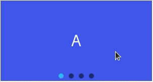

<!-- 源地址: https://iot.mi.com/vela/quickapp/en/components/container/swiper.html -->

# swiper

## Overview

Slider view container.

## Child Components

Supported.

## Attributes

Supports [Universal Attributes](</vela/quickapp/en/components/general/properties.html>).

Name | Type | Default | Required | Description  
---|:---:|---|:---:|---  
index | `<number>` | 0 | No | Index of the currently displayed child component  
autoplay | `<boolean>` | false | No | Whether to automatically play after rendering  
interval | `<number>` | 3000ms | No | Time interval for autoplay, in milliseconds  
indicator | `<boolean>` | true | No | Whether to enable the indicator, default true  
loop | `<boolean>` | true | No | Whether to enable loop mode  
duration | `<number>` |:---:| No | Slide animation duration (duration is dynamically calculated based on finger speed by default)  
vertical | `<boolean>` | false | No | Whether the slide direction is vertical, and the indicator is also vertical when it is  
previousmargin | `<string>` | 0px | No | Front margin, can be used to expose a small part of the previous item, supports units: px and %  
nextmargin | `<string>` | 0px | No | Rear margin, can be used to expose a small part of the next item, supports units: px and %  
enableswipe | `<boolean>` | true | No | Whether to support gesture swiping on the swiper  
  
**Note** : The sum of `previousmargin` and `nextmargin` should not exceed 1/2 of the entire swiper size, and any excess will be truncated.

## Styles

Supports [Universal Styles](</vela/quickapp/en/components/general/style.html>).

Name | Type | Default | Required | Description  
---|:---:|---|:---:|---  
indicator-color | `<color>` | rgba(0, 0, 0, 0.5) | No | Indicator fill color  
indicator-selected-color | `<color>` | #33b4ff or rgb(51, 180, 255) | No | Indicator color when selected  
indicator-size | `<length>` | 20px | No | Diameter size of the indicator component  
indicator-[top|left|right|bottom] | `<length>` | `<percentage>` |:---:| No | Position of the indicator relative to the swiper  
  
## Events

Supports [Universal Events](</vela/quickapp/en/components/general/events.html>).

Name | Parameters | Description  
---|:---:|---  
change | {index:currentIndex} | Triggered when the index of the currently displayed component changes  
swipestart[2+](</vela/quickapp/zh/guide/version/APILevel2>) | {index:currentIndex} | Triggered when the child component switching animation starts (if the switching is caused by finger dragging, it refers to the time point when the finger starts pressing and dragging)  
swipeend[2+](</vela/quickapp/zh/guide/version/APILevel2>) | {index:currentIndex} | Triggered when the child component switching animation ends  
  
## Methods

Name | Parameters | Description  
---|:---:|---  
swipeTo | {index: number(specified position)} | Scroll the swiper to the specified index position  
  
## Example Code
```html
< template > < div class = " page " > < swiper class = " swiper " > < text class = " item item-1 " > A </ text > < text class = " item item-2 " > B </ text > < text class = " item item-3 " > C </ text > < text class = " item item-4 " > D </ text > </ swiper > </ div > </ template > < style > .page { padding : 30px ; background-color : white ; } .swiper { width : 300px ; height : 160px ; indicator-size : 10px ; } .item { text-align : center ; color : white ; font-size : 30px ; } .item-1 { background-color : #3f56ea ; } .item-2 { background-color : #00bfc9 ; } .item-3 { background-color : #47cc47 ; } .item-4 { background-color : #FF6A00 ; } </ style >
```


