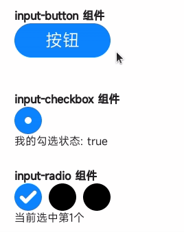

<!-- 源地址: https://iot.mi.com/vela/quickapp/en/components/form/input.html -->

# input

## Overview

Provide an interactive interface to receive user input.

## Child Components

Not supported.

## Attributes

[Common attributes](</vela/quickapp/en/components/general/properties.html>) are supported.

Name | Type | Default Value | Required | Description  
---|:---:|---|:---:|---  
type | button | checkbox | radio | | button | No | Dynamic modification is supported.  
checked | `<boolean>` | false | No | The checked status of the current component, which takes effect when the type is checkbox. It can trigger the checked pseudo-class (checked pseudo-class style is not supported yet).  
name | `<string>` |:---:| No | The name of the input component.  
value | `<string>` |:---:| No | The value of the input component.  
  
## Styles

[Common styles](</vela/quickapp/en/components/general/style.html>) are supported.

Name | Type | Default Value | Required | Description  
---|:---:|---|:---:|---  
color | `<color>` | rgba(0, 0, 0, 0.87) | No | Text color  
font-size | `<length>` | 37.5px | No | Text size  
width | `<length>` | `<percentage>` |:---:| No | When the type is button, the default value is 128px.  
height | `<length>` | `<percentage>` |:---:| No | When the type is button, the default value is 70px.  
  
## Events

[Common events](</vela/quickapp/en/components/general/events.html>) are supported.

Name | Parameters | Description  
---|:---:|---  
change | Different types have different parameters. For details, see the parameters of the change event below. | Triggered when the value or status of the input component changes. When the type is button, there is no change event.  
  
### Parameters of the change Event

Parameter | checkbox | radio | Remarks  
---|:---:|---|---  
name | √ | √ | -  
value | √ | √ | -  
checked | √ |:---:| -  
  
## Methods

Name | Parameters | Description  
---|:---:|---  
focus | {focus:true|false}, if focus is not passed, the default value is true | Enable or disable the focus of the component. It can trigger the focus pseudo-class (focus pseudo-class style is not supported yet).  
  
## Example Code
```html
< template > < div class = " page " > < div class = " section " > < text class = " title " > input-button component </ text > < input class = " button " type = " button " value = " Button " @click = " onButtonClick " /> < text > {{ buttonText }} </ text > </ div > < div class = " section " > < text class = " title " > input-checkbox component </ text > < input class = " checkbox " type = " checkbox " checked = " {{ checkboxChecked }} " @change = " onCheckboxChange " /> < text > My checked status: {{ checkboxChecked }} </ text > </ div > < div class = " section " > < text class = " title " > input-radio component </ text > < div > < input class = " radio " type = " radio " name = " radio " value = " 1 " checked = " {{radioValue === '1'}} " @change = " onRadioChange " /> < input class = " radio " type = " radio " name = " radio " value = " 2 " checked = " {{radioValue === '2'}} " @change = " onRadioChange " /> < input class = " radio " type = " radio " name = " radio " value = " 3 " checked = " {{radioValue === '3'}} " @change = " onRadioChange " /> </ div > < text > Currently, the {{ radioValue }}th one is selected. </ text > </ div > </ div > </ template > < script > export default { private : { buttonText : '' , checkboxChecked : true , radioValue : '1' } , onTextChange (e) { this.textValue = e.value } , onButtonClick () { this.buttonText = 'The button is clicked.' } , onCheckboxChange (e) { this.checkboxChecked = e.checked } , onRadioChange (e) { this.radioValue = e.value } } </ script > < style > .page { flex-direction : column ; padding : 30px ; background-color : #ffffff ; } .section { flex-direction : column ; margin-bottom : 30px ; } .title { font-weight : bold ; } .button { width : 140px ; height : 50px ; font-size : 25px ; color : white ; } .checkbox, .radio { width : 40px ; height : 40px ; margin-right : 10px ; } </ style >
```


