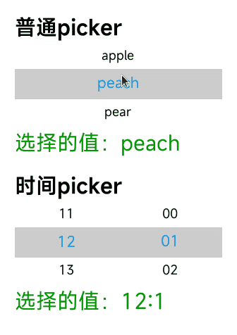

<!-- 源地址: https://iot.mi.com/vela/quickapp/en/components/form/picker.html -->

# picker

## Overview

A scroll picker that currently supports two types of pickers: the ordinary picker and the time picker. The ordinary picker is used by default. 

## Child Components

Not supported

## Attributes

[Common attributes](</vela/quickapp/en/components/general/properties.html>) are supported.

**Ordinary picker**

Name | Type | Default Value | Mandatory | Description  
---|:---:|---|:---:|---  
type | text |:---:| Yes | Dynamic modification is not supported.  
range | `<array>` |:---:| No | Value range of the picker  
selected | `<number>` | 0 | No | Default value of the picker, which is the index of the range.  
  
**Time picker**

Name | Type | Default Value | Mandatory | Description  
---|:---:|---|:---:|---  
type | time |:---:| Yes | Dynamic modification is not supported.  
selected | `<string>` | Current time | No | Default value of the picker. The format is hh:mm.  
  
## Styles

[Common styles](</vela/quickapp/en/components/general/style.html>) are supported.

Name | Type | Default Value | Mandatory | Description  
---|:---:|---|:---:|---  
color | `<color>` | Theme color | No | Font color of the candidate items  
font-size | `<length>` | 30px | No | Font size of the candidate items, in px  
selected-color | `<length>` | #ffffff | No | Font color of the selected item  
selected-font-size | `<length>` | 20px | No | Font size of the selected item, in px  
selected-background-color | `<color>` |:---:| No | Background color of the selected item  
  
## Events

**Ordinary picker**

Event Name | Parameters | Description  
---|:---:|---  
change | {newValue:newValue, newSelected:newSelected} | Triggered when a value is selected from the scroll picker and confirmed (newSelected is the index).  
  
**Time picker**

Event Name | Parameters | Description  
---|:---:|---  
change | {hour:hour, minute:minute} | Triggered when a value is selected from the scroll picker and confirmed.  
  
## Sample Code
```html
< template > < div class = " page " > < text class = " title " > Ordinary picker </ text > < picker class = " picker " type = " text " range = " {{pickerList}} " selected = " 1 " onchange = " onPickerChange " > </ picker > < text class = " value " > Selected value: {{v1}} </ text > < text class = " title " > Time picker </ text > < picker class = " picker " type = " time " selected = " 12:00 " onchange = " onTimePickerChange " > </ picker > < text class = " value " > Selected value: {{v2}} </ text > </ div > </ template > < script > export default { private : { pickerList : [ 'apple' , 'peach' , 'pear' , 'banana' ] , v1 : 'peach' , v2 : '12:00' } , onPickerChange (e) { this.v1 = e.newValue ; } , onTimePickerChange (e) { this.v2 = e.hour \+ ':' \+ e.minute ; } } </ script > < style > .page { flex-direction : column ; padding : 30px ; background-color : #ffffff ; } .title { font-weight : bold ; color : #000 ; } .value { margin-top : 5px ; margin-bottom : 30px ; color : #090 ; } .picker { font-size : 25px ; color : #000 ; selected-font-size : 30px ; selected-color : #09f ; selected-background-color : #ccc ; } </ style >
```


