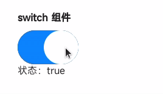

<!-- 源地址: https://iot.mi.com/vela/quickapp/en/components/form/switch.html -->

# switch

## Overview

Switch selection

## Subcomponents

Not supported

## Attributes

Supports [universal attributes](</vela/quickapp/en/components/general/properties.html>)

Name | Type | Default Value | Required | Description  
---|:---:|---|:---:|---  
checked | `<boolean>` | false | No | Can trigger the checked pseudo-class (checked pseudo-class style is not yet supported)  
  
## Styles

Supports [universal styles](</vela/quickapp/en/components/general/style.html>)

Name | Type | Default Value | Required | Description  
---|:---:|---|:---:|---  
thumb-color | `<color>` | #ffffff or rgb(255, 255, 255) | No | Slider color  
track-color | `<color>` | #0d84ff or rgb(13, 132, 255) | No | Track color  
  
## Events

Supports [universal events](</vela/quickapp/en/components/general/events.html>)

Name | Parameters | Description  
---|:---:|---  
change | {checked:checkedValue} | Triggered when the checked state changes  
  
## Sample Code
```html
< template > < div class = " page " > < text class = " title " > switch component </ text > < switch checked = " {{ switchValue }} " class = " switch " @change = " onSwitchChange " > </ switch > < text > Status: {{ switchValue }} </ text > </ div > </ template > < script > export default { private : { switchValue : true } , onSwitchChange (e) { this.switchValue = e.checked } } </ script > < style > .page { flex-direction : column ; padding : 30px ; background-color : #ffffff ; } .title { font-weight : bold ; } .switch { width : 100px ; margin-top : 10px ; } </ style >
```


