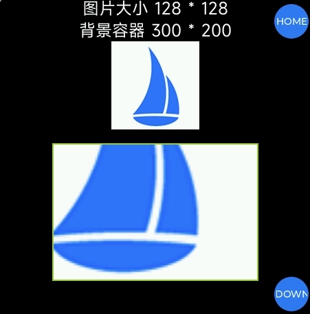

<!-- 源地址: https://iot.mi.com/vela/quickapp/en/components/general/background-img-styles.html -->

# Background Image Style

When adding an image as a component background within a page component, developers can adjust the size, repetition pattern, and placement position of the image background.

## background-size Property

This property defines the size of the background image.

The number of parameters can be one or two.

The list of valid parameters is as follows:

Parameter | Description  
---|---  
`contain` | Scales the background image proportionally to fit entirely within the container, possibly leaving some blank space in the container (used as a single parameter only)  
`cover` | Scales the background image proportionally to cover the entire container, possibly making parts of the background image invisible (used as a single parameter only)  
`auto` | Maintains the original image size. Note that the original image size is in physical resolution, consistent with the mobile screen resolution unit, not the `1px` length in JS applications  
`<length>` | Specifies the exact dimensions of the image in px or dp units. Floating-point calculations are not supported; floating-point values will be floored.  
`<percent>` | Specifies the image dimensions as a percentage of the corresponding container dimensions. Floating-point calculations are not supported; floating-point values will be floored.  
  
When two parameters are provided, the first parameter is interpreted as the width along the horizontal axis, and the second parameter is interpreted as the height along the vertical axis. If only one parameter is provided, `auto` is used as the second parameter, and the rules for two parameters are applied.

Invalid parameters are uniformly interpreted as the default value `auto`, i.e., the original image size.

**Example**
```html
< template > < div class = " page " > < text > Image size 128 * 128 </ text > < text > Background container 300 * 200 </ text > < image src = " ../../common/logo.png " > < div class = " imgBg " > </ div > </ div > </ template > < style > .page { flex-direction : column ; align-items : center ; background-color : #000 ; } text { color : #fff ; font-size : 24px ; } .imgBg { width : 300px ; height : 200px ; margin-top : 20px ; border : 2px solid yellowgreen ; background-color : yellowgreen ; background-image : url ('../../common/logo.png') ; background-size : 300px 200px ; background-repeat : no-repeat ; // Not yet supported ; recommended to include in case support is added later to prevent style anomalies } </ style >
```

**Effect**


## background-repeat Property (Not yet implemented)

This property defines how the background image repeats within the component. The background image can repeat along the horizontal axis, vertical axis, both axes, or not at all.

The number of parameters is one.

The list of valid parameters is as follows:

Parameter | Description  
---|---  
`repeat` | Repeats the image along both the horizontal and vertical axes  
`repeat-x` | Repeats the image only along the horizontal axis  
`repeat-y` | Repeats the image only along the vertical axis  
`no-repeat` | Does not repeat the image  
  
Invalid parameters are interpreted as the default value, i.e., `repeat`.

**Example**
```html
< div class = " container " > < div class = " img " > </ div > </ div > < style > .container { width : 365px ; height : 365px ; background-color : #c7c7c7 ; } .img { width : 100% ; height : 100% ; background-image : url ('../common/logo.png') ; /* Scales the background image proportionally to half the width of the component */ background-size : 50% ; /* Repeats the image along both the horizontal and vertical axes */ background-repeat : repeat ; /* Positions the background image at the center of the component */ background-position : center ; } </ style >
```

```css
.img { width : 100% ; height : 100% ; background-image : url ('../common/logo.png') ; /* Scales the background image proportionally to a width of 100px */ background-size : 100px ; /* Does not repeat the background image */ background-repeat : no-repeat ; /* Positions the background image 20px from the left edge of the component and at a ratio of 3:7 from the top and bottom edges */ background-position : left 20px top 30% ; }
```

## background-position Property

This property defines the position of the background image within the component.

It can be defined using 1-4 values. If two non-keyword values are used, the first value represents the horizontal position, and the second value represents the vertical position. If only one value is specified, the second value defaults to `center`. If three or four values are used, the length or percentage values are offsets from the preceding keyword values.

**Syntax for one value** :

The value can be:

  * The keyword `center` to center the background image.
  * One of the keywords `top`, `left`, `bottom`, `right` to specify which boundary to place the background image. The other dimension is set to 50%, so the background image is centered in that dimension.
  * `<length>` or `<percentage>` to specify the x-coordinate relative to the left boundary. The y-coordinate is set to 50%, centering the background image along the y-axis.

**Syntax for two values** :

One defines the x-coordinate, and the other defines the y-coordinate. Each value can be:

  * One of the keywords `top`, `left`, `bottom`, `right`. If `left` or `right` is given here, this value defines the x-axis position, and the other value defines the y-axis position. If `top` or `bottom` is given here, this value defines the y-axis position, and the other value defines the x-axis position.
  * `<length>` or `<percentage>`. If the other value is `left` or `right`, this value defines the Y relative to the top boundary. If the other value is `top` or `bottom`, this value defines the X relative to the left boundary. If both values are `<length>` or `<percentage>`, the first defines X, and the second defines Y.

_**Note** :_ If one value is `top` or `bottom`, the other value cannot be `top` or `bottom`. If one value is `left` or `right`, the other value cannot be `left` or `right`. In other words, `top top` and `left right` are invalid.

_**Ordering** :_ When pairing keywords, the position does not matter; `top left` and `left top` produce the same effect. When pairing `<length>` or `<percentage>` with a keyword, the order is important; the value defining X should come first, followed by the value defining Y. `right 20px` and `20px right` have different effects; the former is valid, but the latter is not. `left 20%` or `20% bottom` are valid because the X and Y values are clearly defined and in the correct position.

_**Default values**_ are `left top` or `0% 0%`.

**Syntax for three values** :

Two values are keyword values, and the third is an offset from the preceding values:

  * The first value is one of the keywords `top`, `left`, `bottom`, `right`, or `center`. If set to `left` or `right`, X is defined. If set to `top` or `bottom`, Y is defined, and the other keyword value defines X.
  * `<length>` or `<percentage>`, if the second value, is an offset from the first value. If the third value, it is an offset from the second value.
  * A single length or percentage value is an offset from the preceding keyword value. A combination of one keyword with two `<length>` or `<percentage>` values is invalid.

**Syntax for four values** :

The first and third values are keyword values defining X and Y. The second and fourth values are offsets from the preceding X and Y keyword values:

  * The first and third values are one of the keyword values `top`, `left`, `bottom`, `right`. If set to `left` or `right`, X is defined. If set to `top` or `bottom`, Y is defined, and the other keyword value defines X.
  * The second and fourth values are `<length>` or `<percentage>`. The second value is an offset from the first keyword. The fourth value is an offset from the second keyword.

Invalid parameters are all interpreted as the default value (`0px, 0px`), i.e., the image is displayed in the top-left corner of the component.

**Example**
```html
< template > < div class = " page " > < text > Image size 128 * 128 </ text > < text > Background container 300 * 200 </ text > < image src = " ../../common/logo.png " > < div class = " imgBg " > </ div > </ div > </ template > < style > .page { flex-direction : column ; align-items : center ; background-color : #000 ; } text { color : #fff ; font-size : 24px ; } .imgBg { width : 300px ; height : 200px ; margin-top : 20px ; border : 2px solid yellowgreen ; background-color : yellowgreen ; background-image : url ('../../common/logo.png') ; background-size : cover ; background-position : right bottom ; background-repeat : no-repeat ; // Not yet supported ; recommended to include in case support is added later to prevent style anomalies } </ style >
```

**Effect**



## Support Details

Device Product | Description  
---|---  
Xiaomi S1 Pro Sports Health Watch | Not supported  
Xiaomi Band 8 Pro | Not supported  
Xiaomi Watch S3 | Not supported  
Redmi Watch 4 | Not supported  
Xiaomi Wrist ECG Blood Pressure Monitor | Not supported  
Xiaomi Watch S4 | Supported  
REDMI Watch 5 | Supported
