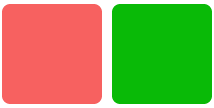

<!-- 源地址: https://iot.mi.com/vela/quickapp/en/components/general/style.html -->

# General Style

General styles are styles that can be supported by all components.

These styles are consistent with the usage of CSS property styles. Developers can write them in `inline styles` or `<style>` tags to customize component styles.

For information on setting component styles, refer to this [document](</vela/quickapp/en/guide/framework/style/page-style-and-layout.html>).

## Sample Code
```html
< template > < div class = " page " > < div class = " box-normal " style = " background-color : #f76160 " > </ div > < div class = " box-normal " > </ div > </ div > </ template > < style > .page { padding : 30px ; background-color : white ; } .box-normal { background-color : #09ba07 ; width : 100px ; height : 100px ; border-radius : 8px ; margin-right : 10px ; } </ style >
```



## Property List

**Note** : All general styles are optional.

Name | Type | Default Value | Description  
---|:---:|---|---  
width | `<length>` | `<percentage>` |:---:| Uses the width required by the component's own content when not set  
height | `<length>` | `<percentage>` |:---:| Uses the height required by the component's own content when not set  
min-width | auto | `<length>` | `<percentage>` | auto | Specifies the minimum width of an element. This property cannot be negative. The default value `auto` is the default minimum width for flexible elements. The same applies below.  
min-height | auto | `<length>` | `<percentage>` | auto | Specifies the minimum height of an element  
max-width | none | `<length>` | `<percentage>` | none | Specifies the maximum width of an element. This property cannot be negative. The default value `none` indicates no restriction. The same applies below.  
max-height | none | `<length>` | `<percentage>` | none | Specifies the maximum height of an element  
padding | `<length>` | 0 | Shorthand property that sets all padding properties in one declaration. This property can have 1 to 4 values. For details, refer to the [MDN (opens new window)](<https://developer.mozilla.org/en-US/docs/Web/CSS/padding>) documentation.  
padding-[left|top|right|bottom] | `<length>` | 0 | Sets the padding in a specific direction for an element. The padding area refers to the space between an element's content and its boundary. This property cannot be negative.  
margin | `<length>` | 0 | Shorthand property that sets all margin properties in one declaration. This property can have 1 to 4 values. For details, refer to the [MDN (opens new window)](<https://developer.mozilla.org/en-US/docs/Web/CSS/margin>) documentation.  
margin-[left|top|right|bottom] | `<length>` | 0 | Sets the margin in a specific direction for an element. This property cannot be negative.  
border |:---:| 0 | Shorthand property that sets all border properties in one declaration. You can set the properties width, style, and color in sequence. Properties not set will use default values.  
border-style | solid | solid | Currently supports only 1 value, setting the style for all borders of an element  
border-width | `<length>` | 0 | Sets the width of all borders for an element  
border-color | `<color>` | black | Sets the color of all borders for an element. For color value input, refer to [Color Configuration](</vela/quickapp/en/components/general/color.html>)  
border-radius | `<length>` | `<percentage>` | 0 | The border-radius property allows you to set rounded corners for an element's outer border. When setting, you need to set border-width and border-color simultaneously. The radius's magnitude will not exceed half of the shorter side of the rectangle.  
background-color | `<color>` |:---:| For color value input, refer to [Color Configuration](</vela/quickapp/en/components/general/color.html>)  
color | `<color>` |:---:| For color value input, refer to [Color Configuration](</vela/quickapp/en/components/general/color.html>)  
background-image | `<uri>` |:---:| Supports local and network image resources; when using the `internal://` protocol, upgrade aiot-toolkit to version 1.1.2 or higher  
background-size | contain | cover | auto | `<length>` | `<percentage>` | auto auto | Sets the background image size. For details, see [Background Image Styles](</vela/quickapp/en/components/general/background-img-styles.html>)  
background-repeat | repeat | repeat-x | repeat-y | no-repeat | repeat | [Currently unsupported] Sets whether and how background images are repeated. For details, see [Background Image Styles](</vela/quickapp/en/components/general/background-img-styles.html>)  
background-position | `<length>` |`<percentage>`| left | right | top | bottom | center | 0px 0px | Sets the position where the background image is drawn within the container. Supports 1-4 parameters. For details, see [Background Image Styles](</vela/quickapp/en/components/general/background-img-styles.html>)  
box-shadow [3+](</vela/quickapp/zh/guide/version/APILevel3>) | `<length>` `<length>` `<color>` |  
`<length>` `<length>` `<length>` `<color>` |  
`<length>` `<length>` `<length>` `<length>` `<color>`  
|:---:| Sets the shadow effect for an element. This property can set values including the X-axis offset, Y-axis offset, blur radius, spread radius, and [color](</vela/quickapp/en/components/general/color.html>) of the shadow.  
Example:  
box-shadow: 60px -16px teal, values correspond to: x-axis offset, y-axis offset, [shadow color](</vela/quickapp/en/components/general/color.html>);  
box-shadow: 10px 5px 5px black, values correspond to: x-axis offset, y-axis offset, shadow blur radius, [shadow color](</vela/quickapp/en/components/general/color.html>);  
box-shadow: 2px 2px 2px 1px rgba(0, 0, 0, 0.2), values correspond to: x-axis offset, y-axis offset, shadow blur radius, shadow spread radius, [shadow color](</vela/quickapp/en/components/general/color.html>)  
opacity | `<number>` | 1 | The opacity property specifies the transparency of an element  
display | flex | none | flex | JS applications only support flex layout; setting the current element's display to none will prevent it from being rendered on JS application pages  
visibility | visible | hidden | visible | The visibility property controls the display or hiding of an element without changing the document's layout  
flex | `<number>` |:---:| Takes effect when the parent container is `<div>` or `<list-item>`  
flex-grow | `<number>` | 0 | Takes effect when the parent container is `<div>` or `<list-item>`  
flex-shrink | `<number>` | 1 | Takes effect when the parent container is `<div>` or `<list-item>`  
flex-basis | `<number>` | -1 | Takes effect when the parent container is `<div>` or `<list-item>`  
flex-direction | `<string>` | row | Defaults to horizontal `row`. Takes effect when the parent container is `<div>` or `<list-item>`  
align-items | `<string>` | flex-start | align-items defines how flex items can be aligned along the cross axis of the flex container's current row. flex-start (default): The flex item's outer margin edge at the cross axis start aligns with the row's edge at the cross axis start. flex-end: The flex item's outer margin edge at the cross axis end aligns with the row's edge at the cross axis end. center: The flex item's margin box is centered along the cross axis of the row. baseline: Flex items are aligned according to their baselines. stretch: Flex items are stretched to fill the entire flex container. This value causes the item's margin box dimensions to be as close as possible to the row's dimensions while respecting the constraints of the `min/max-width/height` properties.  
justify-content | `<string>` | flex-start | justify-content defines how flex items are aligned along the main axis. flex-start (default): Flex items are aligned to the start of a row. flex-end: Flex items are aligned to the end of a row. center: Flex items are aligned to the center of a row. space-between: Flex items are evenly distributed in a row. The first flex item is at the start of the row, and the last flex item is at the end of the row. space-around: Flex items are evenly distributed in a row, with equal space around them.  
position | absolute | relative | relative | Supports relative and absolute property values, with a default value of relative; does not take effect when the parent container is `<list>` or `<swiper>`  
[left|top|right|bottom] | `<length>` |:---:| Generally used in conjunction with `absolute` layout. Supports the unit px and does not currently support percentages.
