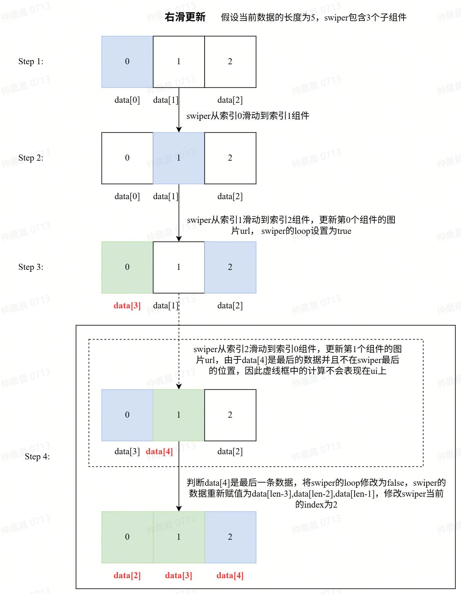

<!-- 源地址: https://iot.mi.com/vela/quickapp/en/guide/best-practice/business.html -->

# Common Business Optimization

## List and Long Copy Optimization

Description

Optimization methods for long lists and long copy (e.g., lengthy privacy agreements, user agreements) during display

  * List

When rendering a list initially, if the content exceeds 10 items, it is recommended to use pagination or trigger new data requests upon reaching the bottom. Avoid rendering a large amount of data initially, as it can cause page rendering lag.

  * Long Copy

Long copy typically involves displaying a large amount of text on small device screens, such as "User Agreement," "Privacy Agreement," "Minor Protection Agreement," etc.

    * It is usually recommended to display the agreement link via a QR code. Scanning the code to view on a mobile device is a common design practice.
    * If the product requires full rendering at once, it may cause page rendering lag and affect the initial user experience. Here, chunked rendering of the copy is recommended. Below is a code example:
```html
<!-- Area for rendering the copy, with handleScroll scroll listener bound --> < template > < scroll id = " scroll " scroll-y = " true " class = " scroll " onscroll = " handleScroll " > < div id = " content " class = " connent " > < block if = " {{currentKey >= 0}} " > < text class = " header-1 " > {{contentArray[0]}} </ text > </ block > < block if = " {{currentKey >= 1}} " > < text class = " header-1 " > {{contentArray[1]}} </ text > </ block > < block if = " {{currentKey >= 2}} " > < text class = " header-1 " > {{contentArray[2]}} </ text > </ block > </ div > </ scroll > </ template > <!-- Save the copy content as an array and record the sequence number of the currently rendered copy --> < script > export default { data : { contentArray : [ { content : 'Copy one..........' } , { content : 'Copy two..........' } , { content : 'Copy three..........' } ] , // Current sequence number of the rendered copy currentKey : 0 , // Current total height currentTHEight : 0 , } // Assign initial value to current total height onReady onReady () { this . $element ('content') . getBoundingClientRect ({ success : (data) => { const { height } = data ; this.currentTHEight = height } }) } // Real-time judgment of scroll height vs. total height; load next copy if near bottom, and reassign total height handleScroll (e) { if (currentTHEight \- e.scrollY < 40) { this.currentKey = currentKey \+ 1 } this . $element ('content') . getBoundingClientRect ({ success : (data) => { const { height } = data ; this.currentTHEight = height } }) } } </ script >
```

## Swiper Multi-Image Optimization

Description

When using the swiper carousel, if there are many images, avoid rendering multiple images simultaneously. Ensure only images within and around the visible area are rendered.

Suppose an album has `200` images to display, creating `200` sub-components in the `swiper` is not performance-friendly. Therefore, consider displaying only `3` sub-components in the `swiper` and dynamically updating the images in the sub-components during swiping to achieve lazy loading in the `Swiper`. The main process for right-swipe lazy loading is as follows:

  * Right-Swipe Lazy Loading Process Assume an array of `5` images `data=[0,1,2,3,4]` needs to be displayed in a `swiper` with `3` sub-components.

    1. When the user clicks the first image, the `swiper` data is `data[0], data[1], data[2]`
    2. When swiping from the first to the second image, the `swiper` array remains `data[0], data[1], data[2]`
    3. When swiping from the second to the third image, modify the first component's data in the `swiper` to the next data of the third image `data[3]`, and set the `loop` property of the `swiper` to true. At this point, the `swiper` data is `data[3], data[1], data[2]`;
    4. When swiping from `data[3]` to `data[4]`, note that `data[4]` is the last data. If the last data is not in the last component of the `swiper`, reset all data in the `swiper` to `data[len-3], data[len-2], data[len-1]` to ensure the last image is in the last component of the `swiper`, and set `loop` to `false` to prevent swiping from the last to the first image.

 `Swiper Lazy Loading Example`

  * Specific Implementation Idea

Monitor the swiper's swiping via the `@change` event in the code. The logic for judging left and right swipes is as follows:
```js
// Judge right swipe if ((! (this.currentIndex === 0 && index === length \- 1) && index > this.currentIndex) || (index === 0 && this.currentIndex === length \- 1)) { } else { }
```

The logic for right swiping is as follows:
```js
// Update data index this.dataIndex = this.dataIndex \+ 1 // Update next right swipe index const updateIndex = this.dataIndex \+ 1 if (updateIndex < this.bigThumbnailInfo.length) { // Update next right swipe to the next image updateItem = this.bigThumbnailInfo [ updateIndex ] // If swiping from the first image if (this.currentIndex === 0) { // Before swiping, it's the first image; update the last in swiper after right swipe this.data [ length \- 1 ] = updateItem resIndex = length \- 1 } else { // console.info("Right swipe: update left") this.data [ this.currentIndex \- 1 ] = updateItem resIndex = this.currentIndex \- 1 } }
```

The logic for left swiping is as follows:
```js
// Update data index this.dataIndex = this.dataIndex \- 1 // Update next right swipe index const updateIndex = this.dataIndex \- 1 // Update next left swipe to the previous image updateItem = this.bigThumbnailInfo [ updateIndex ] if (this.currentIndex === length \- 1) { // Before swiping, it's the last image; update the first in swiper after left swipe this.data [ 0 ] = updateItem resIndex = 0 } else { this.data [ this.currentIndex \+ 1 ] = updateItem resIndex = this.currentIndex \+ 1 }
```

Judge if the current image is the last one:
```js
this.data = [ this.bigThumbnailInfo [ len \- 3 ] , this.bigThumbnailInfo [ len \- 2 ] , this.bigThumbnailInfo [ len \- 1 ] ] indexTemp = 2 this.swiperIndex = this.currentIndex this.isloop = false
```

Judge if the upcoming image is the first one:
```js
this.data = [ this.bigThumbnailInfo [ 0 ] , this.bigThumbnailInfo [ 1 ] , this.bigThumbnailInfo [ 2 ] ] indexTemp = 0 this.swiperIndex = this.currentIndex this.isloop = false
```

If it's neither the first nor the last image, set the `swiper`'s `loop` to `true`:
```js
this.isloop = true
```

## Device Frame Rate Optimization Suggestions

  * When there are background images or images, minimize the use of `border-radius` and use images with rounded corners instead.
  * Ensure the image size matches the size of the `div` or `image` component to avoid scaling.
  * Reduce modifications to `dynamic styles`.
  * Minimize the `nesting level` of tags.
  * Reduce reflows and repaints.

## Other Optimization Suggestions

  * Add try-catch blocks to catch exceptions.
  * For scenarios with slow data requests, consider adding a loading indicator.

