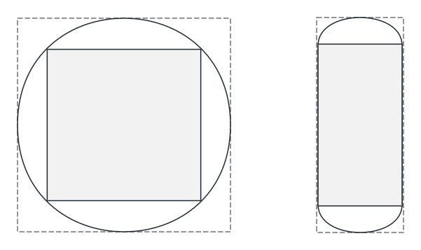

<!-- 源地址: https://iot.mi.com/vela/quickapp/en/guide/design/multi-screens.html -->

# Multi-screen Design

## Xiaomi Smart Wearable Devices

Currently, Xiaomi wearable devices equipped with the Vela system are primarily smartwatches and smart bands. The watch screens are circular or rectangular, while the band screens are mainly rectangular and capsule-shaped.

Data reference for released Vela wearable devices:

Device Type | Device Model | Screen Shape | Screen Size | Resolution | PPI | DPR  
---|:---:|---|:---:|---|:---:|---  
Watch | Xiaomi Watch S1 Pro | Circular | 1.47 inches | 480x480 | 326 | 2.0  
Watch | Xiaomi Watch H1 | Circular | 1.43 inches | 466x466 | 326 | 2.0  
Watch | Xiaomi Watch S3 | Circular | 1.43 inches | 466x466 | 326 | 2.0  
Watch | Xiaomi Watch S4 sport | Circular | 1.43 inches | 466x466 | 326 | 2.0  
Watch | Xiaomi Watch S4 | Circular | 1.43 inches | 466x466 | 326 | 2.0  
Watch | REDMI Watch 5 | Rectangular | 2.07 inches | 432x514 | 324 | 2.0  
Band | Xiaomi Smart Band 8 Pro | Rectangular | 1.74 inches | 336x480 | 336 | 2.1  
Band | Xiaomi Smart Band 9 | Capsule-shaped (track-style) | 1.62 inches | 192x490 | 325 | 2  
Band | Xiaomi Smart Band 9 Pro | Rectangular | 1.74 inches | 336x480 | 336 | 2.1  
  
## Design Recommendations

When integrating products, design decisions can be made based on the application scenarios and the adaptable product forms. If the product scenario allows for good interaction across various screen forms such as smart bands and watches, it is recommended to create three types of design drafts to accommodate the interaction schemes for capsule-shaped, circular, and rectangular screens.

Data reference for different screen shapes:

Screen Shape | Circular Screen | Rectangular Screen | Capsule Screen  
---|:---:|---|---  
Aspect Ratio Range | W/H=1 | 0.5<=W/H<1 | 0.3<W/H<0.5  
Recommended Aspect Ratio | 1 | 0.7 | 0.39  
Recommended Resolution | 466x466 | 336x480 | 192x490  
  
It is recommended to design three sets of UI interactions to adapt to the three main screen types. If the designs for circular and rectangular screens can be reused, one set can be designed for circular and rectangular screens, and another set for capsule screens.

## Safe Area Adaptation for Curved Screens

For circular and capsule-shaped screens, the curved screen edges can cause some display issues. When designing the UI, it is necessary to consider the safe area of the screen and design the main functions within the safe area.

For example, when displaying text or content lists, it is important to consider the completeness and interactivity of the display at the edges.

The gray areas in the illustration represent the safe areas for circular and capsule screens, respectively.

