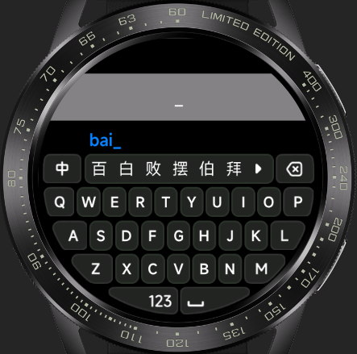
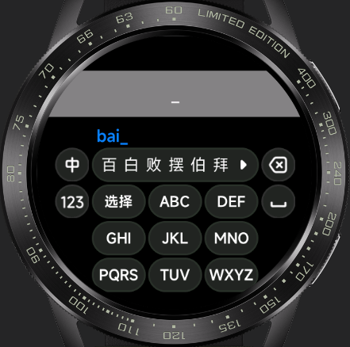

<!-- 源地址: https://iot.mi.com/vela/quickapp/en/guide/developer-materials/extension-components.html -->

# Extension Components

## input-method

### Overview

An input method component that adapts to different screen shapes and supports two mainstream keyboard layouts: full-keyboard mode and T9 mode for both Chinese and English input.

### Example Previews

#### Full-Keyboard Mode

  * Circular Screen

  * Rectangular Screen

  * Pill-Shaped Screen

#### T9 Mode

  * Circular Screen

### Project Address

  * [Github (opens new window)](<https://github.com/NEORUAA/Vela_input_method>)

