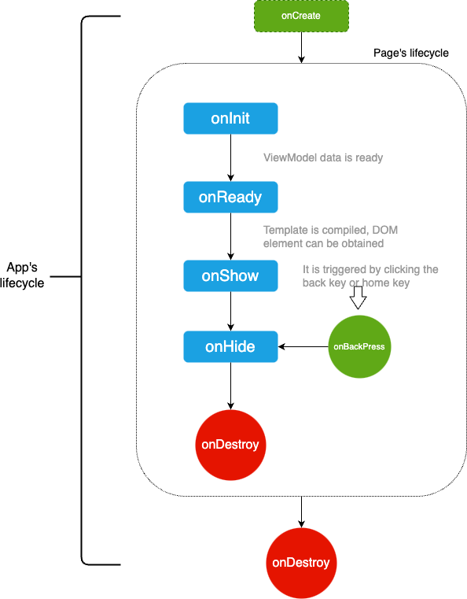

<!-- 源地址: https://iot.mi.com/vela/quickapp/en/guide/framework/script/lifecycle.html -->

# Lifecycle

  * Page lifecycle: `onInit`, `onReady`, `onShow`, `onHide`, `onDestroy`, `onBackPress`, `onRefresh`, `onConfigurationChanged`
  * Page states: `displayed`, `hidden`, `destroyed`
  * APP lifecycle: `onCreate`, `onShow`, `onHide`, `onDestroy`, `onError`

## Lifecycle Diagram



## Page Lifecycle

Since pages are rendered via `ViewModel`, the page lifecycle refers to the lifecycle of the `ViewModel`, including common events: onInit, onReady, and onShow, which are triggered during **page creation**.

### onInit()

**Indicates that the`ViewModel`'s data is ready** and can be used in the page.

**Example** :
```javascript
private : { // Text list for lifecycle lcList : [ ] } , onInit() { this.lcList.push('onInit')console.info(` Triggered: onInit `)// Execute: Get the lcList property of ViewModel: onInit console.info(` Execute: Get the lcList property of ViewModel: ${ this.lcList } `)// $app info console.info(` Get: Data from manifest.json's config.data: ${ this . $app . $data.name } `)console.info(` Get: Data from APP file: ${ this . $app . $def.data1.name } `)console.info(` Execute: Method from APP file ` , this . $app . $def.method1())}
```

### onReady()

**Indicates that the`ViewModel`'s template has been compiled** and DOM nodes can now be accessed (e.g., `this.$element(idxxx)`).

**Example** :
```javascript
onReady() { this.lcList.push('onReady')console.info(` Triggered: onReady `)}
```

### onShow(), onHide()

Multiple pages can run simultaneously in the APP, but **only one page can be displayed at a time**. This differs from pure front-end development, where opening a new page in the browser destroys the previous one. However, it is similar to SPA development, where the browser's global context is shared when switching pages.

Page switching generates new events: onHide() is called when a page is hidden, and onShow() is called when a page is redisplayed.

**Example** :
```javascript
onShow() { this.lcList.push('onShow')console.info(` Triggered: onShow `)} , onHide() { this.lcList.push('onHide')console.info(` Triggered: onHide `)}
```

### onDestroy()

Called when a page is destroyed. Possible reasons for destruction include: the user returns to the previous page, or the user opens too many pages, and the framework automatically destroys some pages to free up resources.

Therefore, **resource cleanup** operations should be performed when a page is destroyed, such as canceling interface subscription listeners (`geolocation.unsubscribe()`).

To check if a page is in a destroyed state, use the `$valid` property of the `ViewModel`: `true` indicates existence, `false` indicates destruction.

**Example** :
```javascript
onDestroy() { console.info(` Triggered: onDestroy `)console.info(` Execute: Page is about to be destroyed. Destruction state: ${ this . $valid } . Should cancel interface subscription listener: geolocation.unsubscribe() `)// true, about to be destroyed setTimeout(function() { // Page has been destroyed, will not execute console.info(` Execute: Page has been destroyed, will not execute `)} . bind(this), 0)}
```

**Note** :

  * Asynchronous operations like `setTimeout` are bound to the current page, so they will not execute after the page is destroyed.

### onBackPress()

Triggered when the user `swipes right to return` or clicks the `physical back button`.

If the event handler returns `true` at the end, it indicates that the system should not return and the developer should handle the business logic (and then manually call the API to return). Otherwise, if no data is returned or other data is returned, the system follows its default logic: return to the previous page.

**Example** :
```javascript
onBackPress() { console.info(` Triggered: onBackPress `)// true: indicates custom handling; otherwise, defaults to returning to the previous page // return true }
```

### onRefresh(query)

Listens for page reopening.

  1. When the page's `launchMode` in the manifest is set to 'singleTask', only one instance of the target page will exist. This function is triggered when the user opens the target page multiple times.
  2. Triggered when the target page is opened with the 'clearTask' flag in the push parameters and the page instance already exists. The parameter in this callback is the data carried when reopening the page. See [Page Launch Modes](</vela/quickapp/en/guide/framework/other/launch-mode.html>) for details.

**Example** :
```javascript
onRefresh(query){ // When launchMode is singleTask, parameters carried when reopening the page are not automatically updated to the page's this object. // Need to manually retrieve and update them from query here. console.log('Page refreshed!!!')}
```

### onConfigurationChanged(event)

Listens for changes in application configuration. Triggered when the application configuration changes, such as a change in system language.

**Parameters**

Parameter | Type | Description  
---|:---:|---  
event | Object | Event indicating a change in application configuration  
  
**event Parameters**

Parameter | Type | Description  
---|:---:|---  
type | String | Reason type for the application configuration change. Supported type values are as follows:  
  
**Supported type values in event**

Parameter | Description  
---|---  
locale | Application configuration changed due to language or region changes  
  
**Example** :
```javascript
onConfigurationChanged(evt){ console.log(` Triggered lifecycle onConfigurationChanged. Configuration type: ${ evt.type } `)}
```

## APP Lifecycle

Five callback functions are provided for the APP lifecycle: onCreate(), onShow(), onHide(), onDestroy(), and onError(e).

**Example** :
```javascript
export default { // Listen for application creation. Called when the application is created. onCreate() { console.info('Application onCreate')} , // Listen for application returning to the foreground. Called when the application returns to the foreground. onShow() { console.info('Application onShow')} , // Listen for application moving to the background. Called when the application moves to the background. onHide() { console.info('Application onHide')} , // Listen for application destruction. Called when the application is destroyed. onDestroy() { console.info('Application onDestroy')} , // Listen for application errors. Called when the application catches an exception. The parameter is an Error object. onError(e){ console.log('Application onError' , e)} , // Exposed to all pages. Accessed in pages via: this.$app.$def.method1() method1() { console.info('This is an APP method')} , // Exposed to all pages. Accessed in pages via: this.$app.$def.data1 data1 : { name : 'This is data stored by the APP' } }
```
