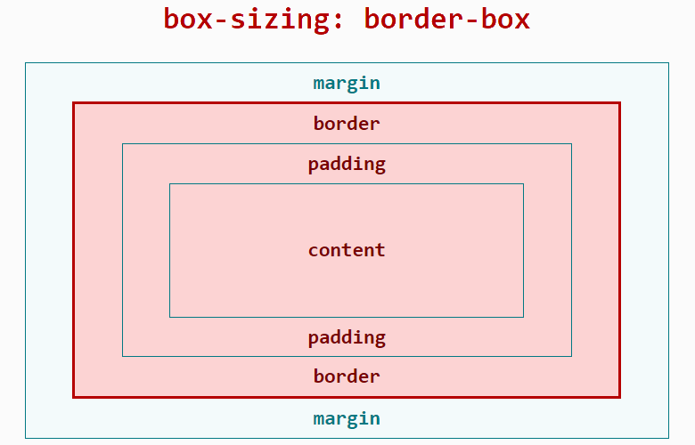

<!-- 源地址: https://iot.mi.com/vela/quickapp/en/guide/framework/style/page-style-and-layout.html -->

# Page Styling and Layout

## Box Model

The JS application layout framework uses the border-box model. For specific performance and width/height/margin calculations, refer to the MDN documentation on [box-sizing (opens new window)](<https://developer.mozilla.org/zh-CN/docs/Web/CSS/box-sizing>). The content-box model and manual specification of the box-sizing property are not currently supported.



Width occupied by the layout:

`Width = width (including padding-left + padding-right + border-left + border-right)`

Height occupied by the layout:

`Height = height (including padding-top + padding-bottom + border-top + border-bottom)`

## Length Units

The framework supports the following length units: `px`, `%`, `dp`.

### px

Unlike traditional web pages, `px` is a unit relative to the `project configuration base width`. It has been adapted for mobile screens, similar in principle to `rem`.

Developers only need to determine the px value in the framework style based on the design draft.

First, define the `project configuration base width`, which is the value of `config.designWidth` in the project configuration file (`<ProjectName>/src/manifest.json`). The default value is 480 if not specified.

Then, the conversion formula between `design draft 1px` and `framework style 1px` is as follows:
``` Design draft 1px / Design draft base width = Framework style 1px / Project configuration base width
```

**Example** :

If the design draft width is 640px and element A has a width of 100px in the design draft, there are two implementation schemes:

**Scheme 1** :

Modify the `project configuration base width`: Set the `project configuration base width` to the `design draft base width`, then `framework style 1px` equals `design draft 1px`.

  * Set the `project configuration base width` in the project configuration file (`<ProjectName>/src/manifest.json`) by modifying `config.designWidth`:
```json
{ "config" : { "designWidth" : 640 } }
```

  * Set the framework style for element A:
``` width: 100px;
```

**Scheme 2** :

Do not modify the `project configuration base width`: If the current project's `project configuration base width` is 480, let the framework style of element A be x`px`. From the conversion formula: `100 / 640 = x / 480`.

  * Set the framework style for element A:
``` width: 75px;
```

### Percentage %

The percentage calculation rules in JS applications are similar to CSS. Refer to the [MDN documentation (opens new window)](<https://developer.mozilla.org/zh-CN/docs/Web/CSS/percentage>).

### dp3+

The dp unit stands for device independent pixels.

Calculation formula: dp value = physical resolution / device pixel ratio

Example: A device with a resolution of 480*480 and a device pixel ratio of 2 has a screen width of 480 pixels = 240dp.

Example code:
```css
<style> .dp-box { width : 360dp ; height : 360dp ; background-color : green ; margin-bottom : 40px ; } </style>
```

## Setting Positioning

The position property supports two values: relative and absolute, with relative as the default value. Refer to the [MDN documentation (opens new window)](<https://developer.mozilla.org/zh-CN/docs/Web/CSS/position>).

## Setting Styles

Developers can use `inline styles`, `tag selectors`, `class selectors`, and `id selectors` to style components.

You can also use `parallel selectors` to set styles. Descendant selectors are not currently supported.

Detailed documentation can be found [here](</vela/quickapp/en/guide/framework/style/>).

**Example** :
```html
< template > < div class = " page " > < text style = " color : #FF0000 ; " > Inline style </ text > < text id = " title " > ID selector </ text > < text class = " title " > Class selector </ text > < text > Tag selector </ text > </ div > </ template > < style > .page { flex-direction : column ; } /* Tag selector */ text { color : #0000FF ; } /* Class selector (recommended) */ .title { color : #00FF00 ; } /* ID selector */ #title { color : #00A000 ; } /* Parallel selector */ .title, #title { font-weight : bold ; } </ style >
```

## Common Styles

For common styles such as margin and padding, refer to [here](</vela/quickapp/en/components/general/style.html>).

## Flex Layout Example

The framework uses `Flex layout`. For more information on `Flex layout`, refer to the external documentation [A Complete Guide to Flexbox (opens new window)](<https://css-tricks.com/snippets/css/a-guide-to-flexbox/>).

Support for `Flex layout` can also be found in the [Common Styles](</vela/quickapp/en/components/general/style.html>) section of the official documentation.

The div component is the most commonly used Flex container component with Flex layout characteristics. The text and span components are text container components. **Other components cannot directly contain text content.**

**Example** :
```html
< template > < div class = " page " > < div class = " item " > < text > item1 </ text > </ div > < div class = " item " > < text > item2 </ text > </ div > </ div > </ template > < style > .page { /* Cross-axis centering */ align-items : center ; /* Vertical arrangement */ flex-direction : column ; } .item { /* Allow stretching when there is remaining space */ /*flex-grow: 1;*/ /* Do not allow compression when space is insufficient */ flex-shrink : 0 ; /* Main axis centering */ justify-content : center ; width : 200px ; height : 100px ; margin : 10px ; background-color : #FF0000 ; } </ style >
```

## Dynamic Style Modification

There are multiple ways to dynamically modify styles, consistent with traditional front-end development habits, including but not limited to the following:

  * **Modify class** : Update the value of the variable used in the component's class attribute.
  * **Modify inline style** : Update a CSS value in the component's style attribute.
  * **Modify bound object** : Control the element's style through a bound object. 

**Example** :
```html
< template > < div style = " flex-direction : column ; " > <!-- Modify class --> < text class = " normal-text {{ className }} " onclick = " changeClassName " > Click to change text color </ text > <!-- Modify inline style --> < text style = " color: { { textColor } } " onclick = " changeInlineStyle " > Click to change text color </ text > <!-- Modify bound object --> < text style = " { { styleObj } } " onclick = " changeStyleObj " > Click to change text color </ text > </ div > </ template > < style > .normal-text { font-weight : bold ; } .text-blue { color : #0faeff ; } .text-red { color : #f76160 ; } </ style > < script > export default { private : { className : 'text-blue' , textColor : '#0faeff' , styleObj : { color : 'red' } } , onInit () { console.info ('Dynamic style modification') } , changeClassName () { this.className = 'text-red' } , changeInlineStyle () { this.textColor = '#f76160' } , changeStyleObj () { this.styleObj = { color : 'yellow' } } } </ script >
```

## Introducing Less/SCSS Precompilation

### Less Section

For an introduction to less syntax, refer to the [less Chinese official website (opens new window)](<https://less.bootcss.com/>).

To use less, first install the corresponding libraries: `less`, `less-loader`:
``` npm i less less-loader
```

Refer to the documentation [Style Syntax --> Style Precompilation](</vela/quickapp/en/guide/framework/style/#样式预编译>). Then add the attribute `lang="less"` to the `<style>` tag.

**Example** :
```html
< template > < div class = " page " > < text id = " title " > Less example! </ text > </ div > </ template > < style lang = " less " > /* Import external less file */ @import './style.less' ; /* Use less */ </ style >
```

### SCSS Section

For an introduction to scss syntax, refer to the [scss Chinese official website (opens new window)](<https://www.sasscss.com/>).

To use scss, execute the following command under the JS application project to install the corresponding libraries: `node-sass`, `sass-loader`:
``` npm i node-sass sass-loader
```

Refer to the documentation [Style Syntax --> Style Precompilation](</vela/quickapp/en/guide/framework/style/#样式预编译>). Then add the attribute `lang="scss"` to the `<style>` tag.

**Example** :
```html
< template > < div class = " page " > < text id = " title " > Less example! </ text > </ div > </ template > < style lang = " scss " > /* Import external scss file */ @import './style.scss' ; /* Use scss */ </ style >
```

## Using PostCSS to Parse CSS

JS applications support using PostCSS to parse CSS. PostCSS can parse CSS using syntax similar to Less and Sass, supporting features such as variables, nesting, and defining functions.

Using PostCSS to parse CSS involves three steps:

  1. Install the corresponding loader:

> npm i postcss-loader precss@3.1.2 -D

  2. Create a postcss.config.js file in the project root directory and add the following content:
```js
module.exports = { plugins : [ require ('precss') ] }
```

Here, precss is a PostCSS plugin.

  3. Add lang="postcss" to the corresponding style tag on the page, as follows:
```html
< style lang = " postcss " > /* Use PostCSS */ .page { justify-content : center ; background-color : #00beaf ; } #title { color : #FF0000 ; } </ style >
```

Now you can write the corresponding code in CSS.

Note

If you want to support more syntax formats, you can add more plugins in the postcss.config.js file. For PostCSS plugins, refer to the [plugin address (opens new window)](<https://github.com/postcss/postcss/blob/master/docs/plugins.md>).
