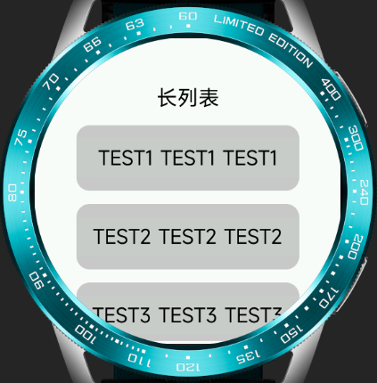
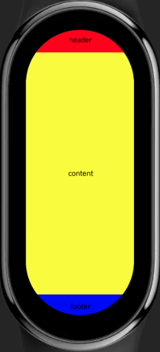
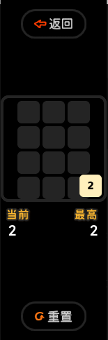
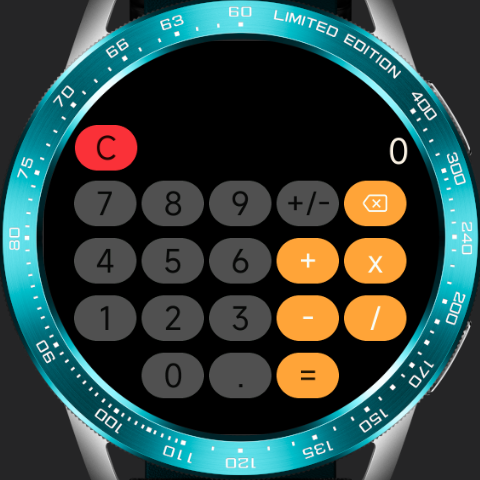

<!-- 源地址: https://iot.mi.com/vela/quickapp/en/guide/multi-screens/samples.html -->

# Code Examples

## Page Layout and Element Adaptation

Some common cross-screen adaptation examples in development.

### Adaptive Container Size

Using percentages or flex styles instead of fixed container sizes with px can provide better compatibility across multiple screens. For example, in scenarios with long scrolling lists, the example is as follows:
```html
< template > < div class = " demo-page " > < text class = " title " > Long List </ text > < list class = " list " > < list-item class = " item " type = " custom " for = " {{listData}} " > < text > {{$item.name}} </ text > </ list-item > </ list > </ div > </ template > < script > export default { private : { listData : [ { name : 'TEST1 TEST1 TEST1' } , { name : 'TEST2 TEST2 TEST2' } , { name : 'TEST3 TEST3 TEST3' } , { name : 'TEST4 TEST4 TEST4' } , { name : 'TEST5 TEST5 TEST5' } , { name : 'TEST6 TEST6 TEST6' } , { name : 'TEST7 TEST7 TEST7' } , { name : 'TEST8 TEST8 TEST8' } , { name : 'TEST9 TEST9 TEST9' } , { name : 'TEST10 TEST10 TEST10' } ] } } </ script > < style > .demo-page { flex-direction : column ; align-items : center ; background-color : #fff ; } .title { margin-top : 50px ; padding : 20px 0 ; font-size : 32px ; } .list { flex : 1 ; width : 340px ; margin-bottom : 5px ; align-items : center ; } .item { width : 100% ; height : 100px ; margin-bottom : 20px ; border-radius : 20px ; background-color : #ccc ; text-align : center ; } text { width : 100% ; font-size : 30px ; text-align : center ; color : #000 ; } </ style >
```

Effect display:

Circular screen / Rectangular screen / Capsule screen

  

### Single-Page Three-Row Layout

In watch and bracelet scenarios, a three-row layout for a single page is a commonly used design approach. The page structure is generally divided into a top title bar, a bottom button interaction area, and a middle main content area. It is recommended to use a fixed height for the top and bottom, with the main part adapting its height.

Code example:
```html
< template > < div class = " demo-page " > < div class = " header " > < text > header </ text > </ div > < div class = " content " > < text > content </ text > </ div > < div class = " footer " > < text > footer </ text > </ div > </ div > </ template > < script > export default { } </ script > < style > .demo-page { width : 466px ; height : 466px ; flex-direction : column ; } .header { width : 100% ; height : 100px ; background-color : red ; } .content { flex : 1 ; background-color : yellow ; } .footer { width : 100% ; height : 100px ; background-color : blue ; } text { width : 100% ; font-size : 30px ; color : black ; text-align : center ; } </ style >
```

Effect display:

Circular screen / Rectangular screen / Capsule screen

  

### Automatic px Scaling Calculation

The px length unit will be converted based on the configured project reference width, with decimal places rounded during the process. Therefore, in scenarios requiring precise calculations, the error value (usually ±1px) introduced by the conversion needs to be considered.

For example, in the following example, the error was not considered when calculating the row width, leading to rendering issues on certain devices:

  

Code example:
```html
< template > < div class = " demo-page " > < div class = " item " for = " nums " > < text > {{$item}} </ text > </ div > </ div > </ template > < script > export default { private : { nums : [ 1 , 2 , 3 , 4 ] } } </ script > < style > .demo-page { display : flex ; flex-wrap : wrap ; justify-content : center ; align-items : center ; } .item { width : 110px ; height : 110px ; margin : 2px ; background-color : #ccc ; } text { color : #000 ; font-size : 30px ; } </ style >
```

Effect display:

Circular screen / Rectangular screen / Capsule screen

  

### Full-Screen Background Image

Using a full-screen background image requires considering whether the image will display well on screens of different sizes. If there are interactive or strictly positioned elements in the background image, it is recommended to handle them as separate elements from the background image.

Effect display:

Circular screen / Rectangular screen / Capsule screen

  

### Page Title Bar

The page title is usually located at the top of the page. On devices with different screen shapes, the aesthetics and completeness of the content display need to be considered. Typically, on devices with edge clipping like circular and capsule screens, the title bar uses a multi-line design to ensure the displayed content length does not exceed the screen. On rectangular screens, a single-row left-right layout is used for a more spacious overall design.

Code example:
```html
< template > < div class = " demo-page " > < div class = " title " > < text class = " title-text " > {{text1}} </ text > < text class = " title-text " > {{text2}} </ text > </ div > </ div > </ template > < script > export default { private : { text1 : '09:28' , text2 : '文案' } } </ script > < style > .demo-page { justify-content : center ; background-color : #5c5c5c ; } .title { width : 90% ; } .title-text { font-size : 36px ; color : #fff ; } @media (shape : circle) { .title { flex-direction : column ; align-items : center ; } } @media (shape : rect) { .title { margin-top : 10px ; justify-content : space-between ; align-items : flex-start ; flex-direction : row-reverse ; } .title-text { font-size : 46px ; } } @media (shape : pill-shaped) { .title { flex-direction : column ; align-items : center ; } .title-text { font-size : 72px ; } } </ style >
```

Effect display:

Circular screen / Rectangular screen / Capsule screen

  

## Cross-Screen Application Project Examples

### To-Do List Application

Circular screen / Rectangular screen / Capsule screen

  

Project address: [Click to download (opens new window)](<https://quickapp-vela.cnbj3-fusion.mi-fds.com/quickapp-vela/multi-screen-todoList.zip>)

### Calculator

Circular screen / Rectangular screen

 

Project address: [Click to download (opens new window)](<https://quickapp-vela.cnbj3-fusion.mi-fds.com/quickapp-vela/multi-screen-calculator.zip>)
