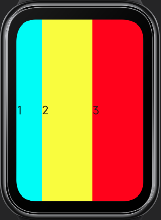
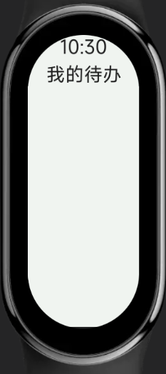
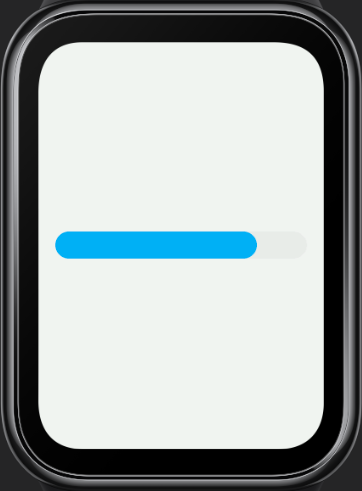

<!-- 源地址: https://iot.mi.com/vela/quickapp/en/guide/multi-screens/specs.html -->

# Adaptation Specifications

Vela OS supports a range of technical capabilities for adapting to various screens.

## Responsive Layout

The container components provided by the system all follow the Flex layout rules by default. Using Flex layout enables responsive screen layouts.

For example, the following code can achieve an even distribution of multiple inline items.
```html
< div > < text style = " flex-grow : 1 ; background-color : aqua ; " > 1 </ text > < text style = " flex-grow : 1 ; background-color : yellow ; " > 2 </ text > < text style = " flex-grow : 1 ; background-color : red ; " > 3 </ text > </ div >
```


For more details, refer to [Flex Layout Examples](</vela/quickapp/en/guide/framework/style/page-style-and-layout.html#flex-layout-examples>).

## Responsive Units

When writing UI styles, you can use the system's responsive length units, including:

  * px
  * %

### px

In Vela applications, px does not represent the physical pixels of the screen but is a unit relative to the project's configured base width, similar in principle to rem.

Developers configure the designWidth field in the manifest file to set the design base width (design draft width), and then use this length unit in style descriptions. The numerical values are directly taken from the pixel values in the design draft, and the system will automatically scale the Vela application UI proportionally on different screens.
```html
{ "config": { "designWidth": 336 } }
```

```html
< template > < div class = " demo-page " > < div class = " container " > </ div > </ div > </ template > < style > .demo-page { justify-content : center ; align-items : center ; } .container { width : 168px ; height : 168px ; background-color : aquamarine ; } </ style >
```

In the example above, if designWidth is configured as 336px, all px values will be calculated based on this base width. Assuming the actual screen width is 336 pixels, the actual width of the container element will also be 168 pixels; if the actual screen width is 192 pixels, the actual width of the container element will be 96 pixels.

336 _480 screen / 192_ 490 screen

 

For more details, refer to [Length Units](</vela/quickapp/en/guide/framework/style/page-style-and-layout.html#length-units>).

### Percentage (%)

% represents a percentage. Many style properties can take percentage values, often used to determine size based on the parent object.

For example, the following code can achieve multiple inline items occupying the parent container's width by percentage.
```html
< div > < text style = " width : 20% ; background-color : aqua ; " > 1 </ text > < text style = " width : 40% ; background-color : yellow ; " > 2 </ text > < text style = " width : 40% ; background-color : red ; " > 3 </ text > </ div >
```



For more details, refer to [CSS Percentage Units (opens new window)](<https://developer.mozilla.org/zh-CN/docs/Web/CSS/percentage>).

## Fixed Length Units 3+

In some layout scenarios, fixed length units are required, and the system's supported dp length unit can meet this need.

The DP length unit represents device-independent pixels, also known as density-independent pixels. It can be considered as a point in the computer coordinate system, representing a logical pixel that can be used by the program. It is a unit that approximates physical size, with the calculation formula as follows:
```html
DP value of screen width = screen resolution width / DPR DP value of element width/height = physical pixel count of element width/height / DPR
```

DPR represents the device pixel ratio, which is the ratio of the device's physical pixels to logical pixels (DP), with the calculation formula as follows:
```html
DPR = device PPI / 160
```

PPI (pixels per inch) represents the number of pixels per inch, characterizing the physical density of the screen. Therefore, DPR is also known as logical density. The logical density value (DPR) of the device screen can be obtained through the device interface.

For example, the following code can achieve elements maintaining approximate physical sizes on screens of different sizes, thus displaying more elements on larger screens.
```html
< template > < div class = " container " > < div class = " text-box " > < text style = " background-color : aquamarine ; " > A </ text > < text style = " background-color : #ff0000 ; " > B </ text > < text style = " background-color : #00ff00 ; " > C </ text > < text style = " background-color : #0000ff ; " > D </ text > </ div > </ div > </ template > < style > .container { justify-content : center ; align-items : center ; } .text-box { justify-content : center ; flex-wrap : wrap ; } text { width : 116dp ; height : 30dp ; font-size : 15dp ; text-align : center ; } </ style >
```

466 _466 screen / 192_ 490 screen

 

## Media Queries

Media queries, introduced in CSS3, are used to apply different styles to web pages based on different screen sizes and device types.

In Vela JS applications, similar media query specifications can be used to write styles for different screens and devices. For detailed information, refer to [Media Queries](</vela/quickapp/en/guide/framework/style/media-query.html>).

For example, the following code can apply different styles based on the screen shape.

Note: The `designWidth` in the following example code is `466`.
```html
< template > < div class = " container " > < text > 10:30 </ text > < text > My To-Do </ text > </ div > </ template > < style > /* When the screen is circular */ @media screen and (shape : circle) { .container { padding-left : 80px ; padding-right : 80px ; padding-top : 40px ; flex-direction : row ; align-items : flex-start ; justify-content : space-between ; } text { font-size : 40px ; } } /* When the screen is pill-shaped */ @media screen and (shape : pill-shaped) { .container { padding-top : 50px ; flex-direction : column ; align-items : center ; } text { margin-top : 10px ; } } </ style >
```

466 _466 screen / 192_ 490 screen

 

## Obtaining Screen Information

In Vela JS applications, screen information, including screen shape and resolution, can be obtained through the device feature interface. Based on the obtained results, corresponding style adaptations can be made.

For example, the following code can determine the type of the progress component (whether it is arc-shaped) based on the screen shape.
```html
< template > < div class = " container " > < progress percent = " 80 " type = " {{progressType}} " > </ progress > </ div > </ template > < script > import device from '@system.device' export default { data : { progressType : "horizontal" } , onInit () { const that = this device.getInfo ({ success : function (ret) { that.progressType = ret.screenShape === "circle" ? "arc" : "horizontal" } }) } } </ script > < style > .container { padding : 20px ; } </ style >
```

Circular screen / Rectangular screen

 

For detailed information, refer to [Device Information (device)](</vela/quickapp/en/features/basic/device.html>).
