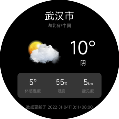

<!-- 源地址: https://iot.mi.com/vela/quickapp/en/guide/start/data-fetch.html -->

# Data Acquisition

In the previous chapters, we have implemented the UI of the weather forecast app and added basic interactions. However, the data displayed on the page is not real data. Next, we will request real data from the HeWeather API and render it.

## Requesting API Data

Network requests require the use of the [Data Request fetch](</vela/quickapp/zh/features/network/fetch.html>) module. Please declare it in the `manifest.json` file before using it.

The `fetch` module provides the `fetch()` method. For detailed usage, please refer to the Vela documentation.

Each page has its own [lifecycle](</vela/quickapp/zh/guide/framework/script/lifecycle.html>). You can send requests in the `onReady` method. The code is as follows:
```html
< script > import router from '@system.router' ; import fetch from '@system.fetch' ; export default { private : { // ... } , onReady () { let key = '<your key>' ; // location, using Wuhan's code here // For more location codes, refer to: https://github.com/qwd/LocationList fetch.fetch ({ url : ` https://devapi.qweather.com/v7/weather/now?location=101010100&key= ${ key } ` }) . then (res => { const result = res.data ; console.log ('Returned data:' , JSON.stringify (result.data , null , 2)) ; }) . catch (error => { console.log (` Data request failed: ` , error) ; }) } , // ... } </ script >
```

> Before using, please apply for a key on the HeWeather development platform and replace the key in the above code.

After adding the above code and replacing it with a valid key, run the app. You should see logs similar to the following in the console, indicating that the request was successful.
```bash
Returned data: { "code" : "200" , "updateTime" : "2022-01-04T10:07+08:00" , "fxLink" : "http://hfx.link/2ax1" , "now" : { "obsTime" : "2022-01-04T09:54+08:00" , "temp" : "-1" , "feelsLike" : "-4" , "icon" : "100" , "text" : "Sunny" , "wind360" : "45" , "windDir" : "Northeast" , "windScale" : "2" , "windSpeed" : "7" , "humidity" : "55" , "precip" : "0.0" , "pressure" : "1029" , "vis" : "15" , "cloud" : "10" , "dew" : "-17" } , "refer" : { "sources" : [ "QWeather" , "NMC" , "ECMWF" ] , "license" : [ "no commercial use" ] } }
```

## Data Rendering

After requesting data from the backend, you need to display it on the page. To display the data, simply update the corresponding data in the [page data object](</vela/quickapp/zh/guide/framework/script/page-data.html>):
```javascript
this.weather = result.data.now ;
```

Here is the complete JavaScript code for the final page:
```html
< script > import router from '@system.router' ; import fetch from '@system.fetch' ; export default { private : { city : 'Wuhan' , province : 'Hubei' , country : 'China' , weather : { obsTime : "12-21 09:05" , temp : "13" , feelsLike : "10" , icon : "101" , text : "Cloudy" , humidity : "72" , vis : "16" } } , onReady () { let key = '<your key>' ; // location, using Wuhan's code here // For more location codes, refer to: https://github.com/qwd/LocationList fetch.fetch ({ url : ` https://devapi.qweather.com/v7/weather/now?location=101200101&key= ${ key } ` }) . then (res => { const result = res.data ; console.log ('Returned data:' , JSON.stringify (result.data , null , 2)) ; this.weather = result.data.now ; }) . catch (error => { console.log (` Data request failed: ` , error) ; }) } , toListPage (eve) { console.log (eve) ; if (eve.direction === 'up') { router.push ({ uri : '/pages/list' }) } } } </ script >
```

Page running result:



The data request for the 3-day weather forecast interface is the same as the real-time weather page, so it will not be repeated here.

In real projects, you need to handle more page details, such as adding a loading state when the page requests data, formatting dates accordingly, etc.

To provide a good user experience, please strictly follow the design draft to write the page structure and styles, and handle various exceptions appropriately.
