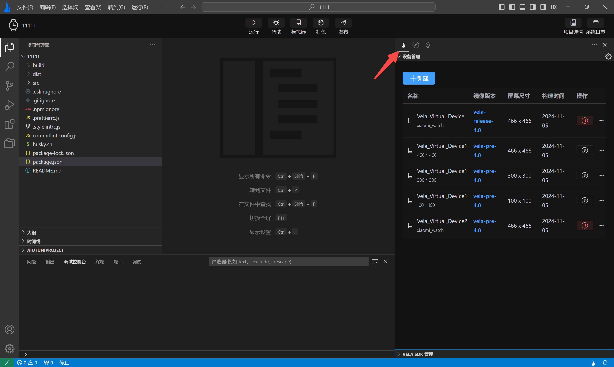

<!-- 源地址: https://iot.mi.com/vela/quickapp/en/guide/start/use-ide.html -->

# Using AIoT-IDE to Develop JS Applications

## Download AIoT-IDE

This application supports **macOS** , **Windows** , and **Ubuntu** systems. Please ensure your device meets the following minimum system version requirements.

* * *

## System Requirements

Operating System | Minimum Version Required  
---|---  
**macOS** | 14 (Sonoma) or later  
**Windows** | 10 or later  
**Ubuntu** | 20.04 LTS or later  
  
## Installing AIoT-IDE

You may encounter the following installation error on macOS:

If you encounter this issue, follow these steps:

  1. Open a shell window and enter: `sudo xattr -r -d com.apple.quarantine`, as shown in Example 1 below.
  2. Press the spacebar **and then drag the application into the window** to get Example 2 below.
  3. Press Enter, enter your password, and then run the program again.

Example 1

Example 2

## Historical Versions

Historical versions can be found at: [Click to view (opens new window)](<https://kpan.mioffice.cn/webfolder/ext/j6SfQsarf8I%40?n=0.18700074913007825>)  
Password: 99E6

## Using AIoT-IDE

### 1\. Initializing a Vela Project

  * Click on "File" > "New Project" in the top-left corner to open the project initialization GUI.
  * Click on the Vela card in the left sidebar and then click "Create".
  * Select a project template and click "Next".
  * Enter the project name and save path, then click "Create" and wait for the project to be created.

### 2\. Project Development

Supports dependency installation, running, debugging, restarting, emulator management, and project packaging.  
After opening a Vela quick app project, AIoT-IDE will display a banner of operation buttons at the top and a development guide on the right. Follow the guide to install the necessary dependencies.  
Once the dependencies are installed, click the operation buttons in the banner to perform corresponding functions.

### 3\. Development Guide

When you open a Vela quick app project, AIoT-IDE will display a development guide on the right to assist you. Follow the guide's instructions to complete the corresponding operations.

If you encounter npm i download failures as per the guide, follow these steps to resolve:

  * Check if there is a `.npmrc` file in the root directory of your project. If not, create one.

  * Open the `.npmrc` file and copy the following content into it:

`registry="https://registry.npmmirror.com/"`

  * Open the terminal and run `npm i` again.

### 4\. Emulator Environment Management

AIoT-IDE supports automatic initialization of the emulator environment, creating, deleting, and listing emulators to view effects during running/debugging.

**Emulator Environment Instructions**

If the emulator environment and instances are missing, the development guide will provide corresponding prompts.

  * Click the "Check emulator environment, create emulator instance" button, and in the modal window that pops up, select "Auto Install" to automatically install the emulator-related dependencies.
  * On the emulator list page, click the "Create" button in the top-left corner to generate an emulator instance.

**Emulator Operation Instructions**

  * View created emulators  
Click the "Emulator" button in the banner to enter the emulator list page, where you can see detailed information about the created emulators.

  * Create a new emulator 
    * Click the "New" button in the top-left corner of the **Device Management** to enter the emulator form page.
    * Fill in the emulator information on the form page and click the "Create" button. The plugin will first download the Vela image and complete the creation.

It is recommended to use the Vela official version (4.0) image.

### 5\. Running the Project

When running, you first need to select the emulator on which to preview the effect. After selection, the currently opened quick app will start in the emulator and display the project UI.

The plugin will filter all emulators starting with "Vela" in the `$HOME/.android/avd` directory. If none are found, AIoT-IDE will prompt at the bottom-right corner, and you can click the "Emulator" button to create one.

### 6\. Debugging the Project

Similar to running, you need to select an emulator when debugging.  
After the quick app starts successfully, AIoT-IDE will display a debugging panel at the bottom. Click the tabs in the debugging panel to perform corresponding operations, such as viewing the DOM tree, checking the Console, and breakpoint debugging.

### 7\. Packaging the Project

**Development Mode Packaging**  
After development is complete, click the "Package" button in the banner to package the application. By default, two new directories will be generated: dist and build.  
The dist folder will contain a `.debug.rpk` file, and the build folder will contain the compiled js files.

**Production Mode Packaging**

  * Before packaging, configure the signature private key to generate a signature file.

    * Auto-generate: Click the "Release" button in the banner > fill in the relevant information > click the "Finish" button. The plugin will generate `private.pem` and `certificate.pem` files in the project's sign directory. After the signature files are successfully generated, click the "Release" button in the **top operation bar**. The packaged output will be similar to development mode packaging, but the rpk file in the dist folder will have a release suffix.

    * Auto-generation requires openssl to be installed in the system environment. Windows systems may encounter openssl missing issues. Here are the specific solutions.

      * Install openssl and configure the system environment variables, then restart the computer. After successful restart, open the terminal in AIoT-IDE, enter openssl, and if it appears as shown below, the installation is successful.

    * Manual generation: Similarly, openssl must be installed in the system environment. Then, open the terminal and run the following command to generate the signature files. Create a new sign directory in the project and place the generated files private.pem and certificate.pem in this directory.  
`openssl req -newkey rsa:2048 -nodes -keyout private.pem -x509 -days 3650 -out certificate.pem`

