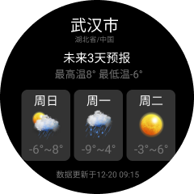
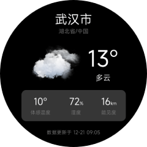

<!-- 源地址: https://iot.mi.com/vela/quickapp/en/guide/start/user-interface.html -->

# Write Page UI

In the previous section [Project Structure](</vela/quickapp/en/guide/start/project-overview.html>), we introduced the roles of files and directories in a Vela JS application project. After gaining a certain understanding of the project structure, we will now implement a simple weather forecast app.

This chapter will implement the page UI of the app, with the main content being: the basic structure of the page, styling, data structure definition, and data rendering.

Restyling according to the UI design draft is a detailed and time-consuming task. To improve work efficiency, it is generally recommended to first conceive the overall implementation approach of the page (page structure, styling, and interactions, etc.), then write the page structure, followed by uniformly adding styling, and finally adding data rendering and interactions.

In this usage guide, to facilitate the demonstration of page structure, styling, and interaction development in Vela JS applications, the above development process is adopted. In actual development, developers can also choose a workflow that suits their own development habits.

TIP

This section contains a relatively large number of code snippets. If you are already familiar with HTML/CSS/JavaScript, you can choose to skip this section. However, we still recommend that you read the content of this chapter to understand some differences between Vela JS application development and traditional front-end development.

## Functional Requirements

The weather forecast app we are going to implement consists of two pages: **Real-time Weather** and **3-Day Weather Forecast**. The real-time weather interface displays the current weather conditions, mainly including information such as weather, temperature, humidity, and visibility. The 3-day weather forecast page is used to display the weather conditions for the next three days.

The final effect to be achieved is shown in the following figures:

 

## Preparation

This app uses the **QWeather API** to obtain weather data, and icons use the **QWeather Icons**.

The weather app in this usage guide is only for demonstrating Vela JS application development techniques. If you need to use related interfaces and resources in actual projects, please register and activate the interfaces on the QWeather developer platform. Detailed information can be viewed on the official website:

  * QWeather Developer Platform: <https://dev.qweather.com/>[ (opens new window)](<https://dev.qweather.com/>)
  * QWeather Icons: <https://icons.qweather.com/>[ (opens new window)](<https://icons.qweather.com/>)
  * Icon Download Address: <https://github.com/qwd/WeatherIcon>[ (opens new window)](<https://github.com/qwd/WeatherIcon>)

## Page Structure

In the [Project Structure](</vela/quickapp/en/guide/start/project-overview.html>) chapter, we introduced that a page (ux file) consists of three parts: `template`, `style`, and `script`. Next, we will write the template (`template`) code for these two pages respectively.

Very similar to HTML, Vela's page template is also composed of tags and attributes, and the syntax is mostly consistent with HTML. The difference is that Vela has its own set of built-in components, which are not exactly the same as those supported by HTML.

In the following code, we use the `div`, `text`, and `image` components. For detailed usage methods of components, you can refer to the [Vela Official Documentation - Components](</en/components>).

### Real-time Weather

The real-time weather page can be divided into three parts from top to bottom: `header`, `body`, and `footer`. The code is as follows.
```html
< template > < div class = " page " > <!-- Header city information --> < div class = " header " > </ div > < div class = " body " > <!-- Main weather information --> < div class = " info " > </ div > <!-- Perceived temperature and other information --> < div class = " more-info " > </ div > </ div > <!-- Footer update time --> < div class = " footer " > </ div > </ div > </ template >
```

Warm Tip

The template can only have one root node.

The header information, including city, province, and country information, has a relatively simple structure. The code is as follows:
```html
<!-- Header city information --> < div class = " header " > < text class = " city " > Wuhan </ text > < text class = " province " > Hubei/China </ text > </ div >
```

Warm Tip

Text must be placed in the text component; otherwise, the text will not be displayed on the interface.

The weather information section is slightly more complex than the header. It can be generally divided into two columns, with the right column further divided into two rows. The code is as follows:
```html
<!-- Main weather information --> < div class = " info " > < image class = " icon " src = " /common/icons/101.png " > </ image > < div class = " column center " > < text class = " temp " > 6° </ text > < text class = " weather " > Clear to Cloudy </ text > </ div > </ div >
```

Next, we implement the module for perceived temperature and other information. It can be generally divided into three columns, with each column further divided into two rows. The code is as follows:
```html
<!-- Perceived temperature and other information --> < div class = " more-info row " > < div class = " item column center " > < text class = " value " > 10° </ text > < text class = " label " > Perceived Temperature </ text > </ div > < div class = " item column center " > < div > < text class = " value " > 67 </ text > < text class = " sub " > % </ text > </ div > < text class = " label " > Humidity </ text > </ div > < div class = " item column center " > < div > < text class = " value " > 5 </ text > < text class = " sub " > km </ text > </ div > < text class = " label " > Visibility </ text > </ div > </ div > </ div >
```

Finally, the footer update time module has a relatively simple structure. The code is as follows:
```html
<!-- Footer update time --> < div class = " footer center " > < text class = " update-time " > Data updated on 12-20 09:15 </ text > </ div >
```

### 3-Day Weather Forecast

The structure of this page is the same as that of the real-time weather page, also divided into three parts from top to bottom, and the content of the `header` and `footer` is the same, so it will not be repeated here.

Next, we mainly look at the implementation of the middle part, which mainly includes the **3-Day Weather Overview** and the **Weather List**.

The weather overview is divided into two rows. The code is as follows:
```html
<!-- Weather Overview --> < div class = " info " > < text class = " title " > 3-Day Forecast </ text > < text class = " summary " > High 8° Low -6° </ text > </ div >
```

The weather list is slightly more complex. First, it can be generally divided into three columns, with each column further divided into three rows. The code is as follows:
```html
<!-- 3-Day Weather --> < div class = " list " > < div class = " item " > < text class = " date " > Sunday </ text > < image class = " icon " src = " /common/icons/301.png " > </ image > < text class = " temp " > -6°~8° </ text > </ div > < div class = " item " > < text class = " date " > Monday </ text > < image class = " icon " src = " /common/icons/311.png " > </ image > < text class = " temp " > -9°~4° </ text > </ div > < div class = " item " > < text class = " date " > Tuesday </ text > < image class = " icon " src = " /common/icons/100.png " > </ image > < text class = " temp " > -3°~6° </ text > </ div > </ div >
```

## Page Styling

Vela supports commonly used CSS features, with a small amount of expansion and modification. It by default supports adaptation to different screen sizes. Detailed attribute support can be queried in the [Attribute List](</vela/quickapp/en/components/general/style.html#attribute-list>).

Vela JS applications use the `flex` layout, which can conveniently implement commonly used layout styles. For technical details of the `flex` layout, you can refer to the [MDN Documentation (opens new window)](<https://developer.mozilla.org/en-US/docs/Web/CSS/flex>).

Currently, only class selectors, ID selectors, grouping selectors (,), and tag selectors are supported. Descendant selectors, attribute selectors, universal selectors (*), sibling selectors (+), direct parent-child selectors (>), pseudo-classes, and inheritance are not supported.

So far, we have completed the coding of the page structure, but no styling has been set yet. Next, we will implement the styling of each module.

### Common Styling

Before writing the styling code, we can first extract some basic common styling, such as arrangement methods, colors, and alignment methods.

In our project, we mainly use horizontal and vertical arrangements, centering, etc. In terms of colors, the main color is white, so we can set the default color of the text to white.

The extracted basic styling is as follows:
```css
/* Common styling */ text { color : #ffffff ; } .column { flex-direction : column ; } .row { flex-direction : row ; } .center { align-items : center ; justify-content : center ; }
```

### page

To solve the screen adaptation problem, all styles related to size (such as `width` and `font-size`) are scaled based on a reference width (default `480px`) according to the actual screen width. For example, `width:100px` on a `960px` width screen is actually `200px`.

Our design draft is designed with a width of `480px`, so the dimensions in the design draft can be directly used in the styling. For example, in the following figure, the overall width is 480, and the dimensions of the module for perceived temperature and other information are `335*100`, so the CSS code is:
```css
.info { width : 335px ; height : 100px ; }
```


For the overall page, we first set the page background to black, the shape to circular, and the page width.
```css
.page { padding : 40px ; background-color : #000000 ; width : 480px ; border-radius : 240px ; }
```

Note

If the reference width of the design draft is not 480, it can be configured in the `manifest.json` file through the `config.designWidth` field:
```js
{ // ... "config" : { "designWidth" : 360 } }
```

### Header Information

The header information is arranged vertically and centered, using the previously extracted common styling: `column` and `center`. Then, add styling to the text to control the font size and color.

The modified template code is as follows:
```html
<!-- Header city information --> < div class = " header column center " > < text class = " city " > Wuhan </ text > < text class = " province " > Hubei/China </ text > </ div >
```

The CSS code is as follows:
```css
/* Header styling */ .city { font-size : 40px ; } .province { font-size : 18px ; color : #757575 ; }
```

Actual running result:  


### Real-time Weather

Similar to the header information, first add the basic styling `column`, `row`, and `center` to achieve the basic layout. Then, write targeted CSS code for each text component to achieve styling such as text color and size.

The completed template code is as follows:
```html
< div class = " body column center " > <!-- Main weather information --> < div class = " info " > < image class = " icon " src = " /common/icons/101.png " > </ image > < div class = " column center " > < text class = " temp " > 6° </ text > < text class = " weather " > Clear to Cloudy </ text > </ div > </ div > <!-- Perceived temperature and other information --> < div class = " more-info row " > < div class = " item column center " > < text class = " value " > 10° </ text > < text class = " label " > Perceived Temperature </ text > </ div > < div class = " item column center " > < div > < text class = " value " > 67 </ text > < text class = " sub " > % </ text > </ div > < text class = " label " > Humidity </ text > </ div > < div class = " item column center " > < div > < text class = " value " > 5 </ text > < text class = " sub " > km </ text > </ div > < text class = " label " > Visibility </ text > </ div > </ div > </ div >
```

For the module of perceived temperature and other information, first arrange it horizontally (`flex-direction: row`), and then set `flex: 1` for each item to achieve the effect of equal width for each item.

Specifically, inside each item, just set the color and size of each text field respectively.

The CSS code is as follows:
```css
/* Weather data styling */ .body { flex : 1 ; } .temp { font-size : 70px ; } .icon { width : 170px ; height : 170px ; margin-right : 20px ; } .weather { font-size : 24px ; } /* More information styling */ .more-info { width : 335px ; height : 100px ; background-color : rgba (255 , 255 , 255 , 0.21) ; border-radius : 15px ; } .item { flex : 1 ; } .value { font-size : 30px ; } .sub { font-size : 14px ; margin-top : 10px ; } .label { color : #757575 ; margin-top : 5px ; }
```

Actual running result:  


### 3-Day Weather Forecast

The styling of the weather overview information module is relatively simple, just arrange it vertically.

Similar to the module of perceived temperature and other information, the 3-day weather list also uses horizontal arrangement. The difference is that each item has a background color and spacing between them, so fixed dimensions are set for each item, and then the spacing between each item is allocated (`justify-content: space-between`) according to the remaining space.

The modified template code is as follows:
```html
<!-- 3-Day Weather --> < div class = " list row " > < div class = " item column center " > < text class = " date " > Sunday </ text > < image class = " icon " src = " /common/icons/301.png " > </ image > < text class = " temp " > -6°~8° </ text > </ div > < div class = " item column center " > < text class = " date " > Monday </ text > < image class = " icon " src = " /common/icons/311.png " > </ image > < text class = " temp " > -9°~4° </ text > </ div > < div class = " item column center " > < text class = " date " > Tuesday </ text > < image class = " icon " src = " /common/icons/100.png " > </ image > < text class = " temp " > -3°~6° </ text > </ div > </ div >
```

The CSS code is as follows:
```css
/* Weather data styling */ .body { flex : 1 ; } .info { margin-bottom : 20px ; } .title { font-size : 30px ; } .summary { font-size : 24px ; color : #757575 ; } /* 3-Day Weather */ .list { width : 380px ; justify-content : space-between ; } .item { width : 120px ; height : 175px ; background-color : rgba (255 , 255 , 255 , 0.2) ; border-radius : 15px ; } .date { font-size : 28px ; } .icon { width : 90px ; height : 90px ; } .temp { font-size : 24px ; }
```

Actual running result:  


### Footer Information

The final template code for the footer information is as follows:
```html
<!-- Footer update time --> < div class = " footer center " > < text class = " update-time " > Data updated on 12-20 09:15 </ text > </ div >
```

The CSS code is as follows:
```css
/* Footer styling */ .footer { margin-top : 20px ; } .update-time { color : #757575 ; }
```

Actual running result:  


## Page Effect

After completing the page structure and styling, the actual running results in the simulator are as follows:

 

## Page Data

We have implemented the rendering of page data, but currently, all the data is directly written into the template code and cannot be dynamically modified in the program.

If you need to dynamically modify the data displayed on the interface in the program, you need to store the data in the [Page Data Object](</vela/quickapp/en/guide/framework/script/page-data.html>) and then use the double curly brace syntax to reference the data, such as `{{ name }}`. Detailed usage methods can be referred to in the [Template Syntax](</vela/quickapp/en/guide/framework/template/>).

Data definition needs to be implemented through JavaScript scripts. Like HTML, JavaScript code needs to be placed in the `script` tag:
```html
< script > export default { private : { city : 'Wuhan' , province : 'Hubei' , country : 'China' , weather : { // Data observation time obsTime : "12-21 09:05" , // Temperature temp : "13" , // Perceived temperature feelsLike : "10" , // Weather icon number icon : "101" , // Weather description text text : "Cloudy" , // Relative humidity humidity : "72" , // Visibility, unit: km vis : "16" } } } </ script >
```

After defining the data, replace the previous template code. The replaced code is as follows:
```html
< template > < div class = " page column " > <!-- Header city information --> < div class = " header column center " > < text class = " city " > {{city}} </ text > < text class = " province " > {{province}}/{{country}} </ text > </ div > < div class = " body column center " > <!-- Main weather information --> < div class = " info " > < image class = " icon " src = " /common/icons/{{weather.icon}}.png " > </ image > < div class = " column center " > < text class = " temp " > {{weather.temp}}° </ text > < text class = " weather " > {{weather.text}} </ text > </ div > </ div > <!-- Perceived temperature and other information --> < div class = " more-info row " > < div class = " item column center " > < text class = " value " > {{weather.feelsLike}}° </ text > < text class = " label " > Perceived Temperature </ text > </ div > < div class = " item column center " > < div > < text class = " value " > {{weather.humidity}} </ text > < text class = " sub " > % </ text > </ div > < text class = " label " > Humidity </ text > </ div > < div class = " item column center " > < div > < text class = " value " > {{weather.vis}} </ text > < text class = " sub " > km </ text > </ div > < text class = " label " > Visibility </ text > </ div > </ div > </ div > <!-- Footer update time --> < div class = " footer center " > < text class = " update-time " > Data updated on {{weather.obsTime}} </ text > </ div > </ div > </ template >
```

## List Rendering

In the 3-day weather forecast page, array storage is used for the weather data of the next 3 days. The `for` directive can be used for rendering (detailed usage methods of the `for` directive can be referred to in the [List Rendering](</vela/quickapp/en/guide/framework/template/for.html>)).

The data definition is as follows:
```javascript
{ list : [ { "fxDate" : "Sunday" , "tempMax" : "12" , "tempMin" : "-1" , "iconDay" : "101" , "textDay" : "Cloudy" , } , { "fxDate" : "Monday" , "tempMax" : "13" , "tempMin" : "0" , "iconDay" : "100" , "textDay" : "Sunny" } , { "fxDate" : "Tuesday" , "tempMax" : "13" , "tempMin" : "0" , "iconDay" : "302" , "textDay" : "Sunny" , "iconNight" : "150" , "textNight" : "Sunny" } ] }
```

The template code is as follows:
```html
<!-- 3-Day Weather --> < div class = " list row " > < div class = " item column center " for = " {{list}} " > < text class = " date " > {{$item.fxDate}} </ text > < image class = " icon " src = " /common/icons/{{$item.iconDay}}.png " > </ image > < text class = " temp " > {{$item.tempMin}}°~{{$item.tempMax}}° </ text > </ div > </ div >
```

Running result:  


### Conditional Rendering

In actual projects, conditional judgments are often required to render different UIs based on different conditions. For conditional rendering, please refer to the [Conditional Directives](</vela/quickapp/en/guide/framework/template/if.html>).
