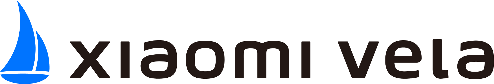

<!-- 源地址: https://iot.mi.com/vela/quickapp/en/ -->

#  JS Application Development Documentation 

A developer-friendly, high-performance IoT cross-platform application framework 

[ Get Started ](</vela/quickapp/en/guide/>)

## Developer-Friendly

Web-like development paradigm for quick learning, with one-stop development tools for convenience and efficiency.

## Rich Components and Interfaces

Provides a variety of commonly used components and interfaces, such as networking, audio, graphics, and security, enabling developers to quickly build applications.

## High Performance

Application development based on Vela OS offers high real-time capability, low power consumption, and low latency, along with exceptional rendering capabilities for a native-like smooth experience.

© Xiaomi Vela all rights reserved. 
