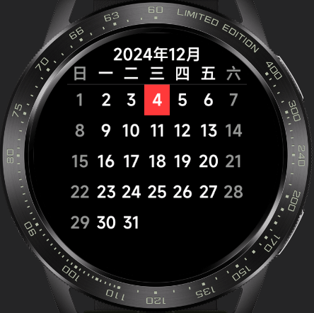

<!-- 源地址: https://iot.mi.com/vela/quickapp/en/samples/ -->

Calendar The calendar app is a tool that facilitates users in recording, scheduling, and tracking important events and activities. This application has achieved multi-screen adaptation, allowing users to view dates for the current year and access more detailed date information by clicking on specific dates. The app features a simple page design and user-friendly operation, serving as a foundation for quickly developing a more feature-rich calendar application.

 

Chart The Chart Quick App is a data visualization tool that enables the rapid and simple generation of various types of charts based on data, including common chart types such as line charts and bar charts. This application has achieved multi-screen adaptation, offering simplicity and ease of use, making it suitable for various data analysis and presentation scenarios.

 

Calculator UI The Calculator Quick App UI has been adapted for square screens, round screens, and racetrack screens, displaying different UI styles based on the screen type. It is a powerful and user-friendly calculator application. Developing based on this example allows for the execution of various mathematical operations, including basic addition, subtraction, multiplication, division, percentages, and more.

 

To-Do List The To-Do List Quick App is a simple and user-friendly task management tool that helps you efficiently record and manage daily tasks and to-do items. This application has been adapted for square screens, round screens, and racetrack screens, featuring a simple page design and user-friendly operation. Developing based on this app allows for the rapid creation of a more feature-rich task management tool.

 

Player This is an efficient and user-friendly Player Quick App. The application features a simple and easy-to-use interface and has been adapted for multiple screens, including round and square screens. Functions include playing and pausing songs, switching between tracks, and displaying playlists. The player's page design is user-friendly with simple interactions, allowing for the rapid development of a more feature-rich Player Quick App based on this example.

 

Settings UI This is a Settings App UI that supports multi-screen adaptation. Developing based on this allows users to easily access and modify various settings, including network settings, volume, Bluetooth, Wi-Fi, screen brightness, notifications, and more. The application features a simple and user-friendly interface, enabling users to easily find the settings they need.

 

Input Method The Input Method App is a highly practical tool that assists users in quickly and accurately inputting text on smartwatches and fitness bands, enhancing work and study efficiency. This input method component has been adapted for multiple screens, including round and square screens, and supports switching between Chinese and English. By incorporating this component, text input on smartwatches and fitness bands can be easily achieved.

Publish-Subscribe This demo is based on the classic publish-subscribe (Pub/Sub) design pattern, providing a lightweight and flexible cross-module communication solution that enables message passing without direct dependencies between modules. The core functions include event subscription ($on), message publishing ($emit), subscription cancellation ($off), and event existence judgment ($judge), supporting asynchronous communication needs in multiple scenarios. Whether it's collaboration between front-end components or linkage between plugin modules, efficient message passing can be achieved through simple calls, helping to simplify code dependencies and improve project maintainability. The code can be directly integrated into Vela quick app projects and is a practical reference for learning design patterns and solving cross-module communication problems.

 
