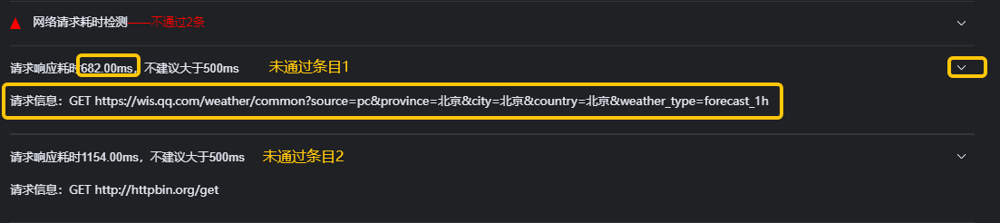
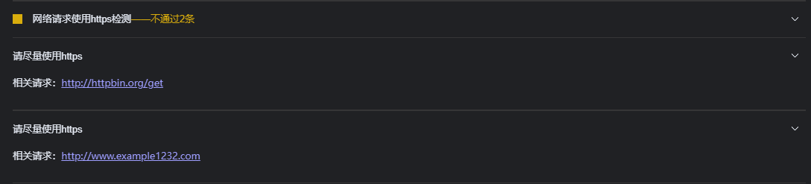
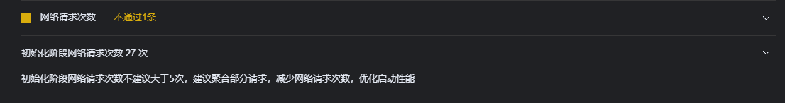
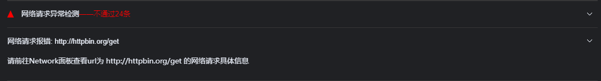

<!-- 源地址: https://iot.mi.com/vela/quickapp/en/tools/debug/audit.html -->

# Optimization Scoring

To optimize the development experience for developers, the `AIoT-IDE` includes a built-in function for generating optimization scoring reports. Simply click the `Generate Report` button to create an optimization report based on the currently open application.

The report is divided into two main sections: dynamic analysis and static analysis. Each detection item includes: specific information about the triggered entry (such as code location/file URL/network URL), optimization suggestions, etc.

## File Analysis

  1. Helps users visually identify files that take up an excessively large proportion of the package size, facilitating package size optimization.

  2. Plans are also in place to provide visual dependency proportion analysis similar to a treeMap in the future.

## Performance Metrics

The optimization report provides multi-dimensional performance metrics along with optimization suggestions to assist developers in making improvements.

## Optimization Detection Items

  * A unified, aggregated detection entry currently includes a total of 9 inspection items: 
    * Multiple-reference code detection
    * Large dependency replacement detection
    * Unused dependency detection
    * Unused system function detection
    * Network request time-consumption detection
    * Network request HTTPS usage detection
    * Network request frequency detection
    * Network request exception detection
    * Code execution error detection

### Multiple-Reference Code Detection

The optimization report will highlight code that is referenced multiple times and provide optimization suggestions for developers to make improvements.

### Large Dependency Replacement Detection

The optimization report will identify dependencies that are excessively large and provide optimization suggestions for developers to make improvements.

### Unused Dependency Detection

The optimization report will highlight unused dependencies and provide optimization suggestions for developers to make improvements.

### Unused System Function Detection

The optimization report will identify unused system functions and provide optimization suggestions for developers to make improvements.

### Network Request Time-Consumption Detection

The optimization report will highlight requests with excessively long response times and provide optimization suggestions for developers to make improvements.

### Network Request HTTPS Usage Detection

The optimization report will identify requests that do not use HTTPS in their responses and provide optimization suggestions for developers to make improvements.

### Network Request Frequency Detection

The optimization report will highlight frequently made requests and provide optimization suggestions for developers to make improvements.

### Network Request Exception Detection

The optimization report will identify abnormal request responses and provide optimization suggestions for developers to make improvements.

### Code Execution Error Detection

The optimization report will highlight code execution errors in the project and provide optimization suggestions for developers to make improvements.

