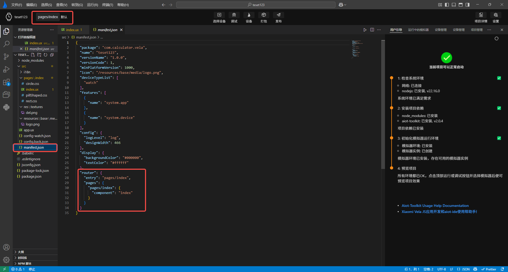

<!-- 源地址: https://iot.mi.com/vela/quickapp/en/tools/debug/build-setting.html -->

# Build Settings

The build settings function allows you to customize the pages and page cache that will be opened when the simulator is running. If no settings are made, it will default to reading the router configuration in the project's `manifest.json` file.

In the top banner area, a display button for the current build mode has been added. Clicking on the current build configuration route path allows you to switch build configurations or click "Add" to add a new build configuration.

Clicking on the current build configuration name will take you to the build mode settings interface, where you can add, delete, or modify the current project's build configurations.

