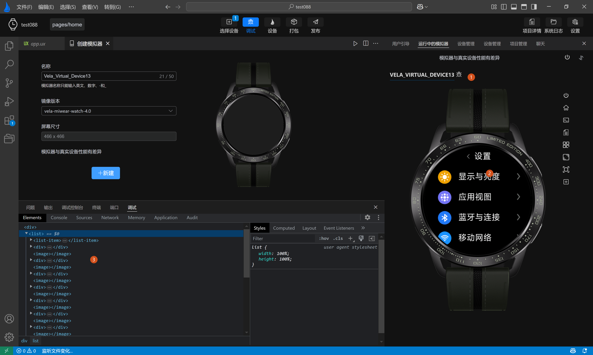
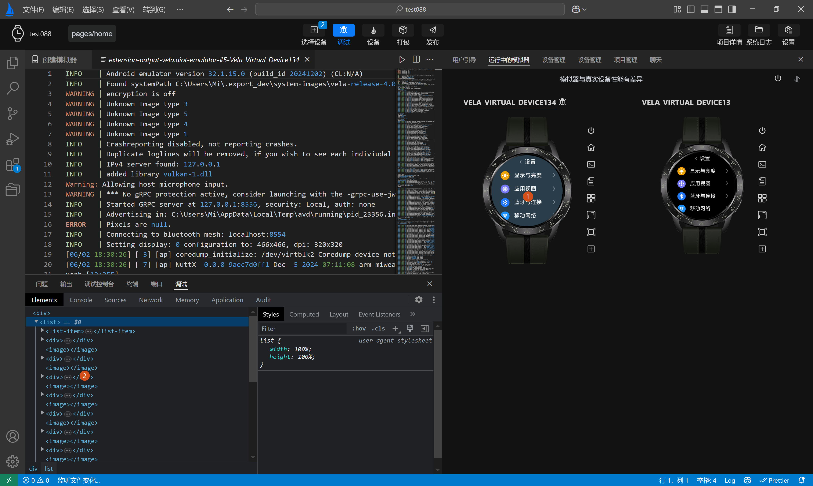
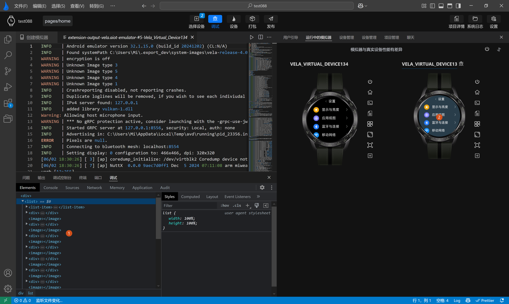

<!-- 源地址: https://iot.mi.com/vela/quickapp/en/tools/debug/debug.html -->

# Debug and Run

Click the `Select Device` button, choose the simulator to run, click OK, and then click the `Debug` button to start the corresponding simulator.

After the simulator starts successfully, the debug page will open. When multiple simulators are running, the debug window corresponds to the simulator with a **selected effect in the title** on the simulator's running page (as **shown in labels 1, 2, and 3 in the figure below**).

Click on a simulator to switch the debug service and perform corresponding debugging.

