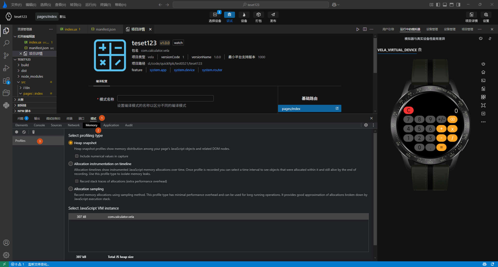

<!-- 源地址: https://iot.mi.com/vela/quickapp/en/tools/debug/memory.html -->

# Memory Analysis

When troubleshooting **memory leaks** , you can assist the analysis by taking two memory snapshots (dumps). For example, to troubleshoot a page memory leak, take a dump before entering the page and another after exiting the page. There are two scenarios for troubleshooting memory leaks:

For applications that do not rely on low-level capabilities: If your application does not require low-level capabilities such as `blueos.multimedia.audio`, you can test directly in `AIoT-IDE`. Click on Position 4 before and after the problematic scenario to take memory snapshots.

For applications that rely on low-level capabilities: You need to install firmware capable of executing JavaScript heap memory snapshots, run the command `dump_js_heap /sdcard`, and then copy the snapshot file from the real device to your computer. Load and analyze it in `AIoT-IDE` via Position 3.

In `AIoT-IDE`, the tools for JavaScript heap analysis and export are located in the function panel area. Select **Debug - > Snapshot -> Profile**, as shown in labels 1, 2, and 3 in the following image:

