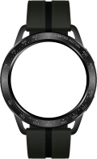
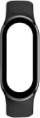
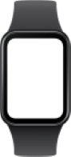
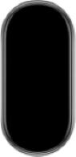
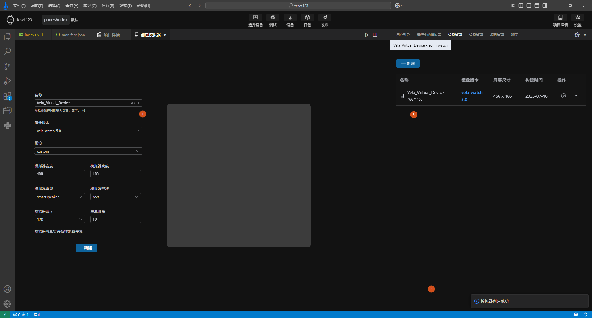
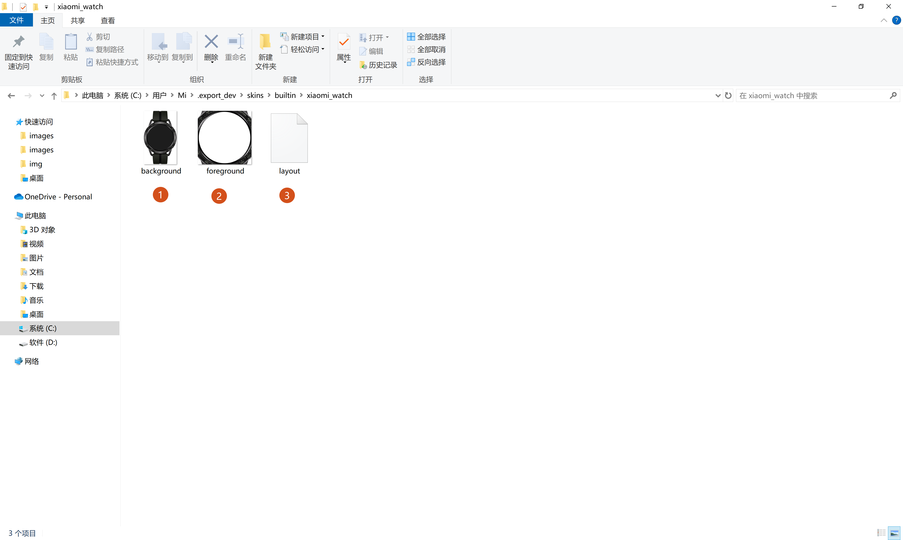
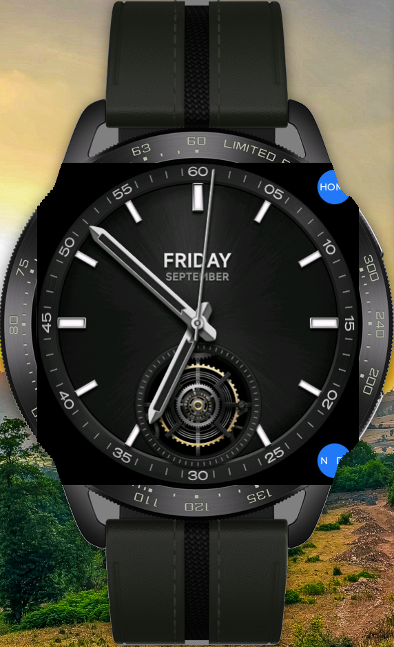
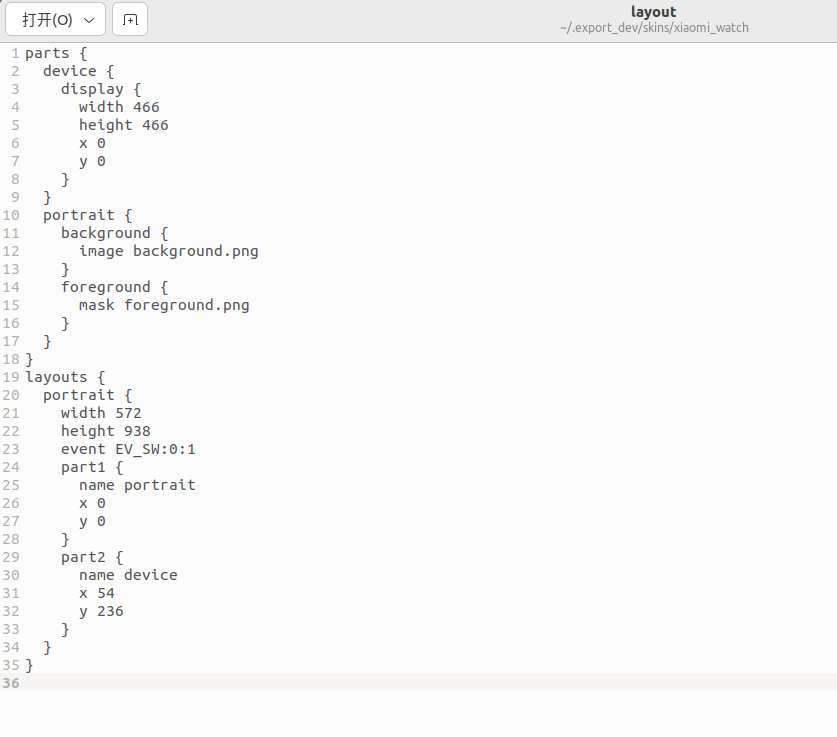

<!-- 源地址: https://iot.mi.com/vela/quickapp/en/tools/debug/multi-screens.html -->

# Multi-Screen Adaptation

To enhance the development experience, `AIoT-IDE` has built-in **** features that allow a single set of code to run on multiple different device screens, testing the adaptation effect on different screens.

## Multi-Device Emulator Creation

To recreate the most realistic multi-screen adaptation development scenario, `AIoT-IDE` provides multiple emulators with different device size configurations and different image versions to test applications on various devices with different image systems.

`Currently, three images are available for selection`

  * `vela-miwear-watch-5.0` Stable release version of vela5.0

  * `vela-miwear-watch-4.0` Stable release version of vela4.0

  * `vela-watch-4.0` Development version of vela

**Currently, six devices with different screen sizes are available for creation:**



xiaomiWatch 466*466


redmiWatch



xiaomiBand



xiaomiBandpro



xiaomi10Band


xiaomiSoundMini

Currently, when creating an emulator, `vela-miwear-watch-5.0` and `vela-miwear-watch-4.0` only support one device type with the xiaomiWatch (466*466) size, while `vela-watch-4.0` supports all the above device types and can also be customized for device type creation.

Note

There is a performance difference between the emulator and the real device

## Custom Emulator

In addition, to support more device sizes, when creating an emulator, you can also choose the **custom** option for the emulator, which provides the following custom configurations:

  *     1. Customize the emulator's width and height (width and height less than 800 and greater than 100), emulator shape, emulator density, etc.
  *     2. Customize and set the emulator type, currently mainly **watch** , **band** , **smartspeaker**
  *     3. Customize the emulator shape, currently there are two main shapes **circular** and **rectangular** , with the rectangular shape allowing customization of rounded corners
  *     4. Customize the emulator screen DPI


After clicking the new button at the bottom and completing the emulator creation, `AIoT-IDE` will pop up a success prompt in the lower right corner, and the device management page will update the created emulator in real-time.



## Multi-Screen Preview

After creating emulators of different device types, when starting the emulator through the `Debug` or `Run` button, **select the corresponding emulator for different devices** and click OK to run them simultaneously.


After successful operation, the emulator preview page will display the preview effects of different device screens.


## Custom Emulator Skin

In addition, if users are not satisfied with just customizing the display effect of the emulator and hope to preview the emulator device more realistically, we also provide the function of customizing the skin.

## Vela Emulator Skin Group

To create a skin, two images and a configuration file are required:

  * `background.png` is the main image of the device, requiring the screen area to be black
  * `foreground.png` is used to cover the part outside the emulator screen.
  * **layout configuration file** , mainly used to configure the layout information of the skin's required `background.png` and `foreground.png`



Among them, `foreground.png` is generally cut from the background image with the emulator screen part modified to transparent color. The comparison between without `foreground.png` and with `foreground.png` is as follows:



foreground.png not configured


foreground.png configured

## Creation of Layout File

Copy the following code and modify the information according to the comments, keeping the rest unchanged.
```bash
parts { device { display { # Emulator size width 466 # Emulator size height 466 # x and y fill 0 x 0 y 0 } } portrait { background { # Name of the background image image background.png } foreground { # Name of the foreground image mask foreground.png } } } layouts { portrait { // The size of the entire skin, usually using the pixel size of the background image width 572 height 938 event EV_SW:0:1 part1 { name portrait x 0 y 0 } part2 { name device # The starting coordinates of the foreground image when cutting from the background image, calculated with the top left corner as 0,0 x 54 y 236 } } } // Fields that will be passed to the underlying configuration when creating the emulator props { // Screen shape. Optional values: circle (circular) , rect (rectangular) , pill-shaped (capsule-shaped screen eg: full-screen bracelet) shape circle // Screen density, optional values: [ '120' , '140' , '160' , '180' , '213' , '240' , '280' , '320' , '340' , '360' , '400' , '420' , '440' , '480' , '560' , '640' ] density 320 // Device type, optional values: phone (mobile phone) , watch (watch) , pad (tablet) , car (car) , tv (television) , band (bracelet) , smartspeaker (speaker) , default is watch flavor watch }
```

## Application of Skin File

Open the `SKD` directory through `AIoT-IDE`. There is a **skins** directory under this directory. Create a new folder named after your skin under the **skins/user** directory, and place the created files into it. If there is no user directory under skins, first create the user directory. Then, when using the IDE to create an emulator, you can choose to apply this skin.

Note

The SDK directory is a directory starting with a dot. Please enable the display of hidden files in the operating system before proceeding.


## Detailed Explanation of Layout

The content in the layout file is as follows:



**Detailed explanation of layout configuration content:**

  * **layout** can define two layout methods: **portrait** and **landscape** , i.e., vertical and horizontal screens. The **width** and **height** are the pixel sizes of your **background.png**.

  * **event** is a fixed value, fill in **EV_SW:0:0**.

  * **part1** refers to the background image and foreground image defined in the parts above. The name represents the name of the referenced part, and x, y represent the starting coordinates of the layout, starting from the top left corner as 0,0.

  * **part2** refers to the **display** defined in the parts above. The name represents the name of the referenced part, and x, y represent the starting coordinates of the layout, starting from the top left corner as 0,0.

  * **parts** defines the components of the skin, usually consisting of two parts, namely the skin and the emulator screen. The one with **display** represents the emulator screen, and the one with **background** and **foreground** represents the skin.

