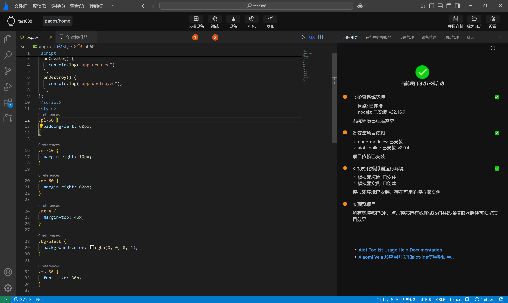

<!-- 源地址: https://iot.mi.com/vela/quickapp/en/tools/debug/start.html -->

# Compile Preview

Running, debugging, releasing, and packaging a Vela project is mainly achieved through the buttons in the **top action bar**. Additionally, the **user guide page** and **device management page** on the right ensure that the current development environment has a **simulator runtime environment** , while the specific display effect is shown in the **simulator preview interface** on the right.

## Run the Project

Click the `Select Device` button, choose the simulator to run, click OK, and then click `Debug` to start the simulator.

After the simulator starts successfully, it will push the current project. Once the push is successful, you can preview the effect in the simulator preview page, as shown in the following dynamic image:

Clicking Run again will stop pushing the current project to the simulator, **but the simulator will continue to run**.
