<!-- 源地址: https://iot.mi.com/vela/quickapp/en/tools/debug/toolbar.html -->

# Function Buttons

After the simulator starts successfully and enters the simulator operation page, `AIoT-IDE` provides several function buttons to facilitate developers in developing and debugging applications.

## Close All Simulators

**Close All Simulators** , located in the top-right corner of the simulator operation page, allows you to close all running simulators when clicked, as shown by number 1 in the following image.

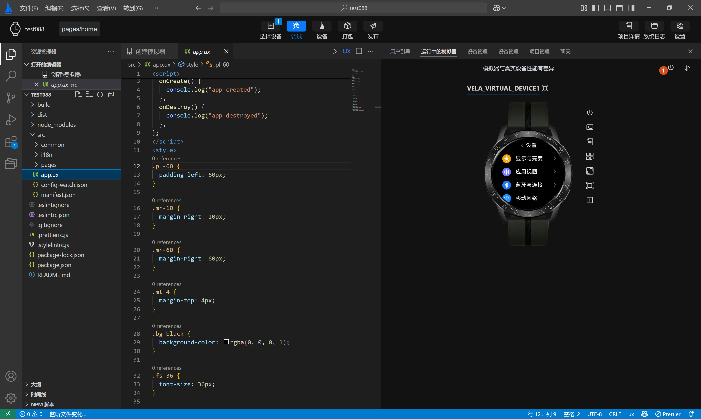

## Customize Simulator Display

**Customize Simulator Display** , located in the top-right corner of the simulator operation page, allows you to customize the display order of the running simulators in a pop-up box when clicked, as shown by number 1 and number 2 in the following image.

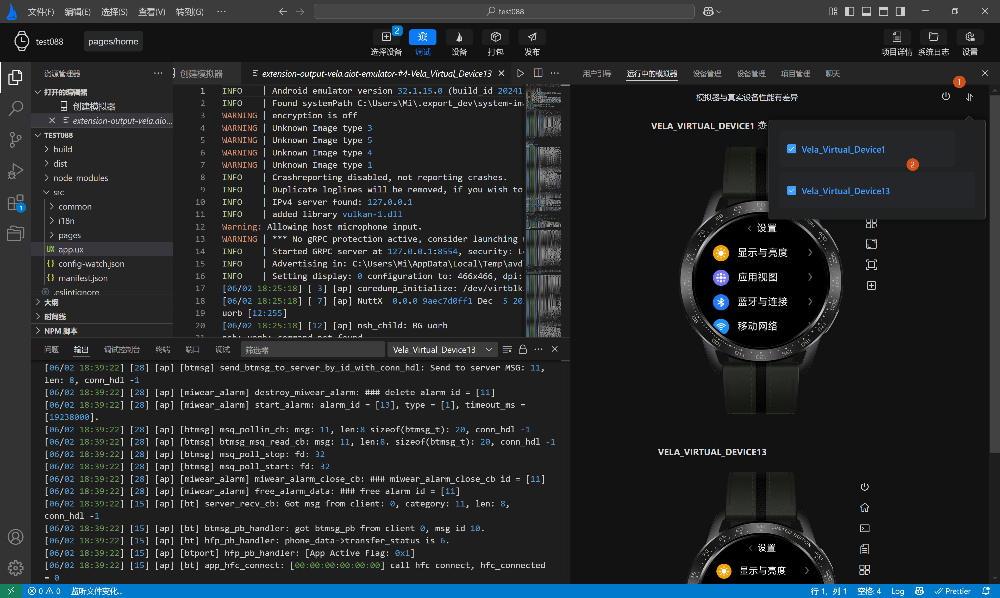

## Shutdown

Shutdown: Each simulator display area has a shutdown button configured on the right side, allowing you to close a single running simulator, as shown by number 1 in the following image.

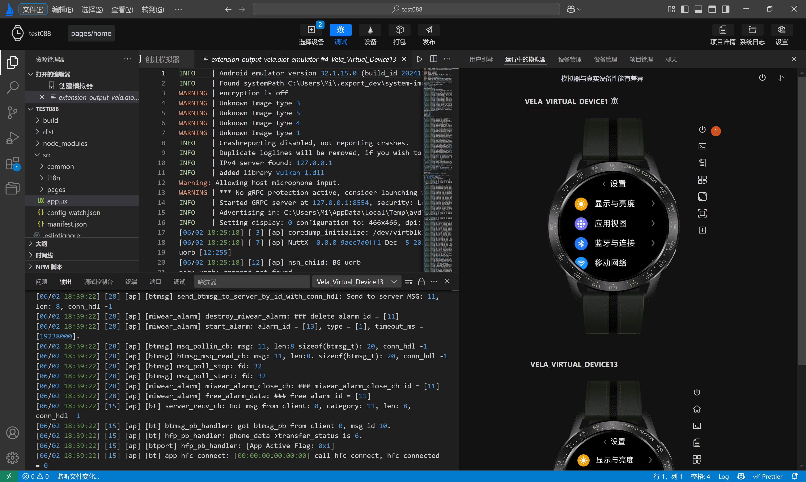

## Home

Home: Each simulator display area has a home button configured on the right side, allowing you to return to the current simulator's home page when clicked, as shown by numbers 1 and 2 in the following image.

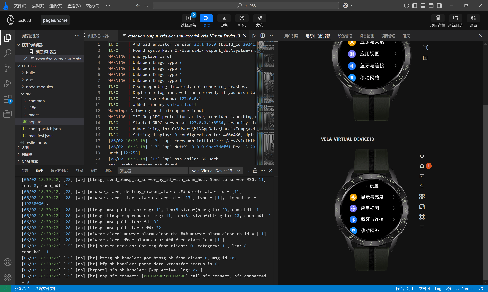

## Terminal

Terminal: Each simulator display area has a terminal button configured on the right side, allowing you to access the simulator's command-line terminal when clicked, as shown by numbers 1 and 2 in the following image.

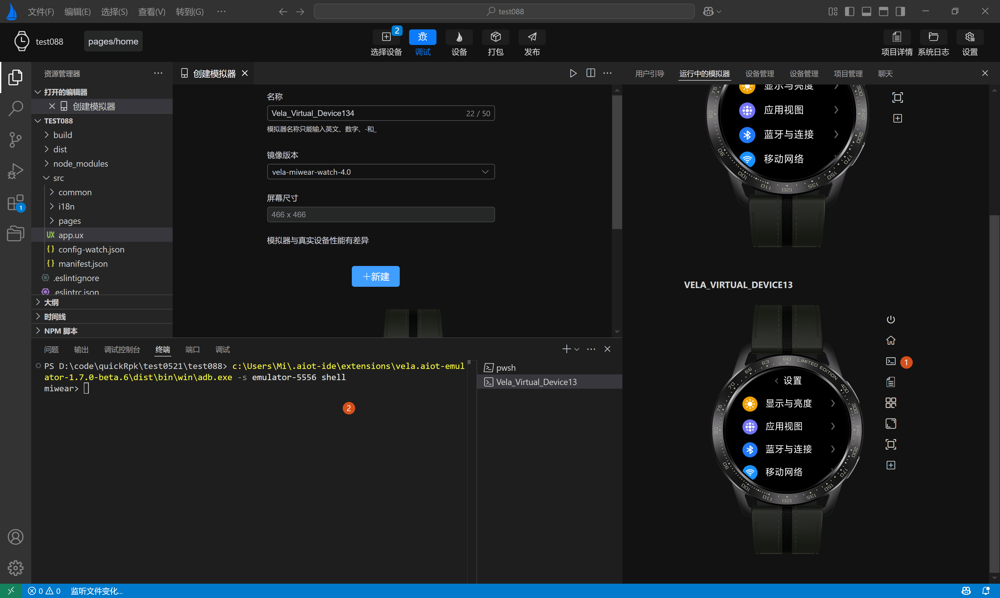

## View Logs

View Logs: Each simulator display area has a view logs button configured on the right side, allowing you to access and view logs when clicked, as shown by numbers 1 and 2 in the following image.

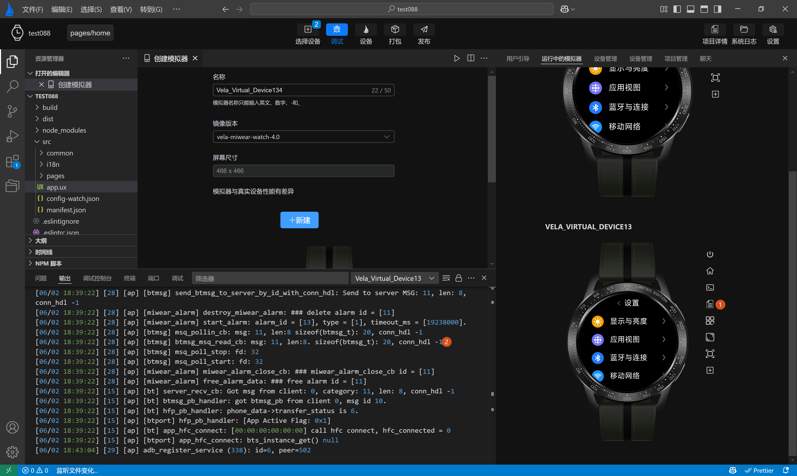

## Menu

Menu: Each simulator display area has a menu button configured on the right side, allowing you to return to the current simulator's menu page when clicked, as shown by number 1 in the following image.

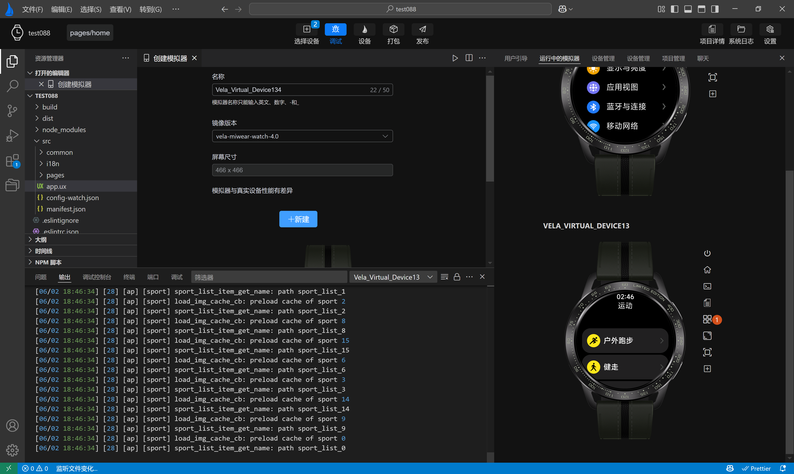

## Screenshot

Screenshot: Each simulator display area has a screenshot button configured on the right side, allowing you to take a screenshot of the current simulator's display and choose between two modes: with skin and without skin, as shown by numbers 1 and 2 in the following image.

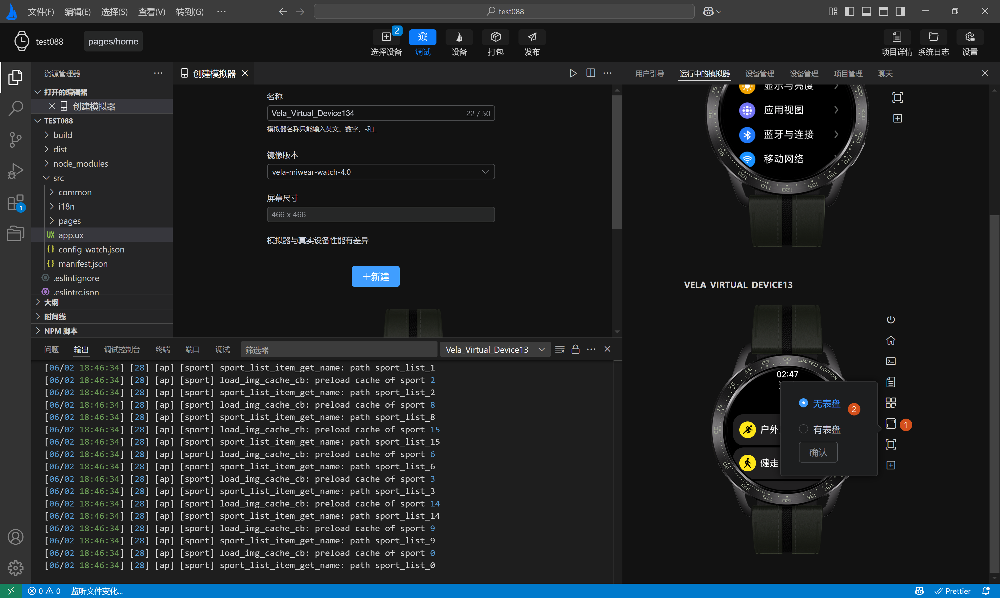

## Size

Size: Each simulator display area has a size button configured on the right side, allowing you to dynamically adjust the display size of the current simulator, as shown by numbers 1 and 2 in the following image.

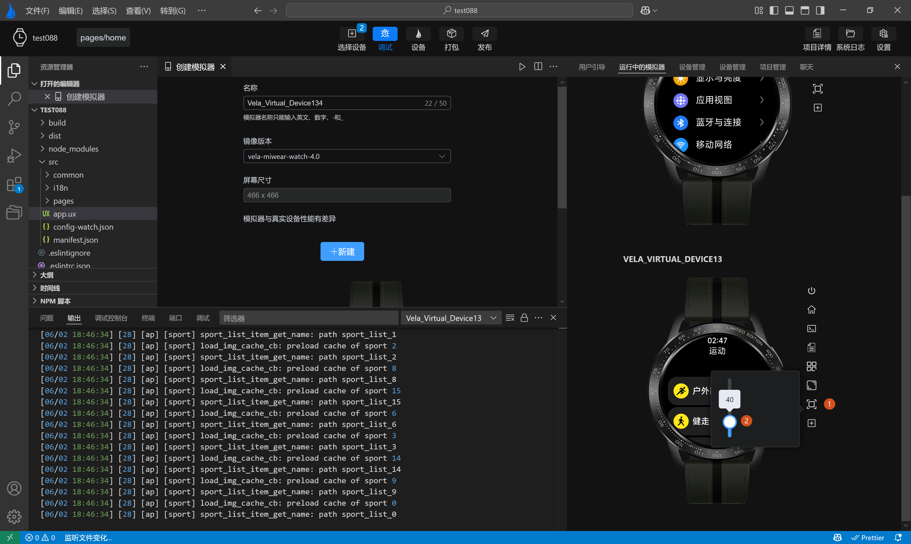

## Install rpk

Install rpk: Each simulator display area has an install rpk button configured on the right side, allowing you to select and install a local rpk file when clicked, as shown by numbers 1 and 2 in the following image.

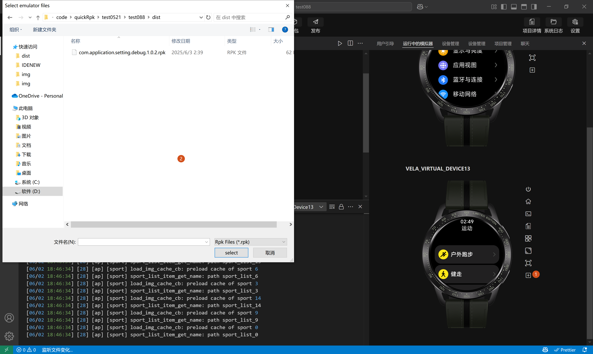

## Run rpk

Run rpk: Each simulator display area has a run rpk button configured on the right side, allowing you to switch between running rpks or uninstall installed rpks from the installed rpk list when clicked, as shown by numbers 1, 2, and 3 in the following image.

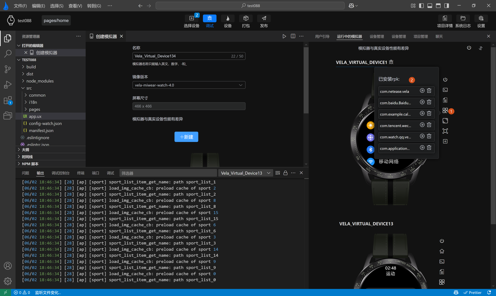
