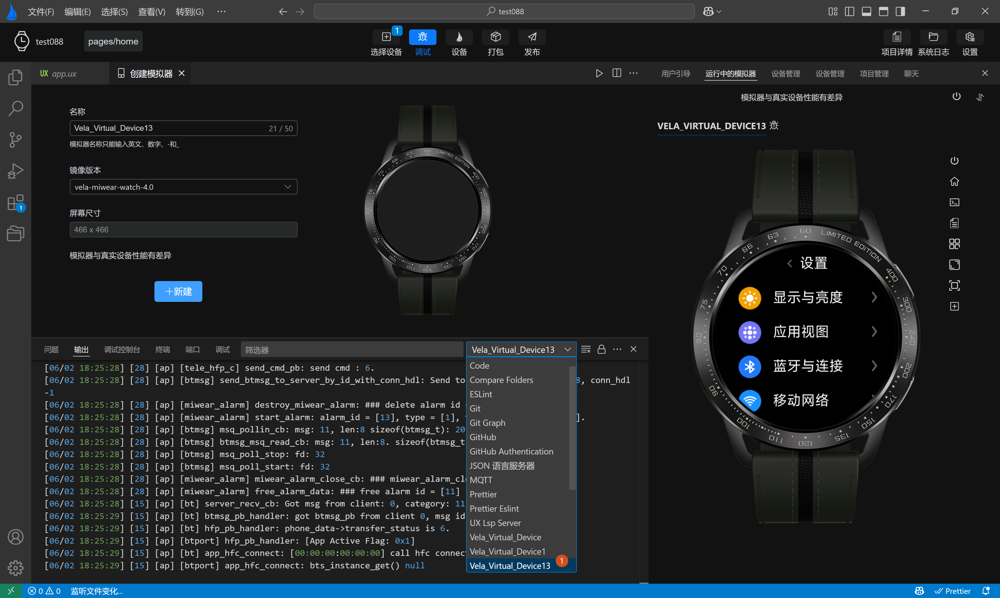

<!-- 源地址: https://iot.mi.com/vela/quickapp/en/tools/debug/watch-log.html -->

# Log Viewing

By utilizing various logs (such as compilation logs and simulator logs), you can quickly understand the current state of your application, thereby improving development efficiency. To view the logs, simply click on the `Output` option in the `Function Panel`. The log output panel provides a range of practical features, including: `Switch-Log-Type`, `Clear-Logs`, `Enable/Disable-Auto-Scroll`, `Export-Logs`, and `Filter-Logs`.

  * **Switch Log Type** : Select the type of logs you want to view, such as simulator logs, compilation logs, etc.
  * **Clear Logs** : One-click to clear all logs of the current type.
  * **Enable/Disable Auto-Scroll** : When enabled, the view will automatically scroll to the latest log entry when new logs are added to the output panel; when disabled, auto-scrolling stops, and logs remain at the last viewed position.
  * **Export Logs** : Export logs of the current type and save them to the logs directory of the current project.
  * **Filter Logs** : With the `Output` panel in focus, use `Command` \+ `F` (or `Ctrl` \+ `F` on Windows) to trigger a keyword search in the logs, with support for regular expressions.

Friendly Reminder: If you encounter anomalies during development, such as a black preview screen or inconsistencies between rendered content and code, first check the **Compilation Logs** to confirm whether the application was built successfully, and then examine the **Simulator Logs** to determine if the application is running properly. If both are fine, please refer to the documentation or seek technical support from the `AIoT-IDE` official team.
