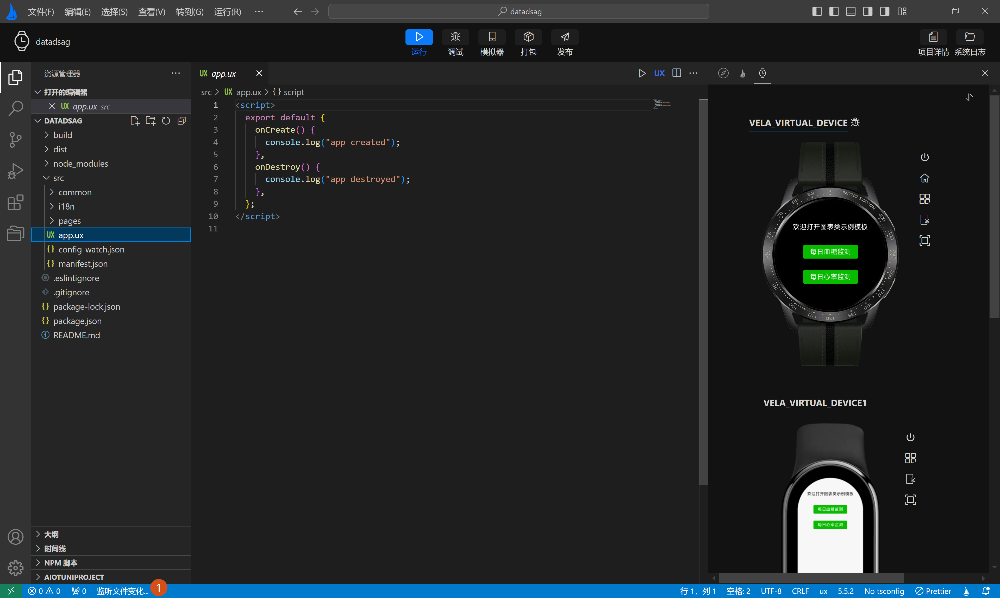
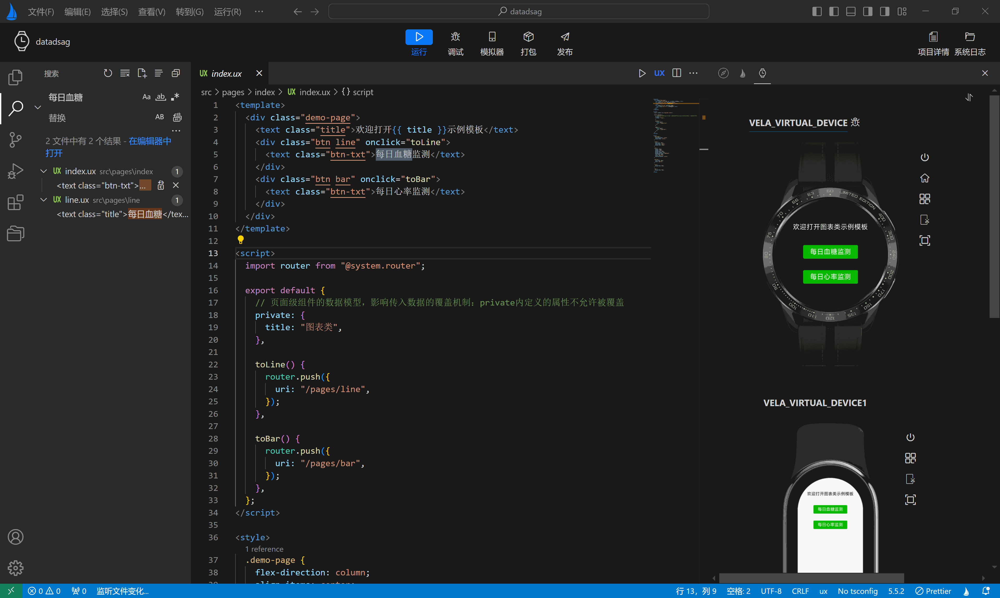

<!-- 源地址: https://iot.mi.com/vela/quickapp/en/tools/dev/build.html -->

# Application Hot Update

When developing **Xiaomi Vela JS applications** using `AIoT-IDE`, a built-in hot update feature is also included. When developers click the **top action bar** `Run` or `Debug` button to run the simulator, file changes are constantly monitored.

When file changes are detected, **automatic compilation** is triggered, the current project is pushed, and the latest effects of the compiled code can be previewed in real-time. When the `Run` or `Debug` button is clicked again to cancel the push, file monitoring will stop, reducing performance consumption.

