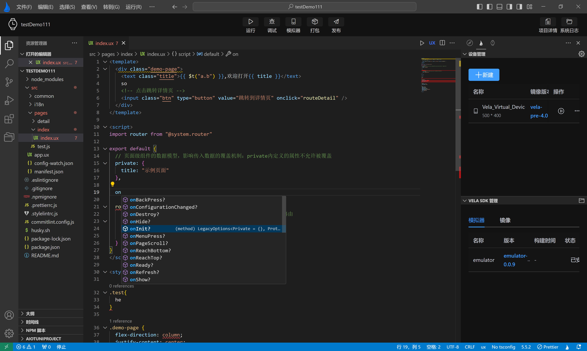
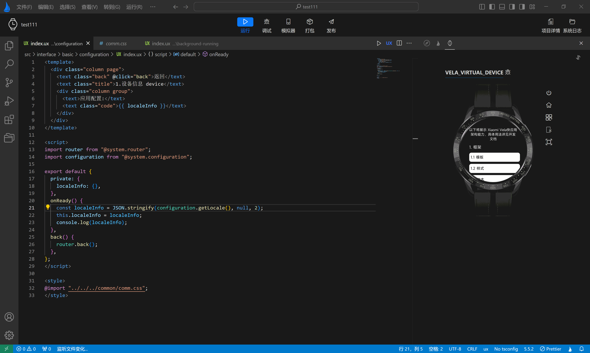

<!-- 源地址: https://iot.mi.com/vela/quickapp/en/tools/dev/format.html -->

# Code Beautification

## Auto Formatting

Auto-formatting of code is crucial in software development, as it enhances code consistency, improves readability, simplifies the review process, and supports agile development practices. **`AIoT-IDE`** provides this feature, but it is turned off by default. To enable it, simply follow these steps:

Use the shortcut key Command (Ctrl for Windows systems) to open the Settings panel. Enter "format" in the search bar.

Check the "Editor: Format On Save" option, as shown in the image below.

Once this option is activated, the system will automatically format your code using Prettier each time you save.

**`Prettier`** is a popular code formatting tool that supports multiple development languages and file formats. Its goal is to provide a unified code style to simplify code maintenance and improve team efficiency. **`AIoT-IDE`** has Prettier built-in, so you don't need to take any additional steps to use it. The specific effect is shown in the dynamic image below:

