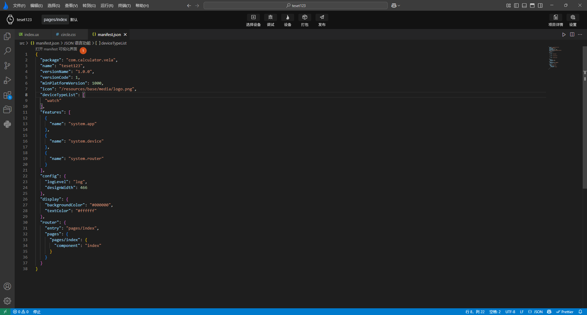
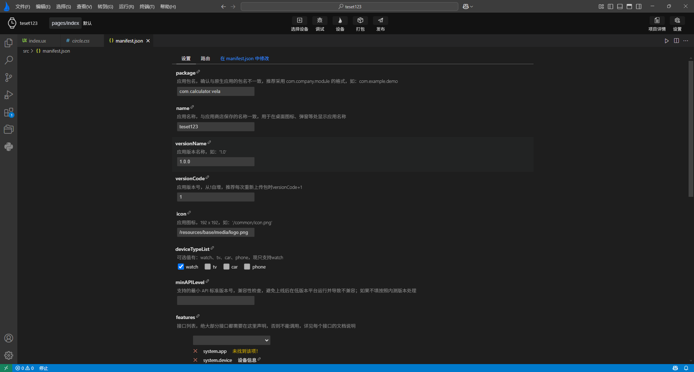

<!-- 源地址: https://iot.mi.com/vela/quickapp/en/tools/dev/manifest.html -->

# Visual Editing

As the main configuration file for the **Xiaomi Vela JS Application** , `manifest.json` has a visual editing interface configured in the `AIoT-IDE`, as shown in the following figure:

After clicking to open the manifest visual interface, you can edit `manifest.json` more intuitively and clearly.

