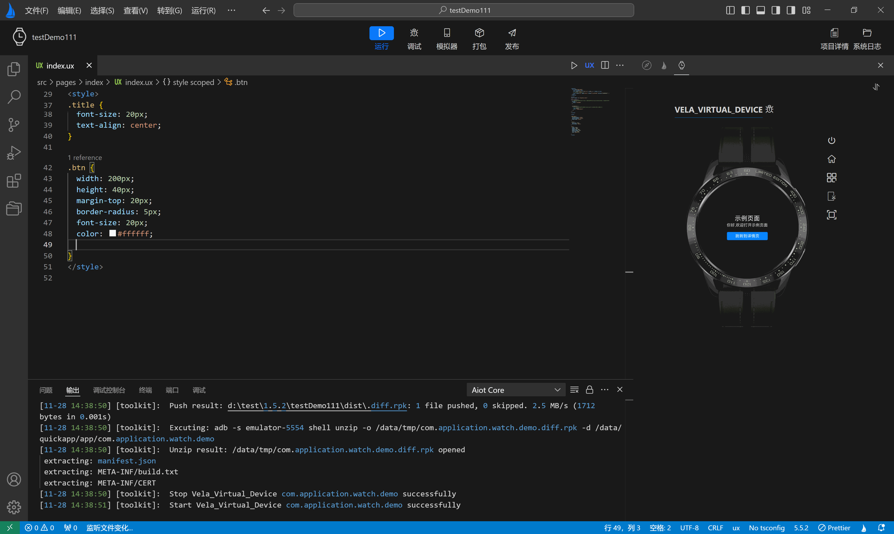
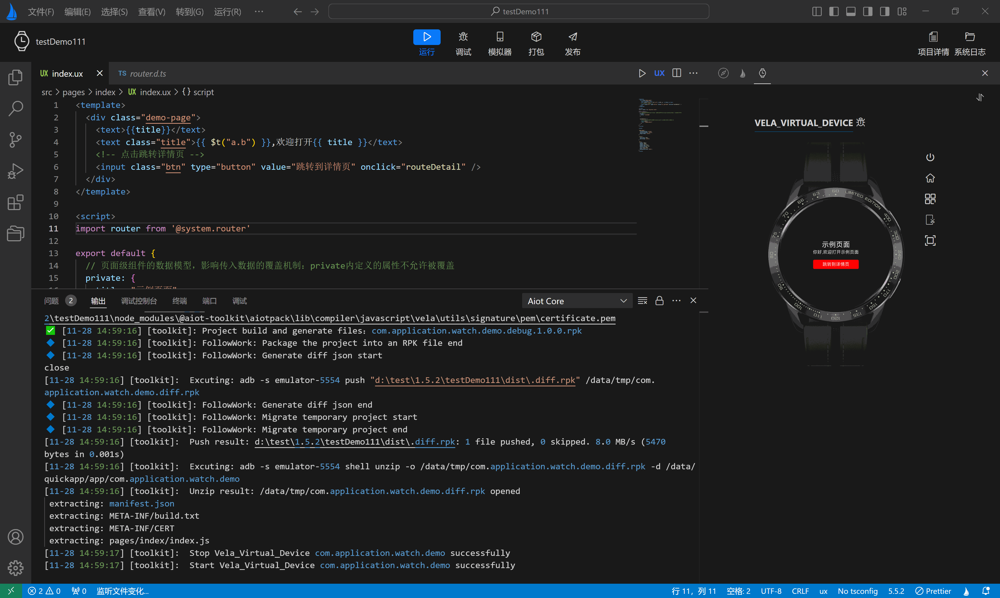

<!-- 源地址: https://iot.mi.com/vela/quickapp/en/tools/dev/start.html -->

# Code Completion

`AIoT-IDE` is based on the secondary development of Visual Studio Code, so it inherits all code editing functions of VS Code. In addition, to better meet the development needs of **Xiaomi Vela JS applications** and enhance the developer experience, `AIoT-IDE` has built-in syntax functions for ux files, including syntax assistance and auto-completion.

## Auto-completion for ux Files

  * Completion in the template area 
    * Tag completion: Start auto-completion after entering < (tag start)
    * Tag attribute completion: Auto-completion of common attributes and component-specific attributes
    * Tag attribute value completion: Auto-completion of attribute values if enumerated values exist

## Completion in the style area

  * CSS property completion: Supports auto-completion of CSS properties;
  * CSS property value completion: Supports auto-completion of CSS property values.

## Other Completions

  * **Path completion** : Auto-completion of file paths, such as component paths;
  * **Class value completion** : Auto-completion based on class values defined in the style tag.

**Jump to Definition in ux Files**

  * **Jump support** : Jump to class and id in the template area, variables, methods, custom components, and interfaces in the script area;
  * **Jump operation** : Use command + left-click on Mac or ctrl + left-click on Windows to jump to the definition. 

**Link Jump in ux Files**

  * **Link jump** : Jump from the ux file to the corresponding linked file;
  * **Jump operation** : Use command + left-click on Mac or ctrl + left-click on Windows to perform the jump.

**Hover Tips in ux Files**

  * **Tag tips** : Display relevant information about tags;
  * **Attribute value tips** : Display relevant information about tag attribute values;
  * **Style tips** : Display style information about style;
  * **Script tips** : Display method, imported module, and other tips in the script area.

