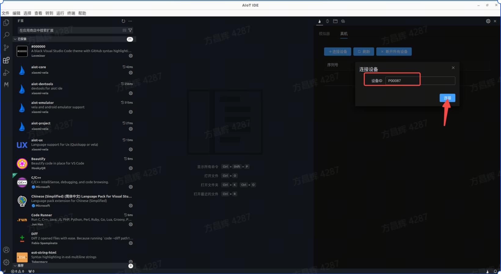
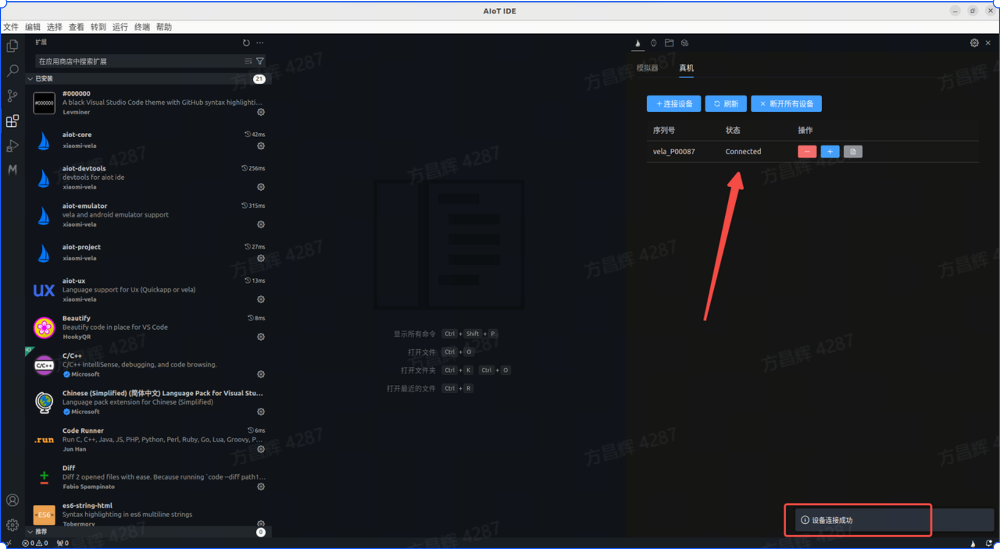
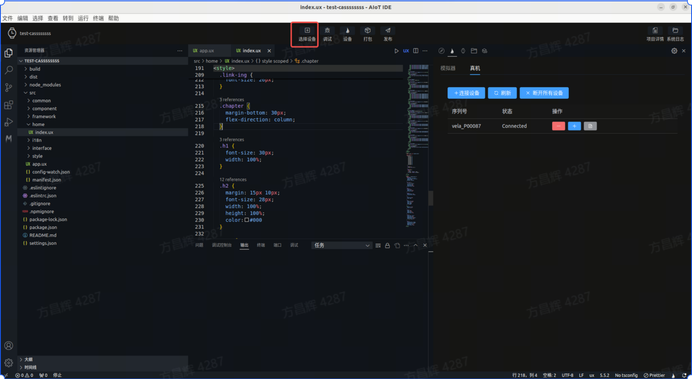
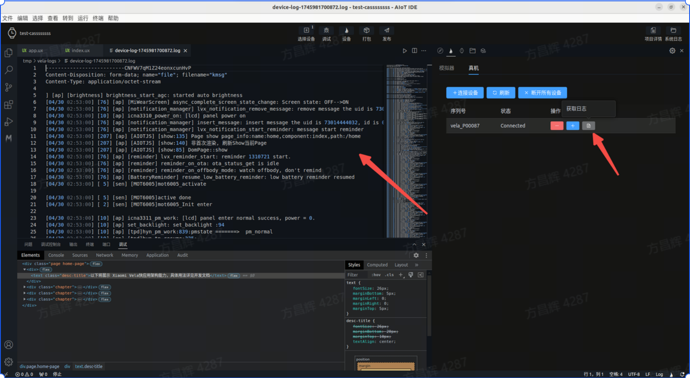
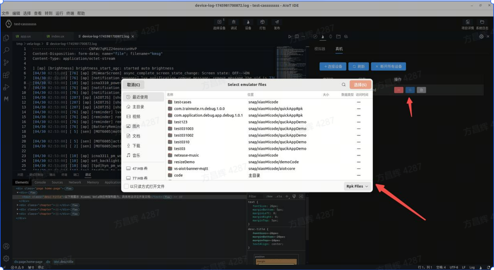

<!-- 源地址: https://iot.mi.com/vela/quickapp/en/tools/devicedebug/start.html -->

# Function Introduction

It supports real-device debugging when developing **Xiaomi Vela JS** applications. In `AIoT-IDE`, you can connect to a real device using its device ID and push the application to the real device for debugging.

## Device Upgrade

Currently, real-device debugging only supports O62 devices. Please contact Xiaomi staff to obtain the document "Xiaomi-Vela-Device-Real-Device-Debugging-Full-Process-Guide" and follow the instructions in the document to obtain the corresponding OTA package and upgrade the device to the specified version that supports real-device debugging.

## Environment Preparation

  1. Please use the beta version of Mi Fitness and connect the test device.
  2. Ensure that the computer network and the mobile phone network are on the same local area network.

## Connection

  1. Open rpk First, open the installed real-device debugging debug-app on the real device (marked in the red box in the image).

  2. Connect After opening the debug-app, click to start debugging. The middle button status of the debug-app will enter "Waiting for IDE Connection". 

  3. IDE-side Connection Open AIoT-IDE on the computer and enter the real-device debugging interface. 

  4. Start Connection Click Connect Device, enter the device IDE (the device ID is obtained from the debug-App above), and click Connect.

  5. Connection Successful After a successful connection, a real device information entry will appear in the list below the button, and the status will be displayed as Connected.

## Debugging

After successfully connecting to the real device, you can enter the debugging phase and debug the currently developed Vela application on the real device.

  1. Select Device Click Connect Device in the top tab bar, select the real device, and then click Debug to enter real-device debugging mode.

  2. Enter Real-Device Debugging After successful debugging and operation, the current application will automatically open on the real device, and the debugging panel will directly open at the bottom of AIoT-IDE.

  3. Obtain Logs Click Obtain Logs in the real-device debugging panel to directly pull logs from the real device.

  4. Push Other rpk In the real-device debugging page, you can click the Push rpk button, select the non-current project rpk to be pushed, and proceed with real-device debugging.

  5. Real-Device Debugging Effect Perform debugging on the AIoT-IDE debugging panel, and the real device will display the debugging effect in real time (but hot updates are not supported. If you need to modify the source code, click the Package button to package the current application and install the rpk through the fourth step).

 
