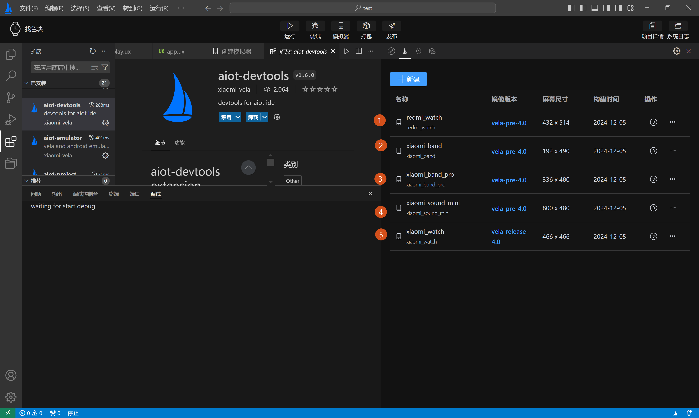
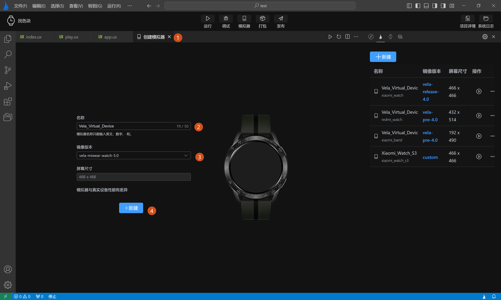
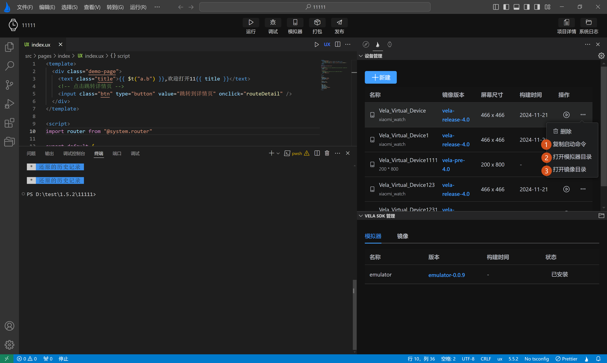

<!-- 源地址: https://iot.mi.com/vela/quickapp/en/tools/emulator/create-emulator.html -->

# Device Management

The Device Management page is mainly divided into two sections:

  * **1\. Simulator Version Management** : Provides functions for adding, deleting, modifying, querying, and running simulators, as shown in Figure 1 below.
  * **2\. Vela Image Version Management** : Offers installation and updates for SDK packages required for the simulator's operating environment, as shown in Figure 2 below.

## Simulator Device Management

Simulator Device Management primarily displays basic information about the simulator:

  * Name
  * Image Version
  * Screen Size
  * Build Time
  * Action Bar (provides functions such as delete and run)

Additionally, users can click the New button in the top-left corner to enter the simulator creation page.

### Automatic Simulator Creation

When using the `AIoT-IDE` development tool for the first time, during the initialization of the simulator environment, the system checks whether a simulator has already been created locally. If no simulator has been created locally, developers will be prompted to automatically create a simulator.

Selecting Confirm will automatically create a formal version simulator after the environment is initialized.

Selecting Create All Device Simulators will automatically create simulators for all device types.

### Creating a New Simulator

Click the **New** button in the figure above to open the simulator creation page. When first entering the **Create Simulator Page** , the default image version is `vela-miwear-watch-5.0`. After entering the simulator name, click **New** to complete the creation. As shown in **Labels 1, 2, 3, 4** in the figure below:

In addition to the default `vela-miwear-watch-5.0` image, users can also select the `vela-miwear-watch-4.0` image and `vela-watch-4.0` image from the dropdown in **Label 3** in the figure above, as shown in **Labels 1, 2** in the figure below:

In the Device Management list, operations can be performed on the created simulators, with buttons provided for running, pausing, and deleting.

  * Additionally, in the Device Management list, multiple quick configurations are provided for user convenience:

    * **Copy Start Command** : Copies the start command for the current simulator, facilitating user self-startup of the simulator and troubleshooting when simulator startup fails.

    * **Open Simulator Directory** : Opens the directory where simulator files are stored, allowing direct viewing of simulator configuration files.

    * **Open Image File** : Opens the directory where simulator SDK packages are stored, allowing direct viewing of simulator SDK package files.

    * **Install Rpk** : After the simulator runs successfully, it allows selecting Rpk packages from the local environment for direct installation and preview (disabled when the simulator is not running).

    * **Custom Image Directory** : When there are multiple image files locally, users can customize the image directory to run their local image files.

    * **Reset Image Directory to Default** : After customizing the image directory, users can reset the image running directory to the system default directory.

## Simulator SDK Management

Simulator SDK Management is mainly divided into two sections:

  * Simulator Kernel, as shown in Figure 1 below
  * Simulator Image, as shown in Figure 2 below

The Simulator SDK Management page primarily displays simulator information across four dimensions:

  * Name
  * Version
  * Build Time
  * Status

Each time `AIoT-IDE` is launched, it automatically detects whether the simulator kernel and simulator image versions need to be updated or installed. Users can view the status column in the list to see if the simulator kernel or simulator image is installed or requires an upgrade. They can manually click to install or upgrade, as shown in Figure 1 below.

## Device Usage Configuration

In addition to the basic functions above, the Simulator Device Management page provides a simple device usage configuration (as shown in Figure 1 below):

  * Adb Mode: Whether to prioritize using the plugin's built-in ADB module or the host's local ADB module (as shown in Figure 2 below).
  * Hide Qt Window: Whether to use GRPC technology to embed the simulator into the IDE for display, or to pop it up externally outside the IDE (as shown in Figure 3 below).

