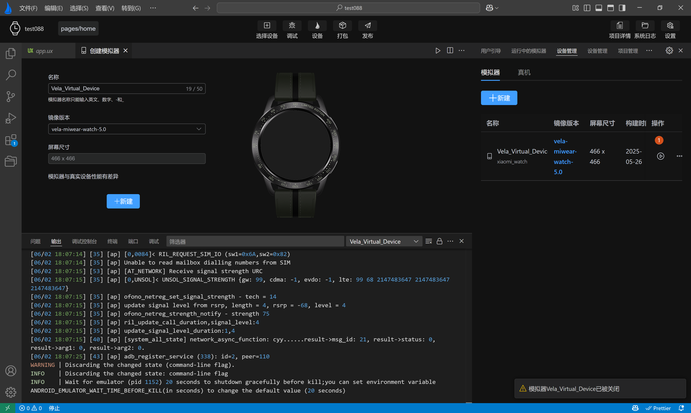
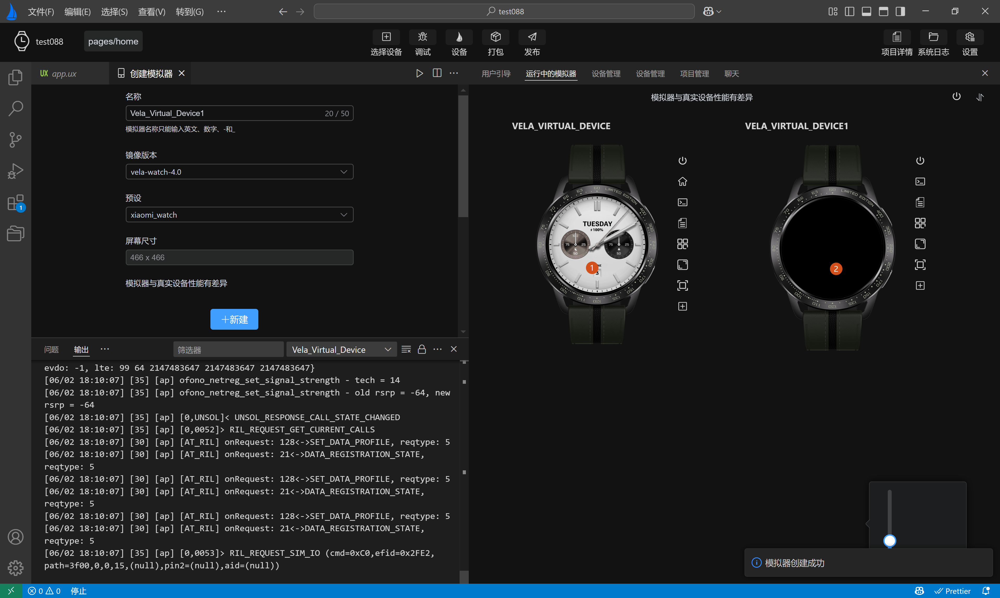

<!-- 源地址: https://iot.mi.com/vela/quickapp/en/tools/emulator/emulator-run.html -->

# Run the emulator

Click the `Run` icon in the emulator list on the Device Management page to automatically run the emulator, and the button will enter a **loading** state. However, after successfully running the emulator through the Device Management page, the currently opened **Xiaomi Vela JS Application Project** will not be pushed. You still need to click the `Select Device` button in the ****top action bar**** , select the running emulator, and then click the `Debug` button to run the current project.

  * After successful running through the Device Management page, different images will exhibit different behaviors:

    * The emulator with the `vela-miwear-watch-5.0` image version will display the watch face page.

    * The emulator with the `vela-miwear-watch-4.0` image version will display the watch face page.

    * The emulator with the `vela-watch-4.0` image version will display a black screen.

As shown in **labels 1 and 2** in the following figure:

