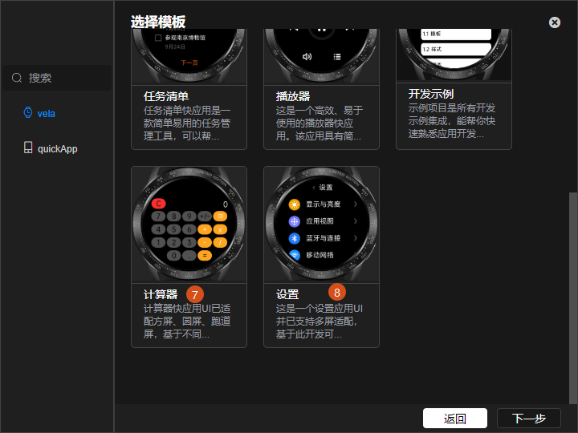
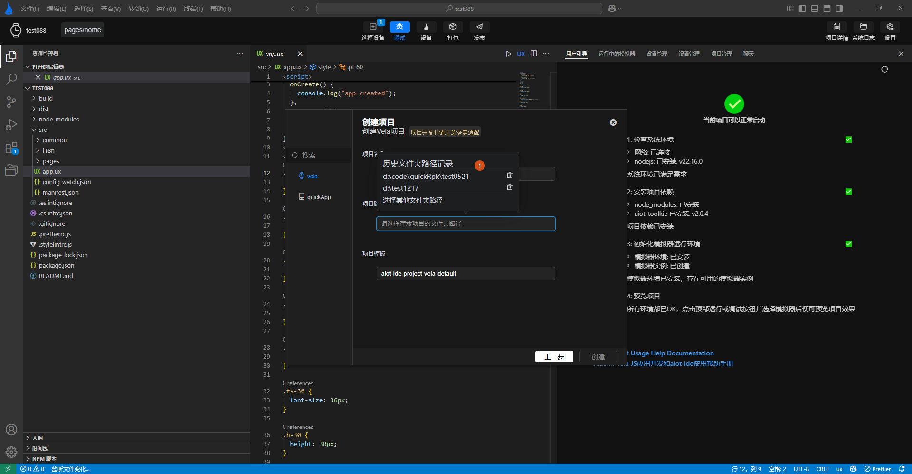

<!-- 源地址: https://iot.mi.com/vela/quickapp/en/tools/project/creat-project.html -->

# Create a New Project

`AIoT-IDE` provides functionality for creating and managing **Xiaomi Vela JS** application projects.

For developers using `AIoT-IDE` for the first time, follow these steps to open the new project dialog and create a project:

  *     1. Click the File button in the top-left corner to display the drop-down menu.
  *     2. Click the New Project menu to open the new project dialog.

When creating a new project, you can select the project type and create a basic **Xiaomi Vela JS** application project using the templates we provide. Currently, eight basic templates are available:

  *     1. Basic template for **Xiaomi Vela JS** application projects
  *     2. Calendar template for **Xiaomi Vela JS** application projects
  *     3. Chart template for **Xiaomi Vela JS** application projects
  *     4. List template for **Xiaomi Vela JS** application projects
  *     5. Music player template for **Xiaomi Vela JS** application projects
  *     6. Development example template for **Xiaomi Vela JS** application projects
  *     7. Calculator template for **Xiaomi Vela JS** application projects
  *     8. Settings panel template for **Xiaomi Vela JS** application projects

 

After selecting a template, click Next and follow these steps to complete the creation:

  *     1. Enter the project name.
  *     2. Select the creation directory (`AIoT-IDE` will remember directories previously selected by the user, allowing for direct selection).
  *     3. After filling in the form, click Create to complete the project creation.

After successful creation, `AIoT-IDE` will automatically open the created project. Follow the instructions on the guide page to install project dependencies, after which you can run the project (**Labels 1 and 2 in the image below**).

