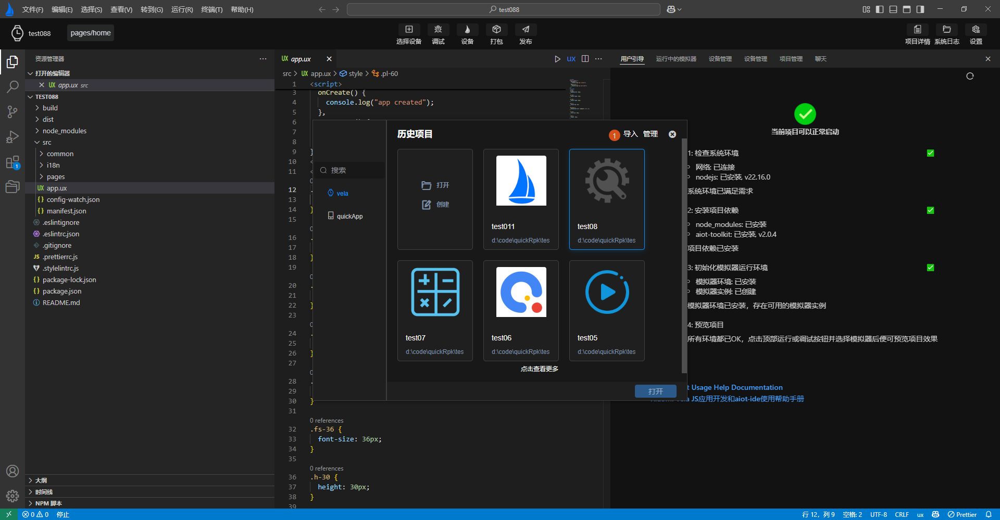

<!-- 源地址: https://iot.mi.com/vela/quickapp/en/tools/project/project.html -->

# Managing Projects

For **Xiaomi Vela JS** application projects created via a new project in `AIoT-IDE`, `AIoT-IDE` provides functions to delete and open historical projects.

## Opening Historical Projects

When opening the new project popup, you can view historical information cards for the projects you have created. Select one of the projects and open it using the Open button in the lower-right corner, as shown in Figures 1 and 2 below:

## Deleting Projects

Move the mouse to the **Manage** button at the top of the historical project information. After clicking, a check button will appear in the upper-right corner of each card. Select one or more historical projects, and then click Delete Project in the lower-right corner. This is shown in **Labels 1, 2, and 3** below:

## Importing Projects

Move the mouse to the **Import** button at the top of the historical project information. After clicking, a folder selection box will automatically open. Select the corresponding project type to import. Non-quickApp projects and **Xiaomi Vela JS** application projects cannot be imported.

