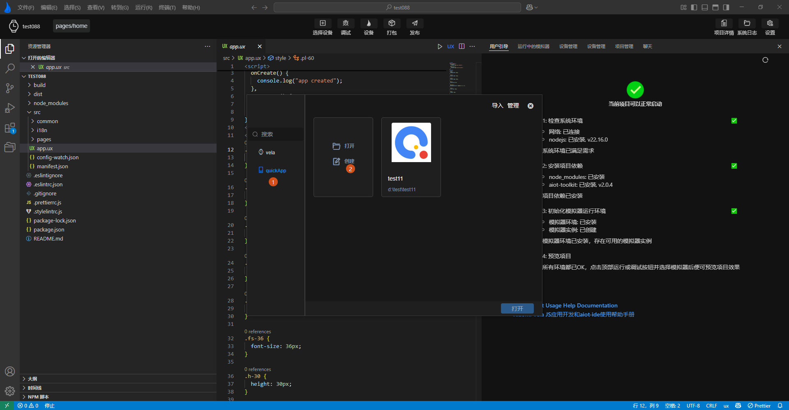
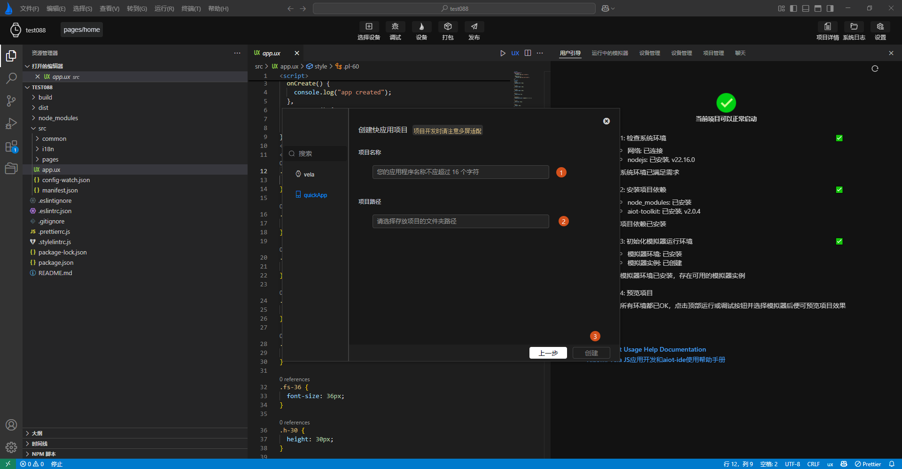

<!-- 源地址: https://iot.mi.com/vela/quickapp/en/tools/project/template.html -->

# Project Type

`AIoT-IDE` not only supports **Xiaomi Vela JS** application projects, but also enables the creation of Quick App projects.

As shown in **Label 1, 2** in the image above, after opening the **New Project Popup** , you can select **quickApp** from the left-side menu, then click **Create** to enter the creation page. Follow the input prompts to enter the creation information, and you can create a Quick App project.

