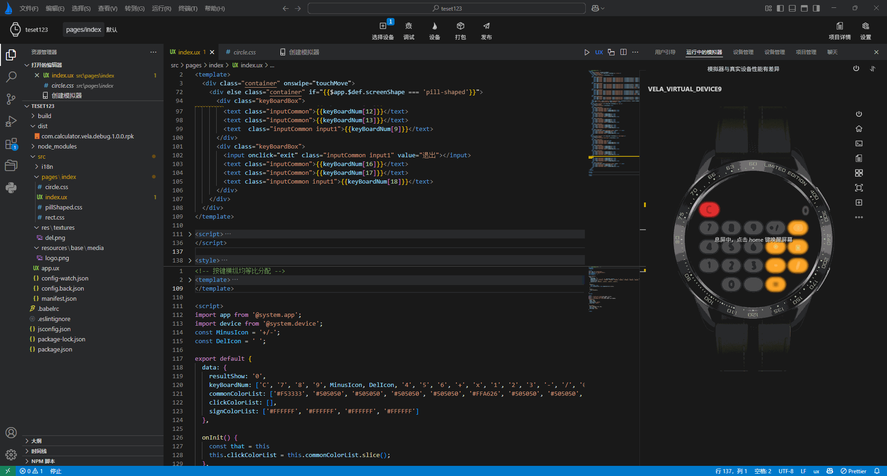
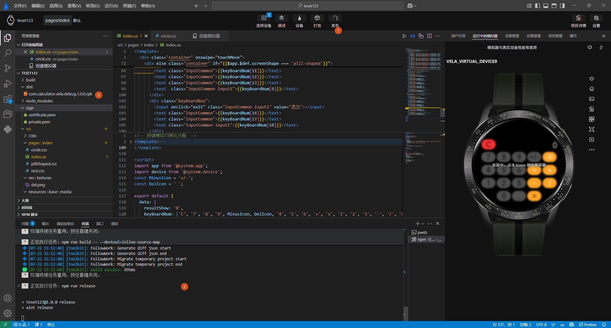

<!-- 源地址: https://iot.mi.com/vela/quickapp/en/tools/release/release.html -->

# Release Application

Unlike the package button in the top button area, clicking the `Release` button to release the application will generate a **release** package.

The **release** package is designed for deployment to the production environment, so it undergoes stricter optimizations to reduce file size and loading time. Typically, the release package contains only necessary files and code, with all debug information, comments, and unused code removed to reduce file size and enhance performance.

At the same time, before generating the release package, it will check whether the current directory **contains a signature file**. If not, it will navigate to the signature creation page, where you can follow the prompts to create a signature file by clicking to complete the process.

After the signature file is **successfully created** , click **Release** again to create the release package.

