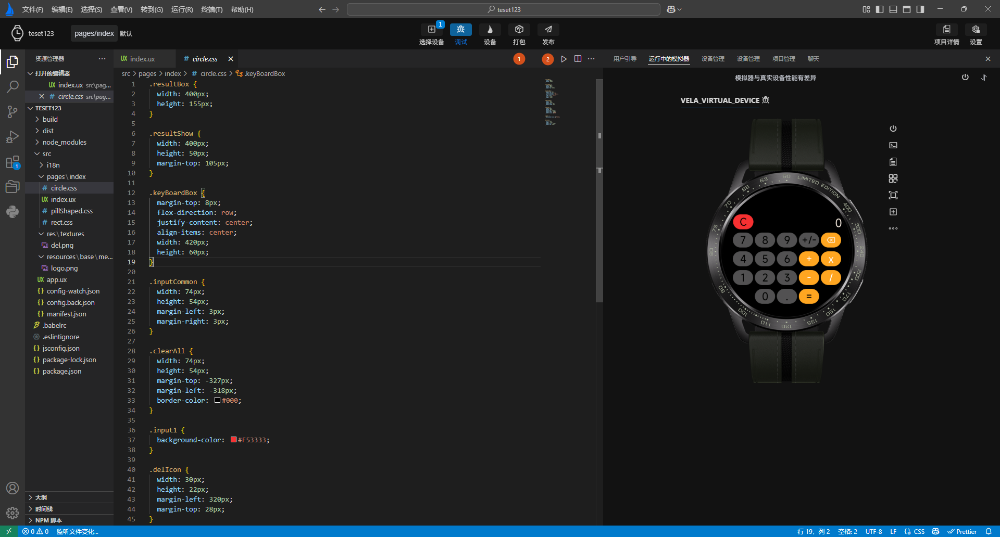
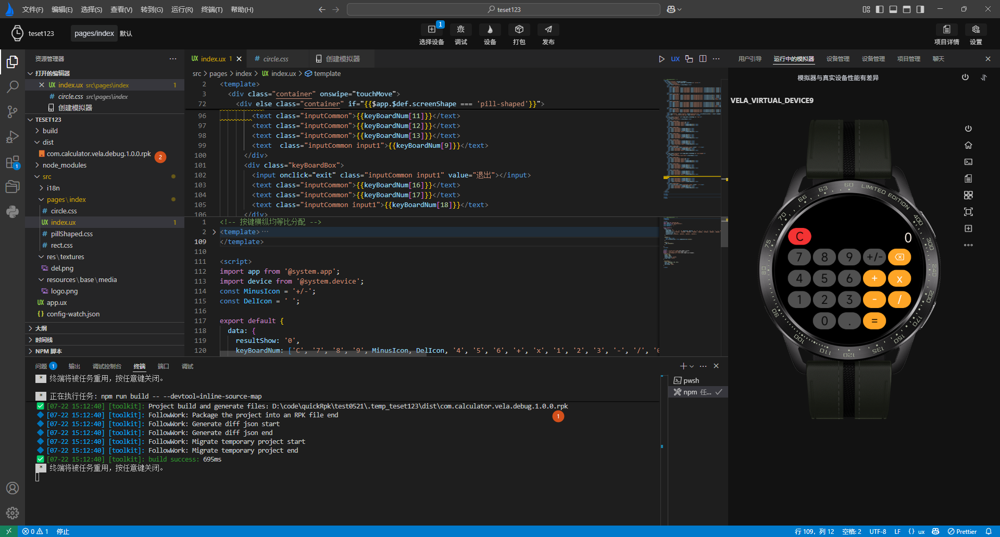

<!-- 源地址: https://iot.mi.com/vela/quickapp/en/tools/release/start.html -->

# Packaging Applications

The packaging of **`Xiaomi Vela JS applications`** employs a specialized .rpk file format. In `AIoT-IDE`, we provide two buttons, **Package** and **Publish** , in the **top operation bar** for packaging the project, as shown in **Labels 1 and 2** in the following figure.

Simply click on "Package Application" to execute the packaging in the function panel. Upon successful packaging, a debug package will be generated in the dist directory.

The debug package is designed to facilitate developers' debugging efforts, so it does not undergo extensive optimization. Typically, the debug package includes debugging information to assist developers in debugging and locating errors.
