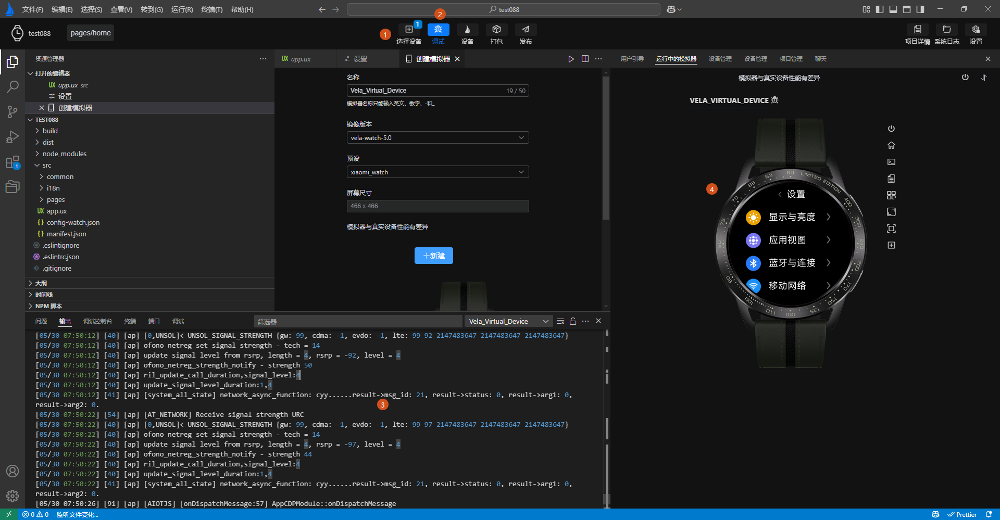

<!-- 源地址: https://iot.mi.com/vela/quickapp/en/tools/start/project.html -->

# Understanding the Interface

## Interface Layout

The main window of `AIoT-IDE` consists of several key areas, as detailed below:

  1. **Sidebar** : Provides functions such as resource explorer, search, Git management, plugin marketplace, and quick access.
  2. **Menu Bar** : Includes menu items like File, Edit, Select, View, Go To, Terminal, Window, and Help.
  3. **Toolbar** : Contains functional buttons for running, debugging, restarting, packaging, and publishing.
  4. **Code Editing Area** : Offers features like code editing, definition navigation, code completion, and error prompts. For details, refer to code completion.
  5. **Function Panel** : Provides panels for issues, output, terminal, debugging, etc.
  6. **Simulator** : Includes functions like guide page prompts, simulation preview, real device operation simulation, and screenshots.

The main window interface, as shown above, only appears when a **Xiaomi Vela JS application** is opened through `AIoT-IDE`. `AIoT-IDE` automatically identifies whether the opened project is a **Xiaomi Vela JS application project** based on the project structure.

## Toolbar Interface

The toolbar interface of `AIoT-IDE` contains several commonly used functions:

**Select Device** : Choose a simulator created locally  
**Debug** : Compile and preview the currently opened **Xiaomi Vela JS** application project, and open the debugging panel to debug the current project  
**Device** : Open the device management page to create simulators of different image types and device types  
**Package** : Package the current **Xiaomi Vela JS** application project into an rpk  
**Publish** : Generate a release-type application package (RPK)

Additionally, `AIoT-IDE` supports direct previewing of the rpk packaged from a `Xiaomi Vela JS` application project. The directory containing the unpacked rpk can be opened with `AIoT-IDE` for previewing.

## Simulator Interface

The simulator interface primarily consists of three parts:

  * **User Guide Page**
  * **Simulator SDK and Device Management Update Page**
  * **Simulator Running Preview Page**

## User Guide Page

The **User Guide Page** of the simulator guides users in initializing the running environment for the **Xiaomi Vela JS** application simulator. Follow the prompts on the guide page:

  *     1. **Install project dependencies** and wait for the project dependencies and environment to be installed before you can normally compile and preview the **Xiaomi Vela JS** application project.
  *     2. **Initialize the simulator environment**. The simulator user guide page will automatically check if the current environment has the simulator running environment. If not, follow the prompts on the user guide page to **automatically install** the simulator environment.

After **correctly operating** as prompted on the guide page above, the guide page will indicate that the **current project can be normally started** , as shown by **label 1** in the following image.

Note: **For performance reasons** , the guide page does not continuously monitor whether project dependencies and the simulator running environment are ready. When users choose to **manually install** the project dependencies and simulator running environment, they can click the **refresh button in the top-right corner of the guide page** to update the guide page status.

## Device Management Page

The device management page is divided into two main parts:

  * **1\. Simulator Management and Real Device Debugging** : Provides functions for adding, deleting, modifying, and querying simulators, as well as running them and debugging real devices.
  * **2\. Simulator SDK Management** : Provides installation and updates for SDK packages required for the simulator running environment.

## Simulator Running Preview Page

The simulator preview page embeds the running simulator into `AIoT-IDE` using grpc technology for previewing. Once project dependencies and the simulator environment are ready, follow these steps to preview the current project:

  *     1. Click the **Select Device** button in the **top action bar** to choose one or more **simulators** to run.
  *     2. Click the **Debug** button in the **top action bar** to run the simulator. The button will enter a **loading state** and turn blue upon successful operation.
  *     3. The bottom toolbar starts outputting simulator running logs, and the page automatically switches from the user guide page to the simulator preview page.
  *     4. Upon successful simulator operation, the simulator preview page will display the corresponding simulator and push the currently opened **Xiaomi Vela JS application** to the running simulator.

