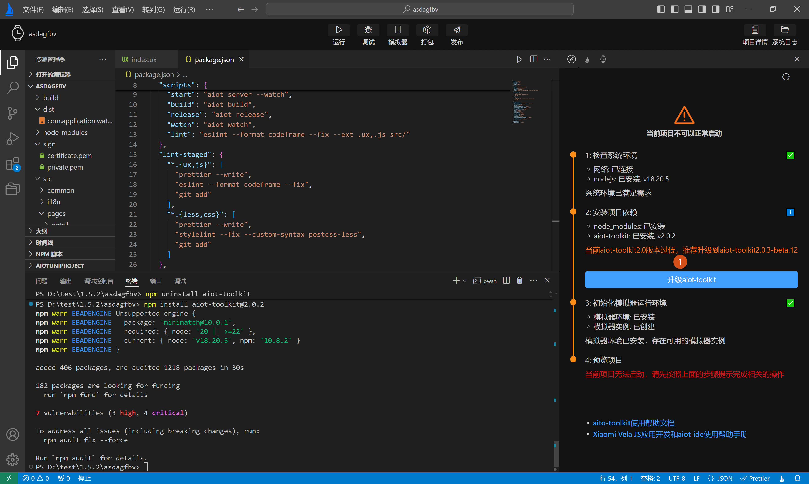

<!-- 源地址: https://iot.mi.com/vela/quickapp/en/tools/toolkit/start.html -->

# AIoT-toolkit

When developers are working on the `Xiaomi Vela JS application` project, `AIoT-IDE` primarily uses the `AIoT-toolkit` built into the project template to complete the project compilation and construction tasks, resulting in build files (named with the rpk suffix, e.g., com.application.demo.rpk).

## Functional Support

The `AIoT-toolkit` is a `command-line tool` that converts **source code projects** into **target code projects** and generates **target code applications** , while also providing emulator-related functions for developers. The `AIoT-toolkit` enables independent development of `Xiaomi Vela JS` applications without relying on `AIoT-IDE`. Without using `AIoT-IDE`, developers can fully utilize the `AIoT-toolkit` for development via command-line tools. The latest **AIoT-toolkit2.0** currently offers the following common commands:

  * Create a project: **npm create aiot**
  * Run directly: **aiot start**. The first run will prompt you to create an emulator; follow the instructions.
  * Build the project to generate an rpk: **aiot build**
  * Build the project in release mode: **aiot release**
  * Get a list of connected devices: **aiot getConnectedDevices**
  * Get setting platforms: **aiot getPlatforms**
  * Create a `Xiaomi Vela JS` emulator: **aiot crateVelaAvd**
  * Delete a `Xiaomi Vela JS` emulator: **aiot deleteVelafangAvd**

## Version Support

Currently, `AIoT-IDE` supports **AIoT-toolkit1.0** and **AIoT-toolkit2.0** , with a minimum supported version of `1.0.18` for **AIoT-toolkit1.0** and `2.0.x` for **AIoT-toolkit2.0**. The latest version of `AIoT-IDE`, **1.6.0** , recommends using **2.0** , which offers faster compilation speeds and hot update support, providing developers with a better development experience.

When `AIoT-IDE` opens a `Xiaomi Vela JS` application, it actively checks the version of **AIoT-toolkit**. If the current project uses **AIoT-toolkit1.0** , it will prompt you to upgrade and view the migration documentation, as shown in **label 1** below:


If your project uses **AIoT-toolkit2.0** but not the minimum official version supported by the current `AIoT-IDE`, it will forcefully prompt you to upgrade, as shown in **label 1** below:



## Functional Optimization

Compared to **AIoT-toolkit1.0** , **AIoT-toolkit2.0** offers the following significant improvements:

  1. Complex functions can be directly written in template syntax.
```html
< div id = " {{(x=> x+ y)(1)}} " onclick = " (evt) => { const x = 10 ; return sum (x , evt , y) } " > </ div >
```

  2. Variables in class can contain multiple class names (previously, each variable could only contain one class name).
```html
class="a {{x}}" // x="a1 a2 a3"
```

  3. Style can be a string or an object (previously, it was only an object).
```html
< div style = " a { { b } } c " > </ div >
```

  4. The order of styles can be written arbitrarily (previously, a fixed order was required).
```html
border: solid red 10px;
```

  5. Error prompts are located by row and column. 

