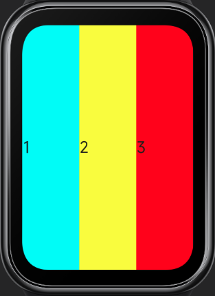
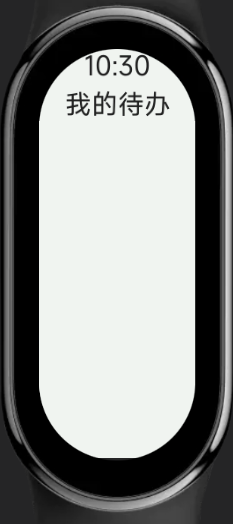
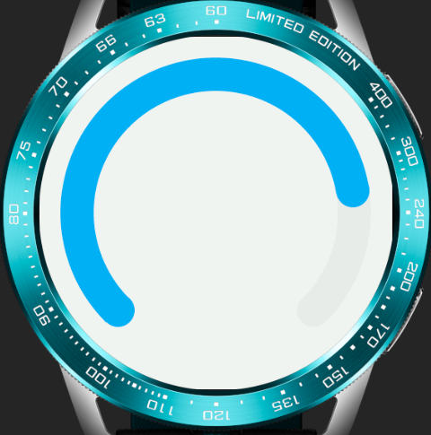

<!-- 源地址: https://iot.mi.com/vela/quickapp/zh/guide/multi-screens/specs.html -->

# # 适配规范

Vela OS 支持一系列适配多种屏幕的技术能力。

## # 自适应布局

系统提供的容器组件均默认遵循 Flex 弹性布局规则，使用弹性布局可以实现屏幕自适应布局。

比如以下代码可以实现行内多个 item 平均分布。

``` <div> <text style="flex-grow: 1; background-color:aqua;">1</text> <text style="flex-grow: 1; background-color:yellow;">2</text> <text style="flex-grow: 1; background-color:red;">3</text> </div> ```



更多说明请参考[Flex 布局示例](</vela/quickapp/zh/guide/framework/style/page-style-and-layout.html#flex-布局示例>)

## # 自适应单位

在编写 UI 样式时，可以采用系统提供的自适应长度单位，包括：

  * px
  * %

### # px

px 在 Vela 应用中不表示屏幕的物理像素，而是相对于项目配置基准宽度的单位，其原理类似于rem。

开发者在 manifest 文件中将 designWidth 字段配置为设计基准宽度（设计稿宽度），然后在样式描述中使用该长度单位，数值直接使用设计稿中的像素值，系统将自动计算使 Vela 应用 UI 在不同屏幕上进行等比缩放。

``` { "config": { "designWidth": 336 } } ```

``` <template> <div class="demo-page"> <div class="container"></div> </div> </template> <style> .demo-page { justify-content: center; align-items: center; } .container { width: 168px; height: 168px; background-color: aquamarine; } </style> ```

如上示例中将 designWidth 配置为 336px，那么所有的 px 值使用都会按照 336px 的基准宽度换算。 假设设备屏幕实际宽度为 336 像素，则 container 元素的实际宽度也为 168 像素；如果设备屏幕实际宽度为 192 像素，则 container 元素的实际宽度为 96 像素。

336*480 屏幕 / 192*490 屏幕

 

更多说明请参考[长度单位](</vela/quickapp/zh/guide/framework/style/page-style-and-layout.html#长度单位>)

### # 百分比%

% 表示百分比，许多样式属性可以取百分比值，经常用以根据父对象来确定大小。

比如以下代码可以实现行内多个 item 按百分比占据父容器宽度，

``` <div> <text style="width: 20%; background-color:aqua;">1</text> <text style="width: 40%; background-color:yellow;">2</text> <text style="width: 40%; background-color:red;">3</text> </div> ```


更多说明请参考[CSS 百分比单位 (opens new window)](<https://developer.mozilla.org/zh-CN/docs/Web/CSS/percentage>)

## # 固定长度单位[3+](</vela/quickapp/zh/guide/version/APILevel3>)

在有的布局场景下，需要使用固定长度单位，系统支持的 dp 长度单位可满足这个需求。

DP 长度单位表示设备独立像素（device-independent pixel），也叫密度无关像素，可以认为是计算机坐标系统中的一个点，这个点代表一个可以由程序使用的逻辑像素，是一个近似物理尺寸的单位，其计算公式为：

``` 屏幕宽度的 DP 值 = 屏幕分辨率的宽度 / DPR 元素宽/高度的 DP 值 = 元素宽/高度的物理像素数 / DPR ```

DPR 表示设备像素比（device pixel ratio），是设备物理像素和逻辑像素（DP）的比值，其计算公式为：

``` DPR = 设备 PPI / 160 ```

PPI（pixels per inch）表示每英寸的像素数，表征屏幕的物理密度，因此 DPR 又被称为逻辑密度。 设备屏幕的逻辑密度值（DPR）可以通过 device 接口获取。

比如以下代码可以实现元素在不同尺寸屏幕上保持近似的物理尺寸，从而在大屏幕上呈现更多的元素。

``` <template> <div class="container"> <div class="text-box"> <text style="background-color: aquamarine;"> A </text> <text style="background-color: #ff0000;"> B </text> <text style="background-color: #00ff00;"> C </text> <text style="background-color: #0000ff;"> D </text> </div> </div> </template> <style> .container { justify-content: center; align-items: center; } .text-box { justify-content: center; flex-wrap: wrap; } text { width:116dp; height: 30dp; font-size: 15dp; text-align: center; } </style> ```

466*466 屏幕 / 192*490 屏幕

 

## # 媒体查询

媒体查询是 CSS3 引入的一个功能，用于根据不同的屏幕尺寸和设备类型，为网页应用不同的样式。

在 Vela JS 应用中，也可以使用类似的媒体查询规范来针对不同屏幕和设备编写样式，详细介绍请参考[媒体查询](</vela/quickapp/zh/guide/framework/style/media-query.html>)。

比如以下代码可以实现根据屏幕形状来应用不同的样式。

注意: 以下示例代码的`designWidth`为`466`

``` <template> <div class="container"> <text>10:30</text> <text>我的待办</text> </div> </template> <style> /* 当屏幕为圆形屏幕时 */ @media screen and (shape: circle) { .container { padding-left: 80px; padding-right: 80px; padding-top: 40px; flex-direction: row; align-items: flex-start; justify-content: space-between; } text { font-size: 40px; } } /* 当屏幕为胶囊形屏幕时 */ @media screen and (shape: pill-shaped) { .container { padding-top: 50px; flex-direction: column; align-items: center; } text { margin-top: 10px; } } </style> ```

466*466 屏幕 / 192*490 屏幕

 

## # 获取屏幕信息

在 Vela JS 应用中，可以通过 device feature 接口获取屏幕信息，包括屏幕形状、屏幕分辨率等。根据获取到的结果可以进行相应的样式适配。

比如以下代码可以实现根据屏幕形状决定 progress 组件的类型（是否是弧形）。

``` <template> <div class="container"> <progress percent="80" type="{{progressType}}"></progress> </div> </template> <script> import device from '@system.device' export default { data: { progressType: "horizontal" }, onInit() { const that = this device.getInfo({ success: function(ret) { that.progressType = ret.screenShape === "circle" ? "arc" : "horizontal" } }) } } </script> <style> .container { padding: 20px; } </style> ```

圆形屏幕 / 矩形屏幕

 

详细介绍请参考 [设备信息 device](</vela/quickapp/zh/features/basic/device.html>)
