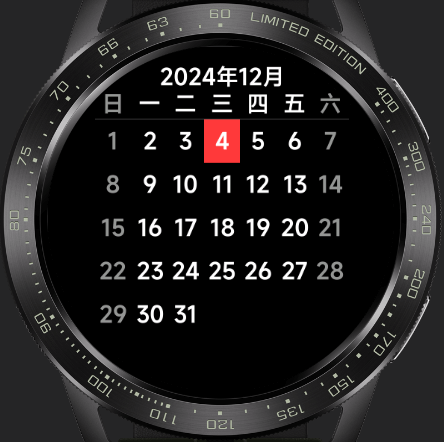
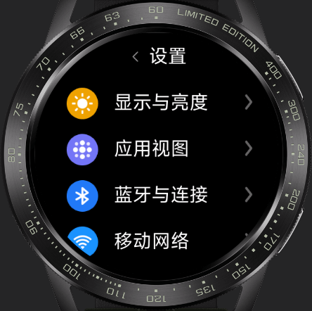

<!-- 源地址: https://iot.mi.com/vela/quickapp/zh/samples/ -->

日历 日历应用是一种方便用户记录、安排和跟踪重要事件和活动的工具。该应用已实现多屏适配，可查看当前年份日期，点击日期可查看更详细的日期信息。应用页面设计简单，操作友好，基于此应用能快速上手开发出一个功能更丰富的日历应用。

 

图表 图表快应用是一款数据可视化工具，能够快速、简单地基于数据生成各种类型的图表，包括折线图、柱状图等多种常见图表类型。该应用已实现多屏适配，简单易用，操作方便，适用于各种数据分析和展示场景。

 

计算器UI 计算器快应用UI已适配方屏、圆屏、跑道屏，基于不同屏幕展示不同的UI样式，同时是一款功能强大、易于使用的计算器应用程序。基于此示例开发能够执行各种数学运算，包括基本的加、减、乘、除、百分比等运算。

 

任务清单 任务清单快应用是一款简单易用的任务管理工具，可以帮助你高效地记录和管理日常的任务和待办事项。该应用已适配方屏、圆屏、跑道屏，页面设计简单，操作友好，基于此应用能快速上手开发出一个功能更丰富的任务管理工具。

 

播放器 这是一个高效、易于使用的播放器快应用。该应用具有简单易用的界面，并且已适配圆屏、方屏等多屏幕，功能包括歌曲播放暂停、切换上下首，展示播放列表。播放器页面设计友好、交互简单，基于此示例能够快速上手开发出一个功能更丰富的播放器快应用。

 

设置UI 这是一个设置应用UI并已支持多屏适配，基于此开发可以让用户轻松地访问和更改各种设置，包括网络设置、音量、蓝牙、Wi-Fi、屏幕亮度、通知等等。该应用具有简单易用的界面，使用户可以轻松地找到他们需要的设置选项。

 

输入法 输入法应用是一种非常实用的工具，可以帮助用户在手表手环上快速、准确地输入文字，提高工作和学习的效率。该输入法组件已适配圆屏、方屏等多屏幕，并且支持中英文切换。通过引入该组件可以轻松实现在手表手环上输入文字。

