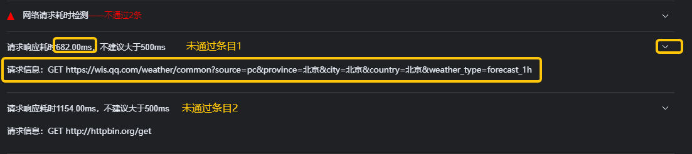
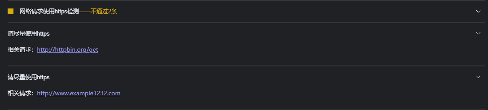
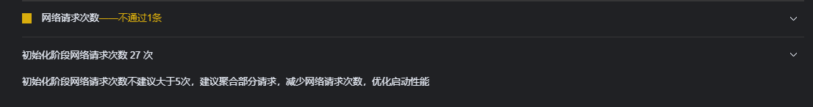
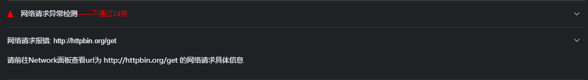

<!-- 源地址: https://iot.mi.com/vela/quickapp/zh/tools/debug/audit.html -->

# 优化评分

为了优化开发者开发体验，`AIoT-IDE`中内置了生成优化评分报告功能，点击`生成报告`按钮即可根据当前打开的应用生成优化报告。

整体分为动态分析和静态分析2部分，每个检测项会包括：触发条目的具体信息（例如代码位置/文件url/网络url），优化建议等。

## 文件分析

  1. 用来帮助用户比较直观地了解当前包体积占比过高的文件，优化包体积

  2. 后续也规划提供类似treeMap的依赖占比可视化分析

## 性能指标

优化报告中有给出多维度的性能指标，给出优化建议,以便开发者进行优化。

## 优化检测项

  * 一个统一的、汇总式地检测入口，目前共计上线9则检查项： 
    * 多次引用代码检测
    * 大型依赖替换检测
    * 未使用依赖检测
    * 未使用系统功能检测
    * 网络请求耗时检测
    * 网络请求https使用检测
    * 网络请求次数检测
    * 网络请求异常检测
    * 代码执行报错检测

### 多次引用代码检测

优化报告中会标出多次引用的代码，给出优化建议，以便开发者进行优化。

### 大型依赖替换检测

优化报告中会标出体积过大的依赖项，给出优化建议，以便开发者进行优化。

### 未使用依赖检测

优化报告中会标出未使用的依赖项，给出优化建议，以便开发者进行优化。

### 未使用系统功能检测

优化报告中会标出未使用的系统功能，给出优化建议，以便开发者进行优化。

### 网络请求耗时检测

优化报告中会标出请求响应耗时过长的请求，给出优化建议，以便开发者进行优化。

### 网络请求https使用检测

优化报告中会标出请求响应中未使用https的，给出优化建议，以便开发者进行优化。

### 网络请求次数检测

优化报告中会标出请求响应中频繁请求的，给出优化建议，以便开发者进行优化。

### 网络请求异常检测

优化报告中会标出请求响应异常，给出优化建议，以便开发者进行优化。

### 代码执行报错检测

优化报告中会标出项目中代码执行报错的，给出优化建议，以便开发者进行优化。

